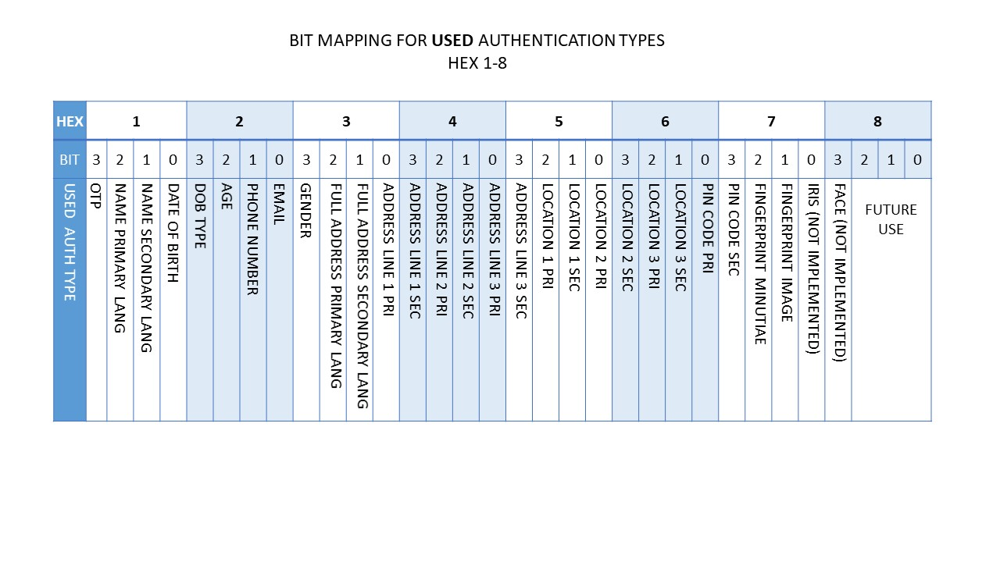
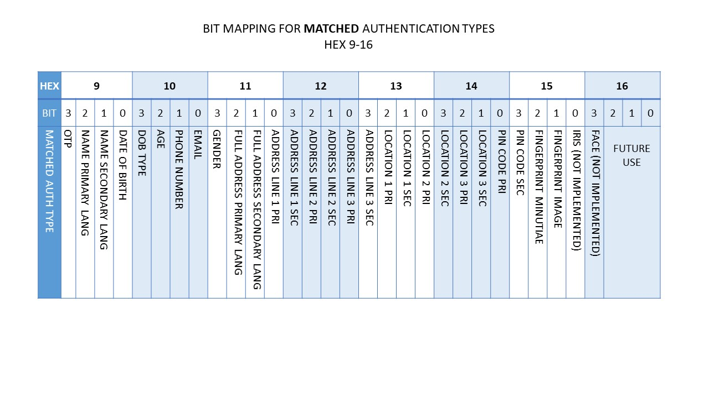
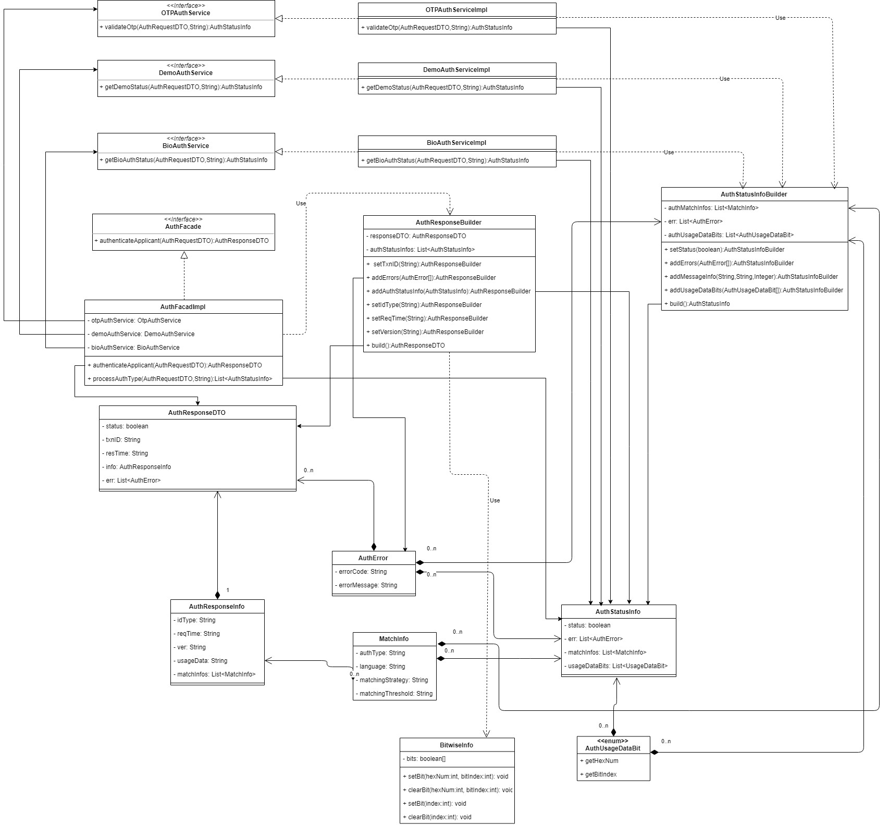
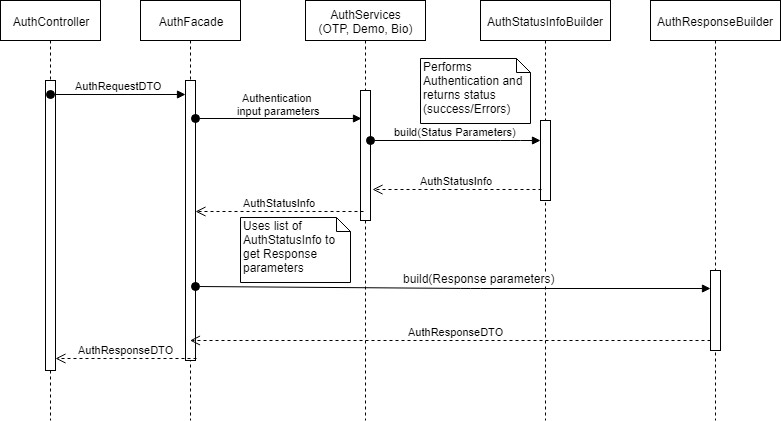

# Identity Auth REST Service Response Buider


**1. Background -**

TSP can send ID Auth Request for one or more kinds of authentications in a single request. ID Authentication service needs to perform authentication for the requested authentication types then needs to create a Success/Failure response as per authentication Success/Failure status of each types. This response needs to convey the overall success of the multi-factor authentication as well as the status of individual authentications. 
This document will provide the details on creating an Authentication Response Builder what will be used for creation of Response for Authentications as mentioned above.


***1.1.Target users -***  
TSP will request for an authentication based on OTP / Demographic Data / Biographic data on behalf of an individual.

***1.2. Key requirements -***  
- TSP can authenticate an Individual using OTP / Demographic Data / Biographic data on behalf of an Individual by ID Authentication API
- TSP will capture Individual’s UIN/VID and construct Authentication Request
- Once Authentication Request is received, authenticate and authorize TSP
- Check Individual’s UIN/VID for authenticity and validity
- Create an authentication response with the status/errors based on the authentication status and send back to TSP.

***1.3. Key non-functional requirements -*** 
-	Logging :
	-	Log each stage of authentication process
	-	Log all the exceptions along with error code and short error message
	-	As a security measure, Individual’s UIN or PI/PA should not be logged
-	Audit :
	-	Audit all transaction details during authentication process in database
	-	Individual’s UIN or PI/PA details should not be audited
	-	Audit any invalid UIN or VID incidents
-	Exception :
	-	Any failure in authentication/authorization of TSP and validation of UIN and VID needs to be handled with appropriate error code and message in Auth Response
	-	Any error in Individual authentication also should be handled with appropriate error code and message in Auth Response 
-	Security :

**2. Solution -**   
For any authentication request (single or multi-factor), a generic AuthResponse is sent back to the TSP, details are as below:
1.	status(Y/N) – The authentication success or failure status, 
2.	txnId (same as request) – the transaction ID, 
3.	resTime  - the timestamp of response, 
4.	err – Array of Errors with error code and message, in case of authentication failure, data validation failure or any other error
5.	info – This block contains below information

    a.	idType – Type of ID (D for UIN, V for VID)
    
	  b.	reqTime – Timestamp of request
    
	  c.	version – Version of Auth API
    
	  d.	matchInfo – Array of Matching information with Matching Strategy and Match Threshold values as in request. This contain below information:
         
    - authType – Which can be one of address, personalIdentity, fullAddress
    - language – language code in which above authType is requested
    - matchingStrategy – Matching strategy (E for Exact match, P for Partial match)
    - matchingThreshold – Integer value for match threshold (0 to 100)
     
    e.	usageData – The 16 digit hex encoded format of used and matched bits.
    


A Sample response body will be as blow:
```JSON
{
  "status": true,
  "err": [],
  "txnID": "txn1234567890",
  "resTime": "2018-10-26T12:19:24.352Z",
  "info": {
    "idvIdType": "D",
    "reqTime": "2018-10-26T12:20:04.121Z",
    "ver": "1.0",
    "matchInfos": [
      {
        "authType": "fullAddress",
        "language": "EN",
        "matchingStrategy": "P",
        "matchingThreshold": 70
      }
    ],
    "usageData": "0x0010000000100000"
  }
}

```

***2.1. Usage Data Bits -***  
The ‘*usageData*’ in the response is a 16 digit hexa-decimal encoded format of used and matched bits. The hex digits 1-8 are used to map which authentication data were used as per the request. And the hex digits 9-16 are used to map which authentication data were matched.

Below are the mappings used for the ‘Used authentication data bits’ that span 1-8 hex digits:



Below are the mappings used for the ‘Matched authentication data bits’ that span 9-16 hex digits:



***2.2. Class Diagram -***  




***2.3.	Sequence Diagram -***  




