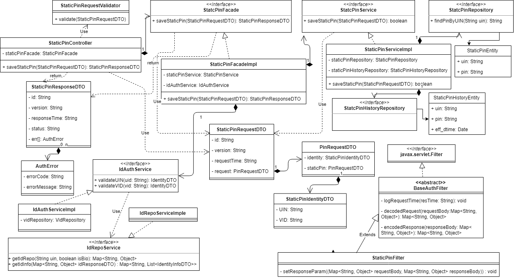
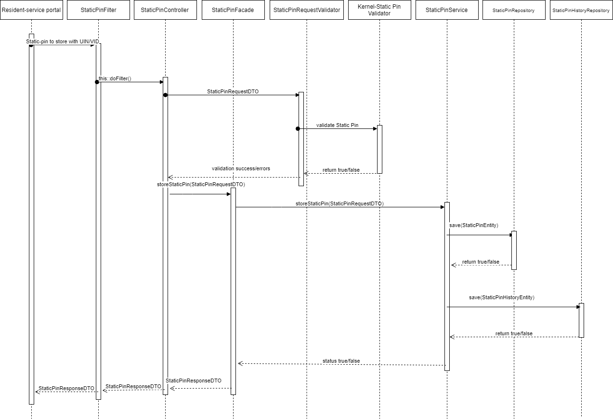

# Static Pin Store REST Service


**1. Background**

An individual can set a static pin using the resident-service portal, which can be used to perform Static Pin based authentication using Static Pin Store API for that Individual.

 **1.1.Target users**  
Individual will send request to store a static pin from resident-service portal.


 **1.2. Key requirements**   
1. UIN of the individual should have been generated and stored in ID repo.

2. Basic UIN Validations on the input UIN should have been executed. (Eg: Length of the UIN based on the UIN policy etc.)

3. VID of the Resident should have been generated

4. Basic VID Validations on the input VID should have been executed. (Eg: Length of the VID based on the VID policy etc.)

5. The individual has set or changed the static pin in the portal after OTP based authetication of the individual.

 **1.3. Key non-functional requirements**   
<TBD>

**2. Solution**   
Static Pin Store REST service addresses the above requirement 

1.	Resident-service portal to construct a POST request with below details and send to Request URL identity/static-pin
Sample Request Body 

```JSON
{
  "id": "mosip.identity.static-pin",
  "version": "1.0",
  "requestTime": "2019-01-21T07:22:57.086+05:30",
  "request": {
	"identity": {
	  "UIN": "678956453456",
	  "VID": "678956453456"
	},
	"staticPin" : "123456"
  }
}
```

2.	Authenticate Resident Portal (JWT) ((TBD))
3.	Validate 'reqTime' for incoming Requests for valid format and timestamp not set as future datetime.
4.	Integrate with kernel UIN Validator and VID Validator to check UIN/VID for validity. Validate UIN/VID for authenticity in AuthDB
5.  Integrate with kernel Static Pin to check static-pin for validity.
6.	Store the static-pin in the database against the UIN of the individual.
7.	Respond to Resident-service portal with below success status - 

```JSON
{
  "id": "mosip.identity.static-pin",
  "version": "1.0",
  "responseTime": "2019-01-21T07:22:58.086+05:30",
  "status": "Y",
   "err": []
}
```

**2.1. Class Diagram**



Below are details on the above classes -
-	**StaticPinRequestDTO** - Request object with input request for storing Static Pin
-	**StaticPinResponseDTO** - Response object with success or failure in Static Pin store request.
-	**StaticPinController** - Spring Controller to receive Static Pin store Request
-	**StaticPinRequestValidator** - Spring Validator to validate input request object StaticPinRequestDTO
-	**StaticPinFacade** - Spring Component that acts like facade layer to validate UIN/VID and invoke StaticPinService to process Static pin store request
-	**StaticPinService** - Spring Service that interacts with StaticPinRepository to store Static pin
-	**StaticPinRepository** - The repository interface that provide access to Static Pin table in the database.


**2.2. Sequence Diagram:**


