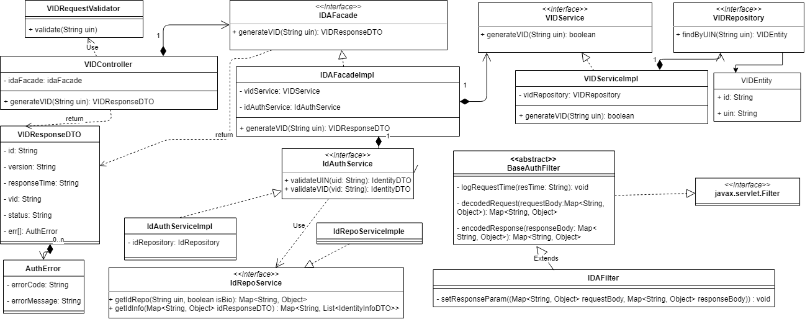
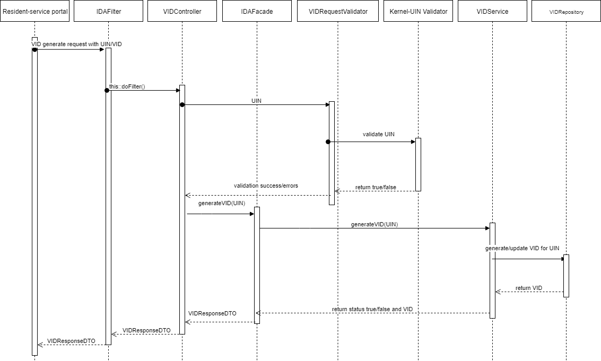

# VID Generate REST Service


**1. Background**

An individual can request to generate a VID using the resident-service portal, which can be used later to perform any authentication using ID-Authentication API with the new VID instead of his UIN number.

 **1.1.Target users**  
Individual will send request to generate/re-generate VID from resident-service portal.


 **1.2. Key requirements**   
1. UIN of the individual should have been generated and stored in ID Repo with active status.

2. Basic UIN Validations on the input UIN should have been executed. (Eg: Length of the UIN based on the UIN policy etc.)

3. The individual has requested for VID generation/re-generation in the portal after OTP based authetication of the individual.

 **1.3. Key non-functional requirements**   
<TBD>

**2. Solution**   
VID generate REST service addresses the above requirement -  

1.	Resident-service portal to construct a GET request with below details and send to Request URL **identity/vid/&lt;version&gt;/{uin}**, where the UIN value is passed as path parameter.<br>
[VID Generator API Spec](https://github.com/mosip/mosip/wiki/ID-Authentication-APIs#5-vid-generator) 
2.	Authenticate Resident Portal ((TBD)).
3.	Integrate with kernel UIN Validator to check UIN for validity. Validate UIN for authenticity in AuthDB
4.  Perform below conditional operations:
	- Check if a VID is already generated and stored for the same UIN in VID table. 
	- If a VID is already present for the UIN, check if the VID is active and it is generated/updated within 24 hours. 
		- If yes, return the same VID. 
		- If VID is not active or generated/updated before 24 hours generate a new VID and update the VID table for the UIN with *Active* status and update the updated_by and updated_dtimes values. 
     - If there is no VID entry earlier, generate the new VID and insert the value to the VID table for the UIN with *Active* status, and set the generated_dtimes, cr_by, and cr_dtimes values.
5.  Integrate with kernel VID Generator to generate VID when required.
6.	Respond to Resident-service portal with below success status - 

```JSON
{
  "id": "mosip.identity.vid",
  "version": "1.0",
  "responseTime": "2019-01-21T07:22:58.086+05:30",
  "vid": "<VID>",
  "err": []
}
```

**2.1. Class Diagram**



Below are details on the above classes -
-	**VIDController** - Spring Controller to receive VID generation Request
-	**VIDRequestValidator** - Spring Validator to validate input parameter in the request such as UIN
-	**VIDFacade** - Spring Component that acts like facade layer to validate UIN and invoke VIDService to process VID request
-	**VIDService** - Spring Service that interacts with Kernel VID Generator to generate VID
-	**VIDRepository** - The repository interface that provide access to VID table in the database.


**2.2. Sequence Diagram:**


