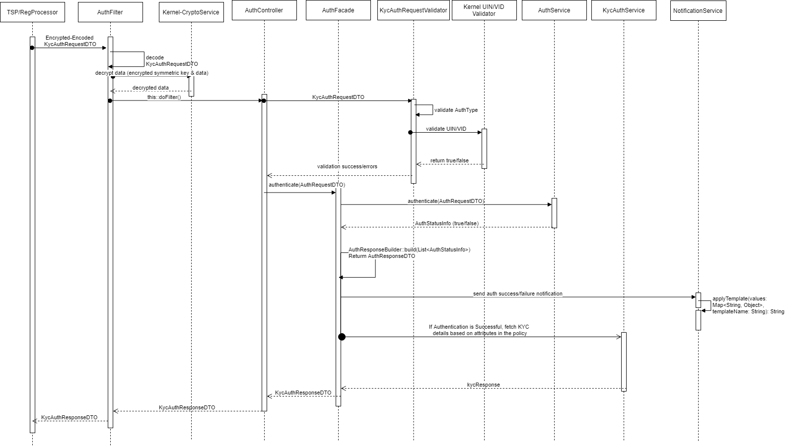

# eKYC Auth REST Service


**1. Background**

eKYC Auth REST service can be used to authenticate an Individual and respond back with KYC details along with Auth details. 
Below are the types of KYC supported by MOSIP – 
1.	No KYC
2.	Limited KYC
3.	Full KYC    
eKYC REST service supports all types of authentications as supported by Identity Auth Service.

 ***1.1.Target users -***  
TSP can use eKYC service to authenticate an Individual by using one or more types of authentication supported by MOSIP and retrieve KYC details of Individual along with Auth details.

 ***1.2. Key requirements -***   
-	TSP can authenticate an Individual using one or more authentication types
-	TSP will send Individual’s UIN/VID to enable authentication of Individual
-	TSP will send muaCode and msaCode to authenticate and authorize a TSP to authenticate an Individual
-	TSP sends Individual’s consent as part of KYC request
-	Check Individual’s UIN/VID for authenticity and validity
-	Validate if Individual’s consent is provided to access KYC details
-	Validate authentication details against the one stored in database
-	Inform authentication status (success/failure) to the Individual in the form of message and/or email

 ***1.3. Key non-functional requirements -***   
-	Logging :
	-	Log each stage of authentication process
	-	Log all the exceptions along with error code and short error message
	-	As a security measure, Individual’s UIN or PI/PA should not be logged
-	Audit :
	-	Audit all transaction details during authentication process in database
	-	Individual’s UIN or PI/PA details should not be audited
	-	Audit any invalid UIN or VID incidents
-	Exception :
	-	Any failure in KYC permissions of TSP or consent needs to be handled with appropriate error code and message in KYC Response
	-	Any failure in authentication/authorization of TSP and validation of UIN and VID needs to be handled with appropriate error code and message in KYC’s auth response
	-	Any error in Individual authentication also should be handled with appropriate error code and message in Kyc Auth Response 
-	Security :
	- 	KYC details of an individual is a sensitive information, hence should be encrypted before sending to TSP
	-	Kyc Auth Request contains sensitive identity information of an Individual. This information should be encrypted by TSP before sending to IDA. On receiving this request, TSP should decrypt identity element before validating Individual’s details for authentication purpose. 


**2. Pre-requisites**   
Below admin configurations should be available before implementing the solution.
-	eKYC auth can be turned on/off from admin for a country. This will be configured by IDA Admin
-	KYC auth permissions will be associated to a TSP and one of the KYC types will also be associated to a TSP while TSP Registration in Admin portal
-	KYC details of an Individual provided to TSP as a response of this eKYC service is time-bound. This means that after a configurable time, these KYC details may be obsolete and TSP should invoke eKYC service again to get latest KYC details. This time known as ttl is configured by IDA admin

**3. Solution**   
KYC Auth REST service addresses the above requirements as explained below.

1.	TSP needs to construct a POST request with below details and send to Request URL identity/kyc
Sample Request Body – 

```JSON
{
	"id": "mosip.identity.kyc",
	"ver": "1.0",
	"consentRequired": true,
	"ePrintRequired": true,
	"authRequest": {// no PPI, only encoding required
		"idvId": "1234567890",
		"idvIdType": "V",
		"authType": {
			"address": true,
			"fullAddress": true,
			"personalIdentity": true,
			"otp": true,
			"pin": false,
			"bio": false
		},
		"muaCode": "tspLevel1ID",
		"txnID": "txn12345",
		"reqTime": "2018-10-17T07:22:57.086+0000",
		"key": "<encrypted_encoded_session_key>",
		"matchInfo": [
			{
				"authType": "fullAddress",
				"language": "fr",
				"matchingStrategy": "P",
				"matchingThreshold": 60
			}
		],
		"pinInfo": {
			"value": "123456",
			"type": "OTP"
		},
		"request": {//encoded and encrypted using mua public key
			"identity": {
				"name": [
					{
						"language": "ar",
						"value": "ابراهيم"
					},
					{
						"language": "fr",
						"value": "Ibrahim"
					}
				],
				"addressLine1": [
					{
						"language": "ar",
						"value": "عنوان العينة سطر 1"
					},
					{
						"language": "fr",
						"value": "exemple d'adresse ligne 1"
					}
				],
				"fullAddress": [
					{
						"language": "ar",
						"value": "فاس-الدار البيضاء"
					},
					{
						"language": "fr",
						"value": "Casablanca"
					}
				]
			}
		}
	}
}
```

2. Authenticate and Authorize TSP <<TBD>>
3. Validate eKYC permissions of TSP for accessing the KYC of Individual’s
4. Validate “reqTime” for incoming Kyc Auth Requests for valid format and timestamp < 24 hours (configurable value) from current time
5. Integrate with kernel UIN Validator and VID Validator to check UIN/VID for validity. Validate UIN/VID for authenticity in AuthDB
6. Once the above validations are successful, Kyc Auth Request is then validated based on specific authentication types as described below.
	a.	OTP Auth – OTP value sent to the Individuals are validated
	b.	Demo Auth – Input Demo fields are validated against stored Individual’s Demo Fields
	c.	Pin Auth – Static Pin generated by the Individuals is validated against the input pin
	d.	Bio Auth – Fingerprint/IRIS/Face minutiae stored is validated against input bio minutiae
7. 	Retrieve Identity details of the Individual based on UIN from ID Repository
8.	Retrieve mode of communication with Individual using admin config to send authentication success/failure information
9.	When the Individual is successfully authenticated based on one or more of the above authentication types, a sms/email notification is sent to them using Kernel’s SmsNotifier and EmailNotifier to their stored phone/email respectively.
10.	Respond to TSP with below success KYC Auth response – 
```JSON
{
	"status": true,//status of auth + kyc
	"err": [],
	"txnID": "txn12345",
	"resTime": "2018-10-17T13:40:19.590+0000",
	"ttl" : "time_to_live_for_KYC_Info",
	"response": { // encoded encrypted using KUA's public key
		"auth": { //No PII to encrypt this separately, only encoding
			"status": true,
			"err": [],
			"txnID": "txn12345",
			"resTime": "2018-10-17T13:40:19.590+0000",
			"info": {
				"idvIdType": "V",
				"reqTime": "2018-10-17T07:22:57.086+0000",
				"ver": "1.0",
				"matchInfo": [
					{
						"authType": "fullAddress",
						"language": "fr",
						"mathingStrategy": "P",
						"matchingThreshold": 60
					}
				],
				"usageData": "0xaf100000af100000"
			}
		},
		"kyc": { // encodes KYC details
			"identity": {
				"name": [
					{
						"language": "ar",
						"value": "ابراهيم"
					},
					{
						"language": "fr",
						"value": "Ibrahim"
					}
				],
				"dateOfBirth": [
					{
						"language": "ar",
						"value": "16/04/1955"
					}
				],
				"age": [
					{
						"language": "ar",
						"value": "30"
					}
				],
				"gender": [
					{
						"language": "ar",
						"value": "الذكر"
					}
				],
				"phoneNumber": [
					{
						"language": "ar",
						"value": "+212-5398-12345"
					}
				],
				"emailId": [
					{
						"language": "ar",
						"value": "sample@samplamail.com"
					}
				],
				"addressLine1": [
					{
						"language": "ar",
						"value": "عنوان العينة سطر 1"
					},
					{
						"language": "fr",
						"value": "exemple d'adresse ligne 1"
					}
				],
				"addressLine2": [
					{
						"language": "ar",
						"value": "عنوان العينة سطر 2"
					},
					{
						"language": "fr",
						"value": "exemple d'adresse ligne 2"
					}
				],
				"addressLine3": [
					{
						"language": "ar",
						"value": "عنوان العينة سطر 3"
					},
					{
						"language": "fr",
						"value": "exemple d'adresse ligne 3"
					}
				],
				"location": [
					{
						"language": "ar",
						"value": "طنجة - تطوان - الحسيمة"
					},
					{
						"language": "fr",
						"value": "Tanger-Tétouan-Al Hoceima"
					}
				],
				"pinCode": [
					{
						"language": "ar",
						"value": "85000"
					},
					{
						"language": "fr",
						"value": "85000"
					}
				],
				"photo": [
					{
						"value": "encoded_face_image_byte_array"
					}
				]
			},
			"ePrint": "encoded printable pdf format of MOSIP card"
		}
	}
}
```

**3.1. Class Diagram:**   
The below class diagram shows relationship between all the classes which are required for KYC authentication service.


**2.4. Sequence Diagram:**   


