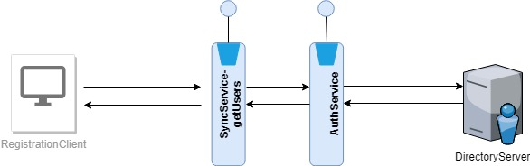

# List of users - Service

#### Background

The roles and userss are stored in LDAP and this is the single source of truth. In case of offline application, the list of users should be repllicated to the respective application. This is a replica of the representation in the LDAP server.  

#### Solution

**The key solution considerations are**

- There should be a service which will return the list of users available in the MOSIP system.

- The service should be secured and the permissions should be provided to a authorized personnel only.

- The service is a wrapper, which will connect to the AuthServer to provide the result.

**Module diagram**

