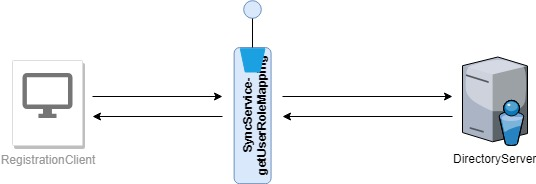

# User Role Mapping - Service

#### Background

The roles and users are stored in LDAP and this is the single source of truth. The user to role mapping is maintained in the LDAP server. In case of offline application, user role mapping should be replicated to the respective application. This is a replica of the representation in the LDAP server.  

#### Solution

**The key solution considerations are**

- There should be a service which will return the user role mapping in the MOSIP system.

- The service should be secured and the permissions should be provided to a authorized personnel only.

- The service is a wrapper, which will connect to the AuthServer to provide the result.

**Module diagram**

