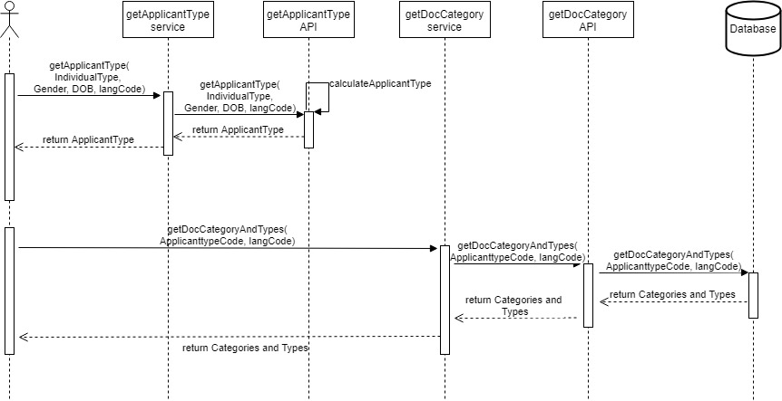

# Applicant Type

#### Background

There can be multiple applicant types in the MOSIP system. An applicant type is the combination of Individual type, Gender and Age group. There are only few fixed Applicant types will be available for the 1.0 version of MOSIP. Once the module receives the criteria for an Applicant type, the code is derived in the Java code. Then this code is used to get the "Document category" and the "Document type" associated with the "Document category". The "Document category" and the "Document type" is maintained in the database.

#### Solution


**The key solution considerations are**


- There are 2 services in this module. One will return back the "Applicant type" based on the Individual type, Gender and Age group. The other service will return the Document category and the Document type for the Applicant type. 

- The Applicant type definition is there in the Java code. 

- The Applicant type and the Document mapping is there in the database. 

**The inputs which have to be provided are:**

We need to provide the Map<String,Object> and the key, value pairs are as follows :

individualTypeCode: mandatory

dateofbirth: mandatory

genderCode: mandatory

biometricAvailable: optional


*Valid values for above keys are as follows :*
 
individualTypeCode: FR,NFR

dateofbirth: must be in this pattern yyyy-MM-dd'T'HH:mm:ss.SSS'Z'

genderCode: MLE,FLE

biometricAvailable: true,false


**Rules based on above input provided**

```
		if (itc.equals(FOREIGNER) && genderType.equals(MALE) && ageCode.equals(CHILD) && !isBioExPresent){
			// 1
			return "001";
		} else if (itc.equals(FOREIGNER) && genderType.equals(MALE) && ageCode.equals(ADULT) && !isBioExPresent){
			// 2
			return "002";

		} else if (itc.equals(NON_FOREIGNER) && genderType.equals(MALE) && ageCode.equals(CHILD) && !isBioExPresent){
			// 3
			return "003";

		} else if (itc.equals(NON_FOREIGNER) && genderType.equals(MALE) && ageCode.equals(ADULT) && !isBioExPresent){
			// 4
			return "004";

		} else if (itc.equals(FOREIGNER) && genderType.equals(FEMALE) && ageCode.equals(CHILD) && !isBioExPresent){
			// 5
			return "005";

		} else if (itc.equals(FOREIGNER) && genderType.equals(FEMALE) && ageCode.equals(ADULT) && !isBioExPresent){
			// 6
			return "006";

		} else if (itc.equals(NON_FOREIGNER) && genderType.equals(FEMALE) && ageCode.equals(CHILD) && !isBioExPresent){
			// 7
			return "007";

		} else if (itc.equals(NON_FOREIGNER) && genderType.equals(FEMALE) && ageCode.equals(ADULT) && !isBioExPresent){
			// 8
			return "008";

		} else if (itc.equals(FOREIGNER) && genderType.equals(MALE) && ageCode.equals(CHILD) && isBioExPresent){
			// 9
			return "009";

		} else if (itc.equals(FOREIGNER) && genderType.equals(MALE) && ageCode.equals(ADULT) && isBioExPresent){
			// 10
			return "010";

		} else if (itc.equals(NON_FOREIGNER) && genderType.equals(MALE) && ageCode.equals(CHILD) && isBioExPresent){
			// 11
			return "011";

		} else if (itc.equals(NON_FOREIGNER) && genderType.equals(MALE) && ageCode.equals(ADULT) && isBioExPresent){
			// 12
			return "012";

		} else if (itc.equals(FOREIGNER) && genderType.equals(FEMALE) && ageCode.equals(CHILD) && isBioExPresent){
			// 13
			return "013";

		} else if (itc.equals(FOREIGNER) && genderType.equals(FEMALE) && ageCode.equals(ADULT) && isBioExPresent){
			// 14
			return "014";

		} else if (itc.equals(NON_FOREIGNER) && genderType.equals(FEMALE) && ageCode.equals(CHILD) && isBioExPresent){
			// 15
			return "015";

		} else if (itc.equals(NON_FOREIGNER) && genderType.equals(FEMALE) && ageCode.equals(ADULT) && isBioExPresent){
			// 16
			return "016";

		}
```

**Module diagram**





## Implementation


**kernel-applicanttype-api** [README](../../../kernel/kernel-applicanttype-api/README.md)
