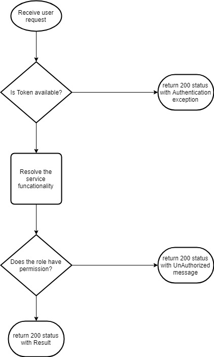

# Authorization in the Kernel webservices

#### Background

There are many webservices in MOSIP platform. All the webservices have the authentication part defined for the services. So, when a request comes to the webservice, the webservice takes the AuthToken in the request. If the AuthToken is not there in the request, the request is rejected right away. If the AuthToken is available, the role name is taken from the User claim. 

#### Solution

**The key solution considerations are**

- The incoming requests should be screened for the AuthToken. If the AuthToken is not available, the request is rejected. Basically, all the incoming requests to the webservices should be filtered for Authentication and Authorization. 

- The role name have to be taken from the User claim in the AuthToken. The token should be sent to the AuthServer for validity and the user claim. 

- The authorization for this JIRA ID is handled in all the web services in the MOSIP kernel platform. 

- Java APIs is not checkec for Authorization. It is upto the users or callers responsibility to declare the roles which can use this Java API. 

**Module diagram**

## Implementation

**kernel-auth-service** [README](../../../kernel/kernel-auth-service/ReadMe.md)
