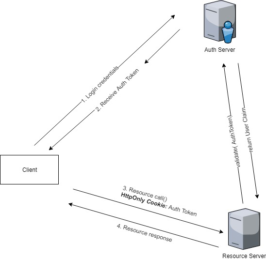
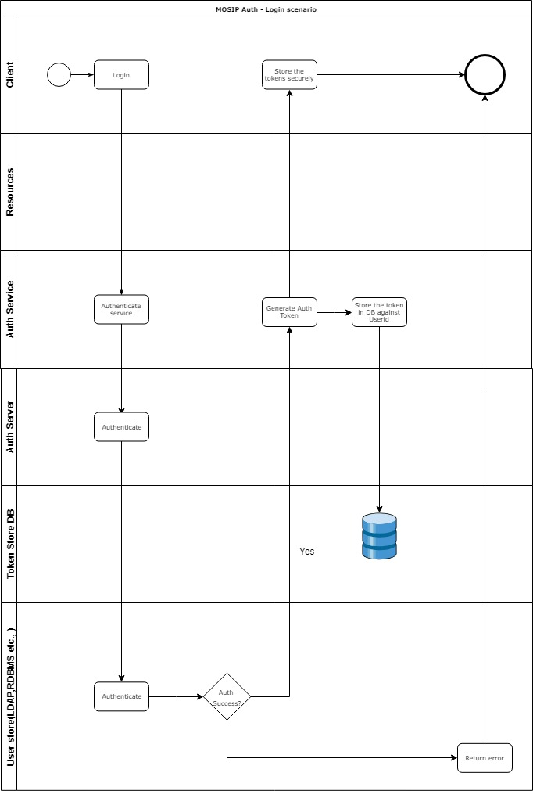
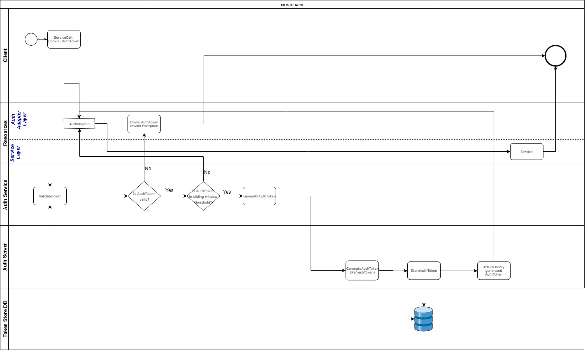

# Authentication and Authorization in MOSIP platform

#### Background

The authentication and authorization in the MOSIP platform is handled in the a centralized place. OAuth 2.0 authorization framework is used as the standards.JSON Web Token(JWT) is used as a mechanism to implement OAuth2.0 framework. 

#### Solution

**The key solution considerations are**

- A centralized Auth Server handles the authorization request from the platform. 

- Once authenticated, the Auth Server  sends back an AuthToken.

- Auth token contains the information about the authenticated user and the meta data such as the expiration time, subject, issuer etc., 

- An additional layers in the Auth service will ensure about the forced logout scenario. Essentially, all the service calls to the Auth Service will go through this creamy layer, where we have a proxy user datastore which will maintain the additional information about the validitiy of the tokens. 

- The Tokens are stored in the creamy layer for an individual user. In case of force logout scenario, this record will be deleted from this proxy user datastore. 

**Tokens Overview**

**MOSIP Authentication and Authorization Principles**

- No resource in the MOSIP can be accessed without Authentication and Authorization. 

- All the auth requests will go via the Auth Server. 

- The user data stores are abstracted behind the Auth Server. 

- The user data stores should be pluggable. 

- The platform's authentication method should support the heterogenous technologies and authentication should happen seamlessly. 

- All the user information are stored in the centralized Data store. 

- In the rest of the MOSIP platform uses only the userid as the handle to the actual user in the data store. No other user attribute should be used as the handle in the MOSIP platform. 

**Different kinds of Actors in MOSIP platform**

- Following are the identified actors in the authentication, 

1. Human users

- These are the actual human users. 

- These actors exists in LDAP or in Database. 

2. Applications

- These are the applications like Registration client, IDA etc., 

- Applications are provided with credentials like applicationid & secret-key

**Implementing Auth in the web services**

- To ease out the development effort, an Auth Adapter component is distributed to the Web service developers. 

- The developer have to do 3 steps to plug in the Auth Adapter, 

1. Include the Auth Adapter jar file in the classpath. 

2. Inject the Auth Server details 

3. Annotate the server method which have to be protected with the "Role" information. 

Reference: https://github.com/mosip/mosip/wiki/Auth-SpringBoot-User-Guide

**Implementing Auth in JavaFX application**

1. If the actual human user login, pass the username and password to the Auth server.

2. In case of background serivces, pass the applicationid & secret-key. 

3. Once authenticated, the client receives the Auth Token. Client stores them in a secured local store.

4. In all the REST service calls to server, include the Auth Token. 

5. If the Auth token is expired, login again. 

**Implementing Auth in Angular application**

1. The human user logs in using the username and the password. 

2. Once authenticated, the client receives the Auth Token. Client stores them in a HTTP-only cookie. 

3. In all the REST service calls to server, Auth Token is included.  

4. If the Auth Token is expired, the page is redirected to the login page.

5. A timer runs in the client side, which is lesser than the session timeout. This timer calls the "/authorize/validateToken" service.

6. If the Auth Token comes insides the Sliding Window Threshold, a new Auth Token will be issued. 

Reference: https://github.com/mosip/mosip/wiki/Auth-Angular-User-Guide

**Data stores for different applications**

1. Pre-Registration --> Relational database

2. Registration --> LDAP

3. Registration processor --> LDAP

4. IDA --> LDAP

**Class diagram**

**Login - Swimlane diagram**

**Service call - Swimlane diagram**

**Sequence diagram**

## Implementation

**kernel-auth-service** [README](../../../kernel/kernel-auth-service/README.md)
