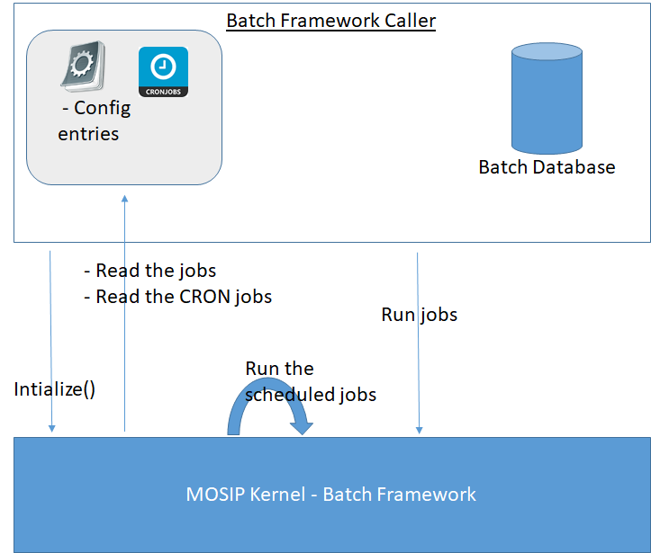

# Kernel Batch Framework

**Background**

Applications will be using the batch framework to execute the jobs in specific period. It contains 2 sections: 

-	First section is to define jobs.
 

-	Second is the batch job scheduler.

 

#### Solution

** The key solution considerations are**

-	Create a batch framework project

-	The projects can configure the jobs in their respective modules. Once the Kernel’s batch jar file added to their project, it takes the corresponding jobs and should execute.

 

** The solution can be**:

-	Create a project which implements the Spring batch framework.

 
-	The jar file of the MOSIP’s Batch Framework have to be added in the classpath of the caller.

-	Create a wrapper interface in the MOSIP batch framework, which will be exposed to the caller of the batch framework.
 

-	The configuration of the jobs and the CRON expressions for the jobs are injected by the caller of the Batch Framework.

## Implementation

**kernel-batch-framework** [README](../../../kernel/kernel-batch-framework/README.md)