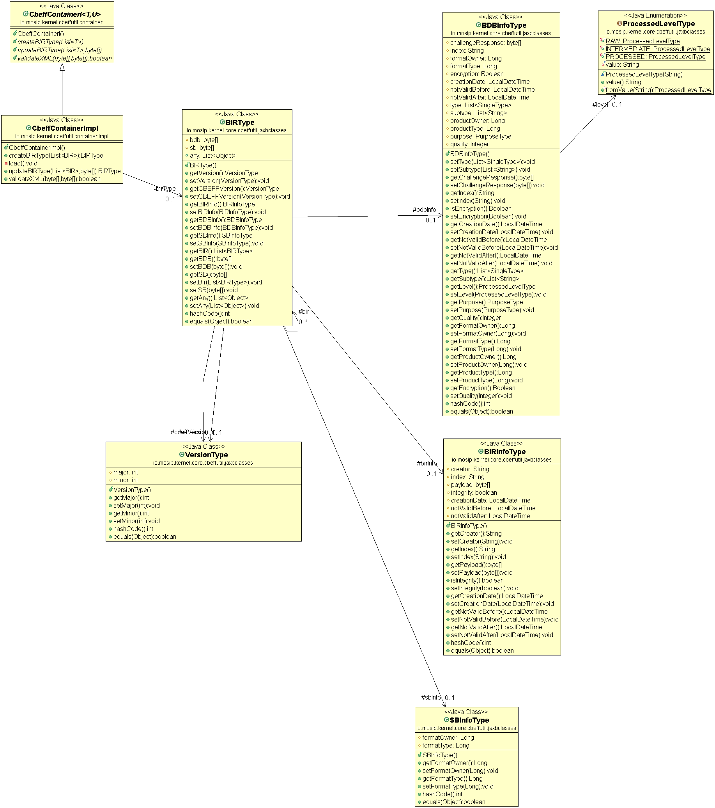

# CBEFF util

#### Background

There are many types of biometric information can be collected as part of the MOSIP platform. There should be a common uniform mechanism to deal with the information. CBEFF is used to achieve this. CBEFF (Common Biometric Exchange Formats Framework) is a set of ISO standards defining an approach to facilitate serialisation and sharing of biometric data in an implementation agnostic manner. This is achieved through use of a data structure which both describes, and contains, biometric data.

#### Solution

**The key solution considerations are**

- A standard format of the biometrics data have to be described. 

- The format should be standard across the ABIS utilities 

- The CBEFF file will be of XML format. The validations of any XML file have to be validated with the XSD in the MOSIP platform to confirm the validity of the document. 

- The incoming CBEFF file have to be converted to the Java object. The XSD also gets converted to Java representation. Once the conformity is validated, the data from the CBEFF file can be utilized. 

- The CBEFF contains the list of BIR(Biometric Identification Records)

- The structure of the BIR is as follows, 

	- BIR Biometric Identification Record
		- version
		- CEFFVersion
		- BIRInfo
		- BDB info(Biometric Data block)
			- FormatOwner
			- FormatType
			- Creation Data
			- Type
			- Subtype
			- purpose
			- quality
		- SB Info (Signature block)
		- byte array of the ISO image
		- byte array of signature image
		- Any elements
 
- The CBEFF util supports the following functions, 
	1. Create CBEFF file. 
	2. Update a CBEFF file. 
	3. Search based on BDB info type
	4. Search based on BDB info sub type

**High Level Diagram**

**Class diagram**

## Implementation

**kernel-cbeffutil** [README](../../../kernel/kernel-cbeffutil-api/Readme.md)
