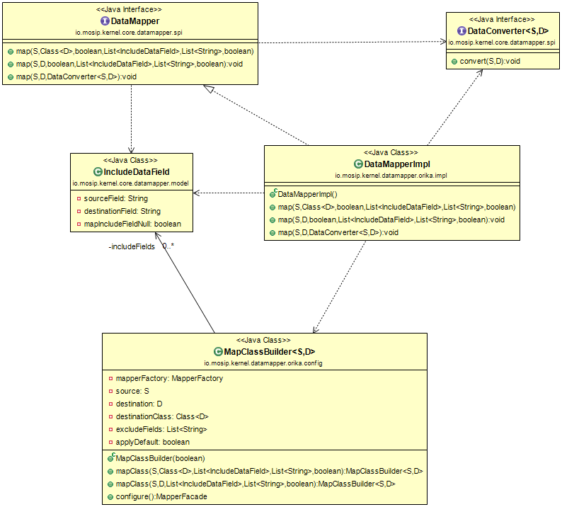

## Data Mapper

**Background**

This library can be used to facilitate data mapping between objects. It contain a series of methods that accept following parameters:

-	Source Object

-	Destination Object / Class

-	Mapping Fields to include

-	Fields to exclude

-	Null mapping

-   Default mapping

- 	Data converter

**Solution**

**The key solution considerations are**

- Create an interface for DataMapper and DataConverter having required method declaration, which will be exposed to the other applications.

- Create a project which will have Data Mapper implementation based on Orika API.

- DataMapper can be used in any MOSIP module for encryption and decryption after adding crypto implementation to their class path.

**Class diagram**

## Implementation

**kernel-datamapper-orika** [README](../../../kernel/kernel-datamapper-orika/README.md)