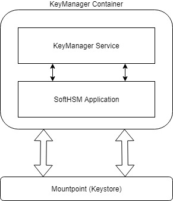

# Dockerize SoftHSM

#### Background

The key manager uses the SoftHSM software to store the keys. The SoftHSM software also will be bundled as the part of key manager. An external volume will be mounted to the container, where the keys are stored. Each time the container gets started, the SoftHSM will be installed and it will load all the keys from the mount. 

#### Solution

**The key solution considerations are**

- When the Key Manager starts, it have to install the associated SoftHSM software itself. 

- The old keys which had been created should be persisted each time. 

- When the key manager starts for the next time, it have to load all the old keys which was generated during the earlier sessions. 

**Module diagram**

