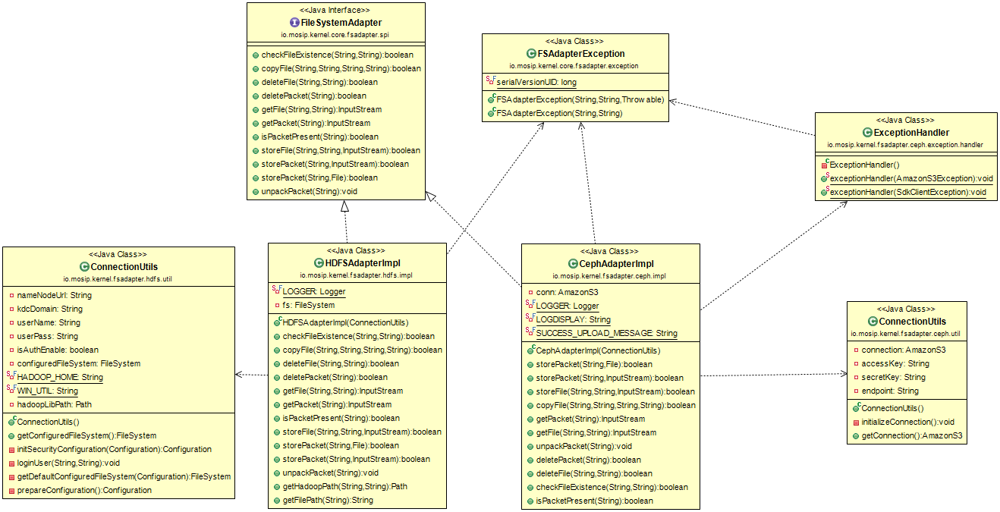

# File System adapter

#### Background

MOSIP system can use multiple file systems. For example, the files system can be HDFS, CEPH etc., A common adapter should be used to plugin whatever the file systems. 

#### Solution

**The key solution considerations are**

- The file system implementation should not affect the base design. 

- When MOSIP decides to switch the file system, it should be configurable. 

**Class diagram**

## Implementation

**kernel-fsadapter-hdfs** [README](../../../kernel/kernel-fsadapter-hdfs/Readme.md)
