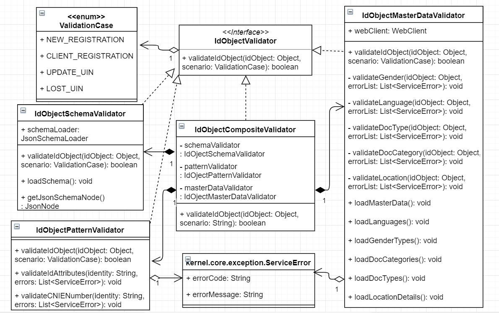
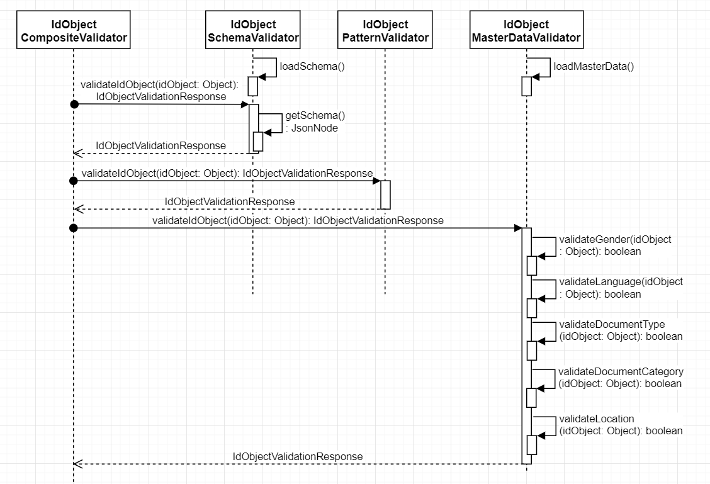

# ID Object Validator:

## 1. Background

This library can be used to validate ID Object. It performs below 4 validations.
1. Validate input ID JSON String against ID Schema configured for the country
2. Validate ID attributes against configured regex patterns
3. Validate ID attributes like Gender, Language, DocumentType, Location, etc. against Master Data APIs
4. Validate Country-specific ID attributes

**Note -**
1. This IDObject Validator needs to be modified if there is any change made to the ID Object for any country
2. The ID Attributes added in ID Schema are for reference purpose. Additional ID attributes for a country can be added
3. If any additional attributes added or existing one removed from ID Schema, corresponding validations needs to be modified in the IDObject Validator

***1.1.Target Users -***  
- Pre-Registration and Registration Processor can use ID Object Validator to validate ID Object against ID Schema configured for the country, and data of few ID attributes against Master Data stored for the country
- Registration Client can use ID Object Validator to validate created ID Object against ID Schema for the country, verification for ID Attributes for Registration Processor will happen against their local database

***1.2. Key Non-Functional Requirements -***   
-	Logging :
	-	Log all exceptions along with error code and short error message
	-	As a security measure, Individual’s UIN should not be logged
-	Audit :
	-	Audit all transaction details in database
	-	Individual’s UIN should not be audited     
-	Exception :
	-	Any error in storing or retrieval of Identity details should be handled with appropriate error code and message in the response  
-	Security :  

## 2. Solution:    

The key solution considerations are - 
- Create an interface IDObjectValidator with a method to validate input ID JSON
- Create a project which implements IDObjectValidator based on any opensource json-schema-validator. Current implementation uses Draft v7 specifications of [JSON Schema](http://json-schema.org/)
- IDObjectValidator can be used in any MOSIP module to validate ID Object, after adding its jar in their class path

**2.1. Class Diagram:**    

**2.2. Sequence Diagram:**    

**2.3. Implementation**
WIP
