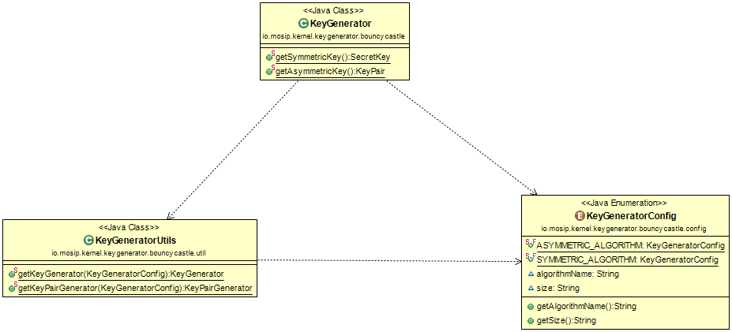

# Symmetric key and Asymmetric key pair Generator

#### Background

This library can be used to generate symmetric secret key and asymmetric public-private key pair based on defined set of algorithms. It contains two methods which provide symmetric key and asymmetric key pair.

#### Solution

**The key solution considerations are**

- Create an interface for KeyGenerator having required method declaration to provide symmetric/asymmetric keys, which will be exposed to the other applications.

- Create a project which implements KeyGenerator with set of algorithms based on Bouncycastle API.

- KeyGenerator can be used in any MOSIP module for  to generate symmetric/asymmetric keys after adding KeyGenerator implementation to their class path.

**Class Diagram**

## Implementation

**kernel-keygenerator-bouncycastle** [README](../../../kernel/kernel-keygenerator-bouncycastle/README.md)