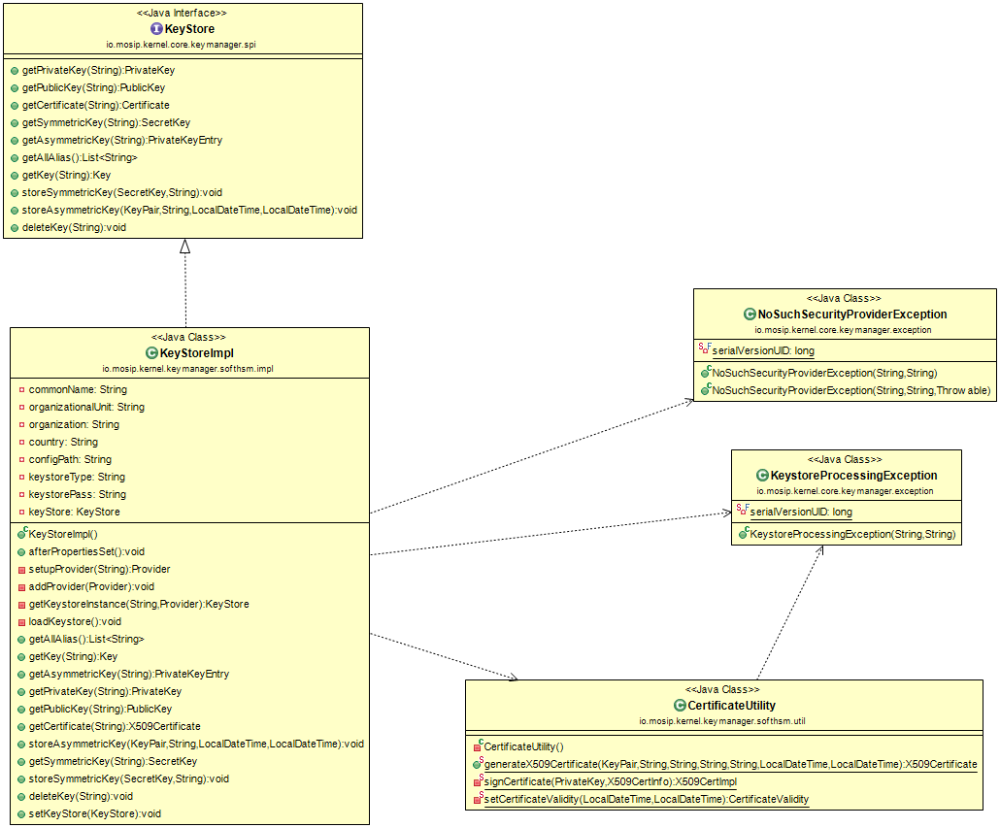

# Keymanager Softhsm:

## Background

This library can be used to interact with SoftHsm key store. It contains several methods to store and retrieve Keys and Certificates as:

1. Get All Alias
2. Get/Delete key for specific Alias
3. Store/Get Symmetric key for specific Alias
4. Store/Get Asymmetric key for specific Alias
5. Get Private key for specific Alias
6. Get Public key for specific Alias
7. Get Certificate for specific Alias

## Solution:

**The key solution considerations are**

- Create an interface KeyStore having required method declaration to to store and retrieve Keys and Certificates, which will be exposed to the other applications.

- Create a project which implements KeyStore interface.

- KeyStore can be used in any MOSIP module to validate after adding its implementation to their class path.

[dockerizesofthsm](kernel-dockerizesofthsm.md)

**Class Diagram:**

## Implementation

**kernel-keymanager-softhsm** [README](../../../kernel/kernel-keymanager-softhsm/ReadMe.md)
