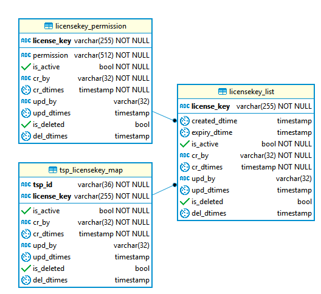

# License key generation and validation

#### Background

TSPs call the IDA to authenticate the Individuals. There can be various service calls such as Demographic, biometric based authentications. Each service calls have the permission associated. When a service call comes to the IDA, a request is sent to the Kernel module to retrieve the permissions for the License Key.
This service can be used to generate,assign permission and validate License key based on expiry date, suspended or blocked for a TSP Id. Service has REST API exposed for fetching and validating License key. 

#### Solution


**The key solution considerations are**

- A service is defined to receive the request to generate a new license key for a TSP. 

- Another service associates the license key with the list of permissions. 

- Another service accepts the incoming requests from the TSPs should be validated for authentication. Check whether the TSPs has the valid license.  

- Then the permissions are retrieved for the identified TSPs. 

- Return the permissions associated with the License keys.  

**Module diagram**


- Request body model for licenseKey generate POST **/license/generate**


```
{
  "licenseExpiryTime": "2019-03-07T10:00:00.000Z",
  "tspId": "9837"
}
```
**Example Response**

```JSON
{
  "licenseKey": "gR7Mw7tA7S7qifkf"
}
```

- Request body model for licenseKey-Tsp map POST **/license/permission**


```JSON
{
  "licenseKey": "gR7Mw7tA7S7qifkf",
  "permissions": [
    "OTP Trigger","OTP Authentication"
  ],
  "tspId": "9837"
}
```
**Example Response**

```JSON
{
  "status": "Mapped License with the permissions"
}
```


- Request for Validation and Permissions Get **/license/permission**


```
license/permission?licenseKey=gR7Mw7tA7S7qifkf&tspId=9837
```

**Example Response**

```JSON
{
  "permissions": [
    "OTP Trigger",
    "OTP Authentication"
  ]
}
```


**Class Diagram**


**ERD**





## Implementation


**kernel-otpmanager-service** [README](../../../kernel/kernel-otpmanager-service/README.md)


