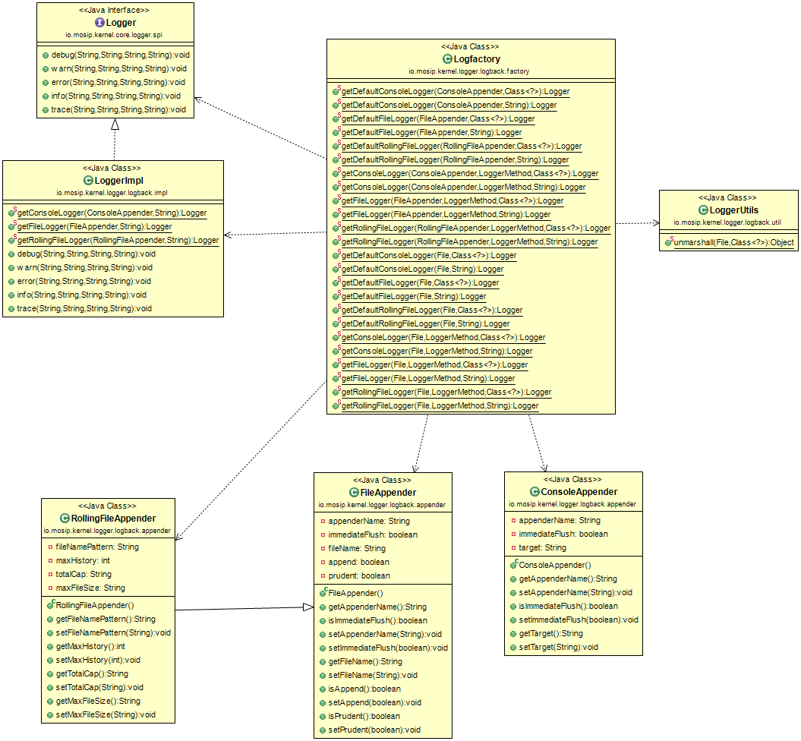

# Logger

#### Background

This application can be used to log execution steps and errors with customized messages and format. It has three different options for logging as:

- Console

- File

- Rolling File

#### Solution

**The key solution considerations are**

- Create an interface for Logger having required method declaration to provide logging functionalities, which will be exposed to the other applications.

- Create a project which implements Logger based on Logback API.

- Logger can be used in any MOSIP module for for logging after adding KeyGenerator implementation to their class path.

**Class Diagram**

## Implementation

**kernel-logger-logback** [README](../../../kernel/kernel-logger-logback/README.md)