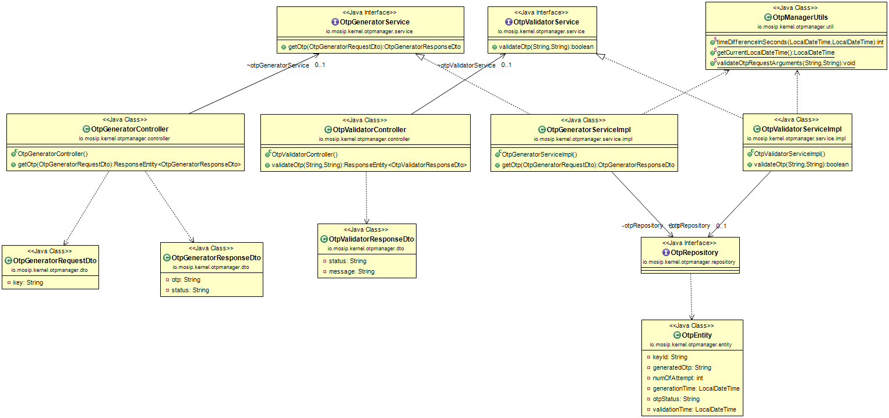

# One Time Password (OTP) Service

#### Background

This service can be used to generate and validate OTP based on configured business rules. Service has REST API exposed for OTP. 


#### Solution


**The key solution considerations are**


- Create a project which provides REST service to generate and validate OTP.


- REST service can be used by any MOSIP module for OTP through HTTP client.

- The algorithm used to generate the OTP is from the source code, https://github.com/google/google-authenticator-android/blob/master/AuthenticatorApp/src/main/java/com/google/android/apps/authenticator/OtpProvider.java


- Request body model for OTP generate POST **/otpmanager/otps**

```
{
  "key": "requestId12378"
}
```


- Response body model for POST **/otp/generate**

```
{
  "otp": "029983",
  "status": "GENERATION_SUCCESSFUL"
}
```


- Request for OTP validation GET **/otp/validate?key=string&otp=029983**


- Response body model for GET **/otp/validate?key=string&otp=029983**

```
{
  "status": "success",
  "message": "VALIDATION SUCCESSFUL"
}
```


**Class Diagram**





**ERD**


## Implementation


**kernel-otpmanager-service** [README](../../../kernel/kernel-otpmanager-service/README.md)

