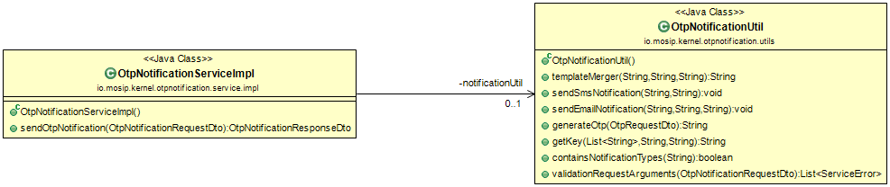

# OTP Notification Service

#### Background

This service can be used to send otp through email or/and sms based on request.This service make use of Kernel's OTP Manager service for OTP generation, Kernel Email and SMS services to send out notification. Service has REST API exposed to send messages and attachments through Email. 


#### Solution


**The key solution considerations are**


- Create a project which provides REST service to send email.


- Service can send email/SMS request to kernel service and responds back immediately. 


- REST service can be used by any MOSIP module to send email through HTTP client.


- Request body model for POST **/otpnotifier/otp/send**

(curl sample)

```
{
  "emailBodyTemplate": "Your OTP is $otp",
  "emailId": "testmail@tmail.com",
  "emailSubjectTemplate": "Test Mail",
  "mobileNumber": "1234567890",
  "notificationTypes": [
    "email","sms"
  ],
  "smsTemplate": "Test SMS $otp"
}
```


- Response body model

HttpStatus: 202 Accepted


```
{
  "status": "success",
  "message": "Otp notification request submitted"
}
```

**Class Diagram**





## Implementation


**kernel-otpnotification-service** [README](../../../kernel/kernel-otpnotification-service/README.md)
