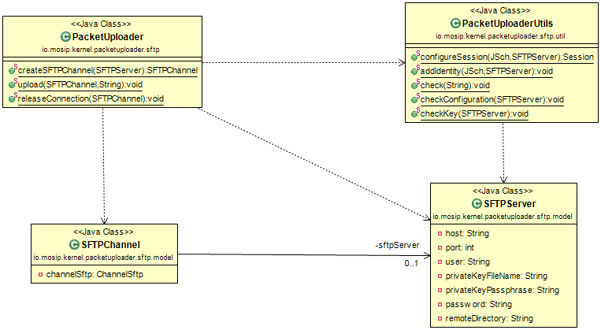

# SFTP Client

#### Background

This library can be used as a SFTP client to upload files/packets to SFTP server. It has series of operations to perform as:

- Creating SFTP channel providing SFTP server details

- Upload files

- Release the connection
 

#### Solution

**The key solution considerations are**

- Create a project which implements SFTP client using SSH connection based on Jcraft JSCH API.

- SFTP Client can be used in any MOSIP module for upload files after adding KeyGenerator implementation to their class path.

**Class Diagram**

## Implementation

**kernel-packetuploader-sftp** [README](../../../kernel/kernel-packetuploader-sftp/README.md)