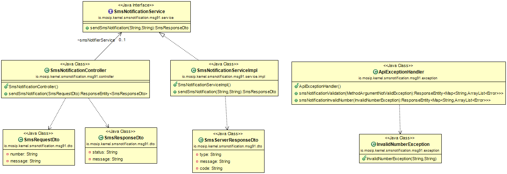

# SMS Notification Service

#### Background

This service can be used to send sms through configured SMS gateway. Service has REST API exposed to send messages through SMS. 


#### Solution


**The key solution considerations are**


- Create a project which provides REST service to send SMS.


- REST service can be used by any MOSIP module to send SMS through HTTP client.


- Request body model for POST **/notifier/sms**

```
{
  "message": "OTP-66776666",
  "number": "8980889888"
}
```


- Response body model for POST **/notifier/sms**

HttpStatus: 202 Accepted

```
{
  "status": "success",
  "message": "Sms Request Sent"
}
```


**Class Diagram**





## Implementation


**kernel-smsnotification-service** [README](../../../kernel/kernel-smsnotification-service/README.md)
