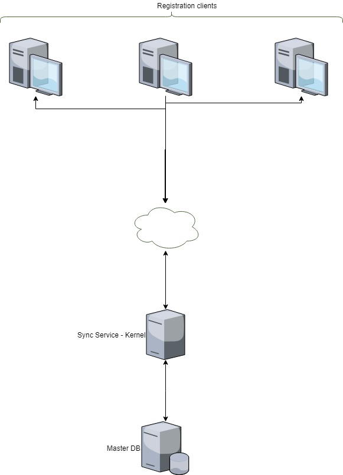

# Sync services

#### Background

There can be applications in the MOSIP platform which can go in offline mode. During these times, the MOSIP platform data should be available to them such as Master data, user data etc., This service gives the list of master data to the caller. 

#### Solution

**The key solution considerations are**

- The service should return all the master data in MOSIP platform. 

- Based on the requested timestamp, only the delta changes are returned. If the requested timestamp is empty, all the data is returned. 

- In all scenarios, 200 error codes is returned. 

**Module diagram**

**ERD**

## Implementation

**kernel-syncdata-service** [README](../../../kernel/kernel-syncdata-service/README.md)
