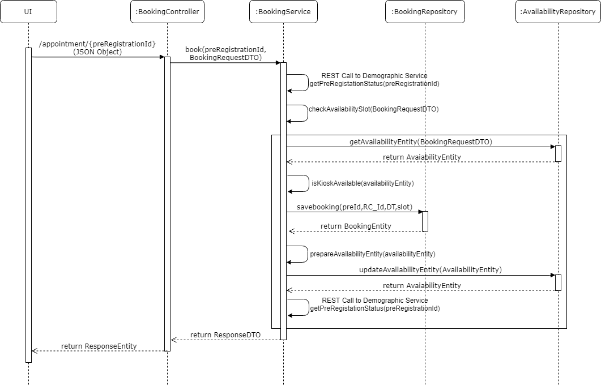
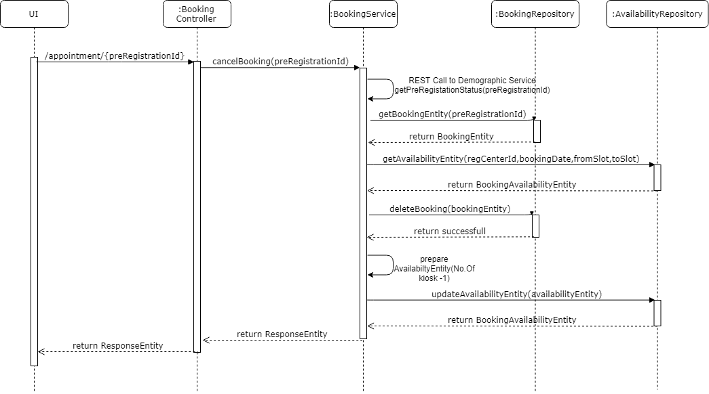
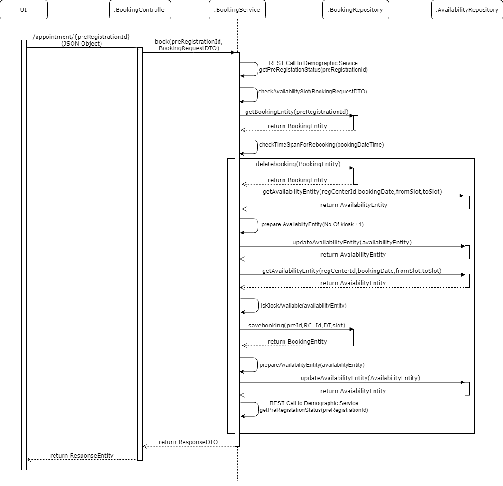
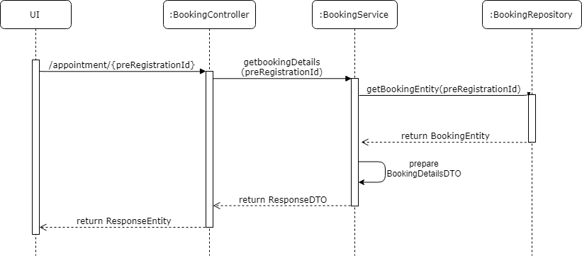

# Approach for Pre-Registration Booking Service

**Background**
- Exposing the REST API to book/cancel/modify a appointment for a citizen.

The target users are -
   - Pre-Registration portal

The key requirements are -

-   Create Booking APIs to book an appointment for the selectd Registration center and the availability time slot for the Registration center, rebook an appointment, cancel an appointment, reterive appointment details, reterive availability for the registration center.

- This ablove details need to store in a pre-registration database. Once storing the data is completed then system need to update the availability time slots for the particular registration center.

- Once the availability time slots for the particular registration center get updated successfully then an status need to update the pre-registration status as "Booked".

The key non-functional requirements are

-   Log the each state of the pre-registration creation:

    -   As a security measures the Pre-Id or applicant information should not be logged.

-   Audit :

    -   Each state of the Pre-Registration appointment booking should be stored into the Database for audit purpose.

    -   Pre-reg Id and important detail of the applicant should not be audited.

-   Exception :

    -   Any exception occurred during the registration booking, the same will be reported to the user with the user understandable exception.

**Solution**

**Booking an appointment :**

- Create a REST API as '/appointment/{preRegistrationId}' POST method, which accept the PreRegistrationId as path parameter and in request body json object contains registration center id, booking date, from slot and to slot.

- Check for the pre-registration whether it is existing or not and check for availability slot for the requested details.

- Update the availability by decrementing the value by 1.

- Save the booking data in the pre-registration booking table. after inserting the booking data system need to update the main table (applicant_demographic) with the status code "Booked"

- Audit the exception/start/exit of the each stages of the Pre-registration create mechanism using AuditManager component.

**Class Diagram**

**Sequence Diagram**

**Booking an multiple appointment :**

- Create a REST API as '/appointment/' POST method, which accept the json object from request body which contains PreRegistrationId, registration center id, booking date, from slot and to slot.

- Itrate the booikng request and check for the pre-registration whether it is existing or not.

- Check for the pre-registration whether it is existing or not and check for availability slot for the requested details.

- Update the availability by decrementing the value by 1.

- Save the booking data in the pre-registration booking table. after inserting the booking data system need to update the main table (applicant_demographic) with the status code "Booked"

- Audit the exception/start/exit of the each stages of the Pre-registration create mechanism using AuditManager component.

**Class Diagram**

**Sequence Diagram**

**Cancel an appointment :**

- Create a REST API as '/appointment/{preRegistrationId}' PUT method, which accept the Pre-Registration Id as path parameter.

- Update the availability by incrementing the value by 1.

- Delete the booking data in the pre-registration booking table. after deletion of booking data, system need to update the main table (applicant_demographic) with the status code "Pending_Appointment"

- Audit the exception/start/exit of the each stages of the Pre-registration Cancel Booking mechanism using AuditManager component.

**Class Diagram**

**Sequence Diagram**

**Re-Booking an appointment :**

- Create a REST API as '/appointment/{preRegistrationId}' POST method, which accept the PreRegistrationId as path parameter and in request body json object contains registration center id, booking date, from slot and to slot.

- Reterive the existing booking details and update the availability by incrementing the value by 1.

- Delete the booking data in the pre-registration booking table. after deletion of booking data, system need to update the main table (applicant_demographic) with the status code "Pending_Appointment"

- Update the availability by decrementing the value by 1 for the requested registration center id, booking date, from slot and to slot.

- Save the booking data in the pre-registration booking table. after inserting the booking data system need to update the main table (applicant_demographic) with the status code "Booked"

- Audit the exception/start/exit of the each stages of the Pre-registration Re Booking mechanism using AuditManager component.

**Class Diagram**

**Sequence Diagram**

**Get appointment details :**

- Create a REST API as '/appointment/{preRegistrationId}' GET method, which accept the Pre-Registration Id as path parameter 

- Reterive the booking details from database based on the requested Pre-Registration Id.

- Prepare an response with the fetched values and send this reponse to this API call.

- Audit the exception/start/exit of the each stages of the Registration center availability mechanism using AuditManager component.

**Class Diagram**

**Sequence Diagram**

**Get Registration center availability :**

- Create a REST API as '/appointment/availability/{registrationCenterId}' accept the Registration center id in the request path parameter.

- Get the configured offset from the properties file and prepare the date range

- Reterive the availability time slots from database based on the requested registration center id and the date range.

- Prepare an response with the fetched values and send this reponse to this API call.

- Audit the exception/start/exit of the each stages of the Registration center availability mechanism using AuditManager component.

**Class Diagram**

**Sequence Diagram**

**Get Pre-Registration IDs by Appointment date range :**

- Create a REST API as '/appointment/preRegistrationId/{registrationCenterId}' accept the Registration center id

- Get the current system date time from the pre-registration application portal.

- Need to calaculate "To Date" from the configuration and the requested Date.

- Reterive the pre-registration IDs from database based on the requested registration center id and the date.

- Prepare an response with the fetched values and send this reponse to this API call.

- Audit the exception/start/exit of the each stages of the Registration center availability mechanism using AuditManager component.

**Class Diagram**

**Sequence Diagram**

**Success / Error Code** 

 While processing the Registration center booking if there is any error or successfully then send the respective success or error code to the UI from API layer as  Response object.

  Code   |       Type  | Message|
-----|----------|-------------|
  PRG_PAM_RCI-001 |  Error   |   User has not been selected any time slot.
  PRG_PAM_RCI_002  | Error   |   Appointment time slot is already booked.
  PRG_PAM_RCI_003  | Error   |   Appointment time slot is already canceled.
  PRG_PAM_RCI_004  | Error   |   Appointment can not be canceled.
  PRG_PAM_RCI_005  | Error   |   Appointment Rebooking cannot be done.
  PRG_PAM_RCI_006  | Error   |   Registration Center data not found.
  
**Dependency Modules**

Component Name | Module Name | Description | 
-----|----------|-------------|
  Audit Manager     |   Kernel        |    To audit the process while creating the pre-registration.
  Exception Manager  |  Kernel     |       To prepare the user defined exception and render to the user.
  Log        |          Kernel         |   To log the process.
  Database Access   |    Kernel      |      To get the database connectivity

**User Story References**

  **User Story No.** |  **Reference Link** |
  -----|----------|
  **MOS-664**      |     <https://mosipid.atlassian.net/browse/MOS-664>
  **MOS-665**      |     <https://mosipid.atlassian.net/browse/MOS-665>