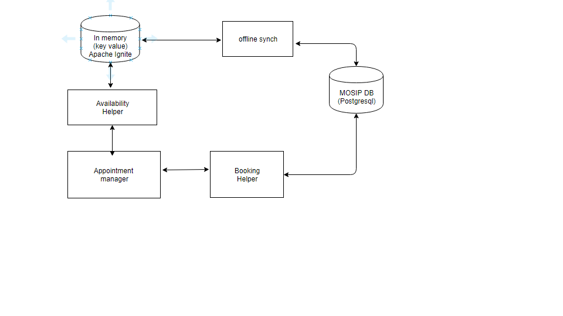

# Approach for Booking and availibility.

**Background**
- Pre registration has booking module where citizen could book the time slot for a given registration centre.

The target users are -
   - Citizen

The key requirements are -
-   Able to search registration center with multiple criterias.
-  Get the availibility of the regiostartion centre for a given date.
- Reserving a time slot.

NFR-
1. availibility shoiuld be consistentely updated and viewed.
2. NFR for the response time shold be 3 seconds.
3. availibility server side transacion should be 200ms.

 

**Solution**

**component Diagram**

