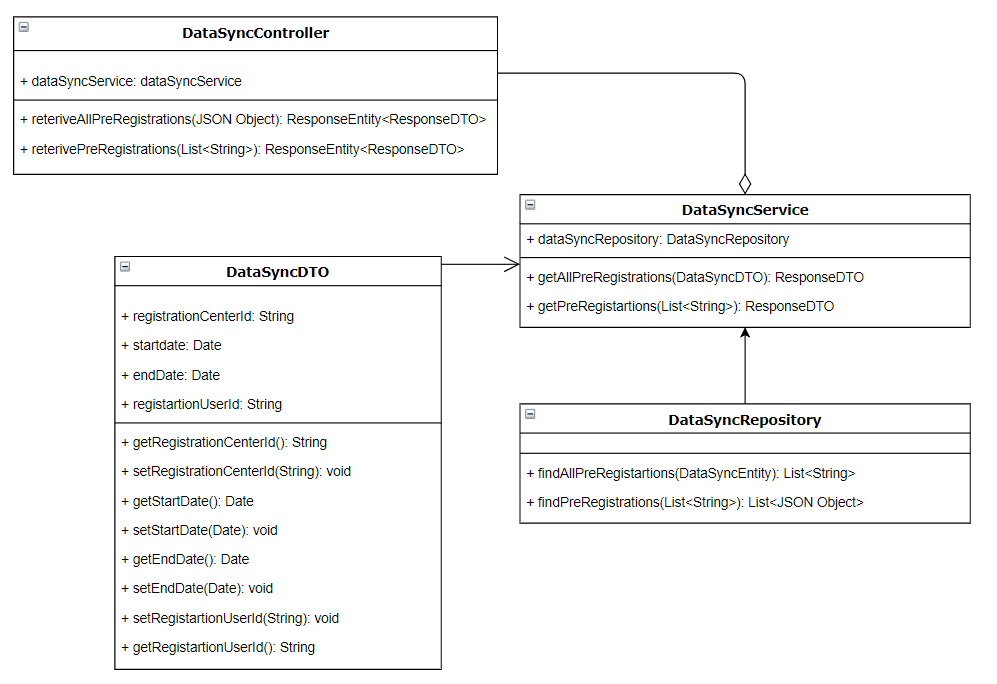
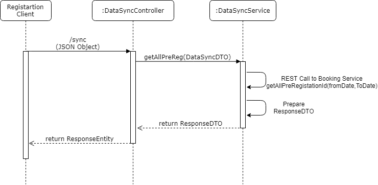
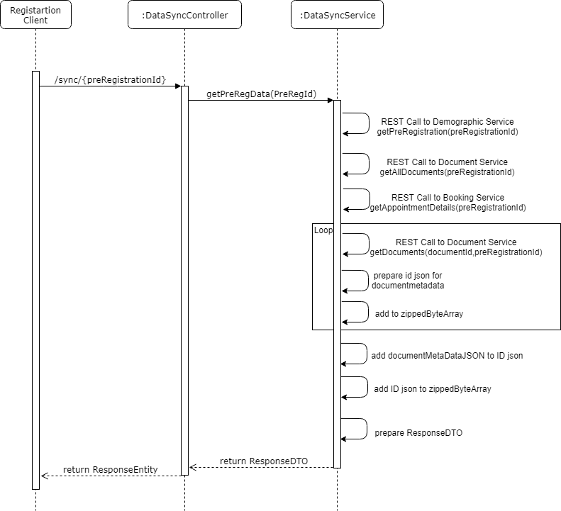
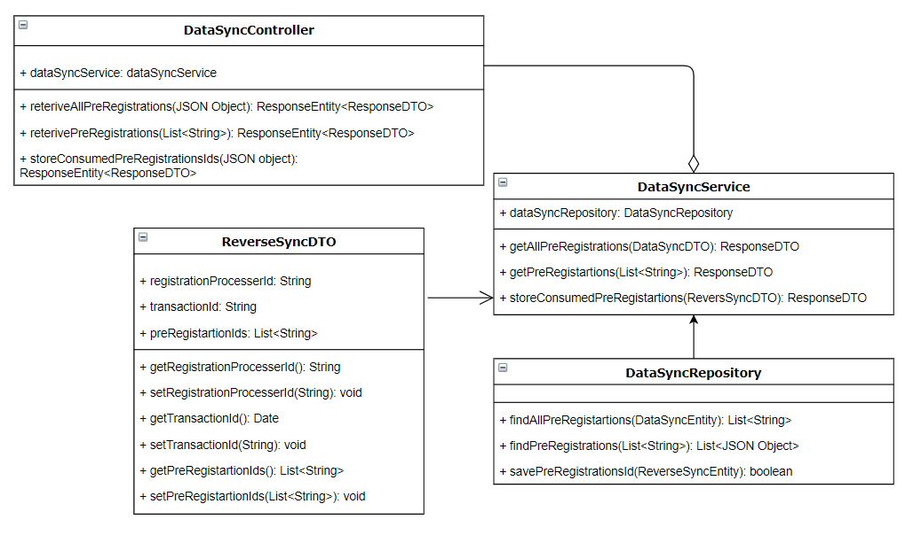

# Approach for Data Sync Service

**Background**
- Exposing the API to Registration client will provide with the list of Pre-Registration IDs for which they wants to get Pre-Registration Data.
- Expose the API to Registration Processer will provide with the list of Pre-Registration IDs for which it wants to update Pre-Registration status.

The target users are -
   - Registration Client and Registration Processer

The key requirements are -
- Create the REST API to Registration client, list of Pre-Registration IDs for which it wants to get Pre-Registration Data.

- Another REST API to Registration client, they will provide Pre-Registration Id to get the pre-registration data in zipped format. which consisting of ID.json and Documents.

- Create the REST API to Registration Processer will provide with the list of Pre-Registration IDs for which they consumed.

The key non-functional requirements are

- Security :
    - The Pre-Registartion securly share the pre-registration data to registration client.
    - Reponse signature.
	
- Log the each state of the data sync:
    -   As a security measures the Pre-Id/registration client/registration processor information should not be logged.

- Audit :
    - User ID, RC ID, Transaction ID, Timestamp should be stored into the DB for audit purpose.
    - Pre-reg Id and important detail of the applicant should not be audited.
	- Registartion processor ID, Transaction ID, Timestamp should be stored into the DB for audit purpose.

-   Exception :
    -   Any exception occurred during the pre-registration data sync, the same will be reported to the registration client in a understandable exception.

	
**NFRs -**

1. Pre registration would expose Datasynch service. this is REST over HTTPS.

2. Registration client would call the service

3. the result would be fetched from DB and zipped information delivered.

4. security architecture would depict the security scenarios other than HTTPS.

5. multiple clients and pre registration is source of data.

6. registration client should be online to get the data.

7. NO intermidiate server to suport mobility of registration client.

8. HTTPS provides end point security.

 

**Solution**

**Reterive all pre-registration Ids :**

- Create a REST API as '/sync' POST Method, which accept the Data Sync JSON object from the request body.

- The JSON object contains Registration Center ID, Appoointment Date Range(Start Date, End Date).

- The System will generate a Transaction ID and  fetch all the Pre-Registrations within the Date Range(Start Range, End Date) and for the Registration Center ID received.

- The System will calculate the count of the Pre-Registration IDs being sent.

- The System will send the List of Pre-Registration Ids, count of Pre-Registrations and transaction id in response entity .

- Audit the exception/start/exit of the each stages of the data sync mechanism using AuditManager component.

**Class Diagram**

**Sequence Diagram**

**Reterive Pre-Registartions:**

- Create a REST API as '/sync' GET Method, which accept the pre-registration id from the request path parameter.

- The System will generate a Transaction ID and do the following operation need to be happens:

	 Step1: fetch the demographic JSON object and appointment date time and decrypt JSON object, if successful go to next step otherwise throw an exception.

	 Step2: fetch all the document metadata and prepare the JSON structure and append it to the ID JSON object. fetch the perticular document, if successful go to next step otherwise throw an exception.

	 Step3: preapre a zip file and ResponseDTO.{zip file structure need to discuss}

-   Audit the exception/start/exit of the each stages of the data sync mechanism using AuditManager component.

**Class Diagram**

**Sequence Diagram**

**Store all pre-registration Ids :**

- Create a REST API as '/sync/consumedPreRegIds' POST method accept the JSON object from the registration-processor.

- The Registration Processor will provide the List of Pre-Registration IDs received by it(from Registration Client). 

- The System will generate a Transaction ID and store all the Pre-Registration ids in "prereg-i_processed_prereg_list" table and update in "prereg-processed_prereg_list" table.

- The "prereg-i_processed_prereg_list" table is not permanent, for maintanance purpose database team can truncate this table.

- A batch job need to be running to update the application.demoraphic table with "Processed" status.

- Once Pre-Registration successfully processed. System will send an Acknowledgement of the Receipt ("need to be check BA(Vyas)")

- Audit the exception/start/exit of the each stages of the reverse data sync mechanism using AuditManager component.

**Class Diagram**

**Sequence Diagram**

**Success / Error Code** 
   - While processing the Pre-Registration if there is any error or successfully then send the respective success or error code to the UI from API layer as  Response object.

  Code   |       Type  | Message|
-----|----------|-------------|
  0000      |             Success |   Packet Successfully created

  
  
  

**Dependency Modules**

Component Name | Module Name | Description | 
-----|----------|-------------|
  Audit Manager     |   Kernel        |    To audit the process while data sync.
  Exception Manager  |  Kernel     |       To prepare the user defined exception and render to the user.
  Log        |          Kernel         |   To log the process.
  Database Access   |    Kernel      |      To get the database connectivity

**User Story References**

  **User Story No.**|**Reference Link**

  **MOS-668**      |     <https://mosipid.atlassian.net/browse/MOS-668>
  **MOS-1999**       |    <https://mosipid.atlassian.net/browse/MOS-1999>