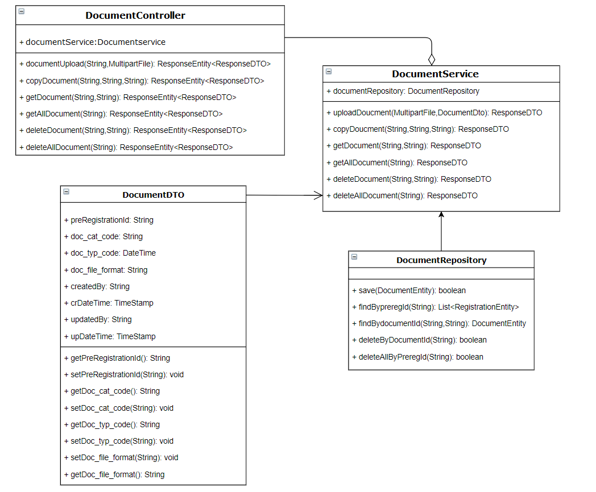
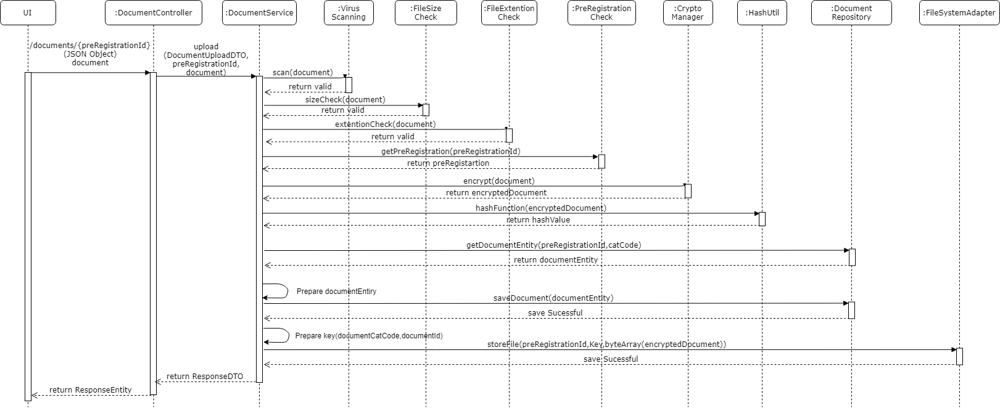
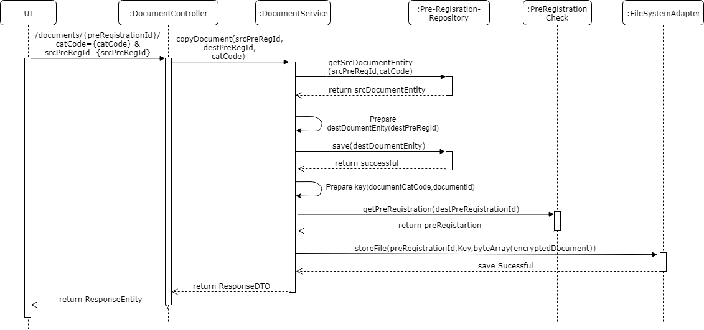
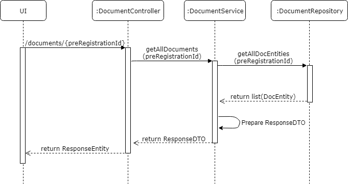
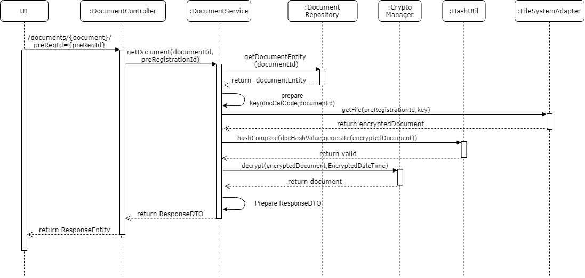
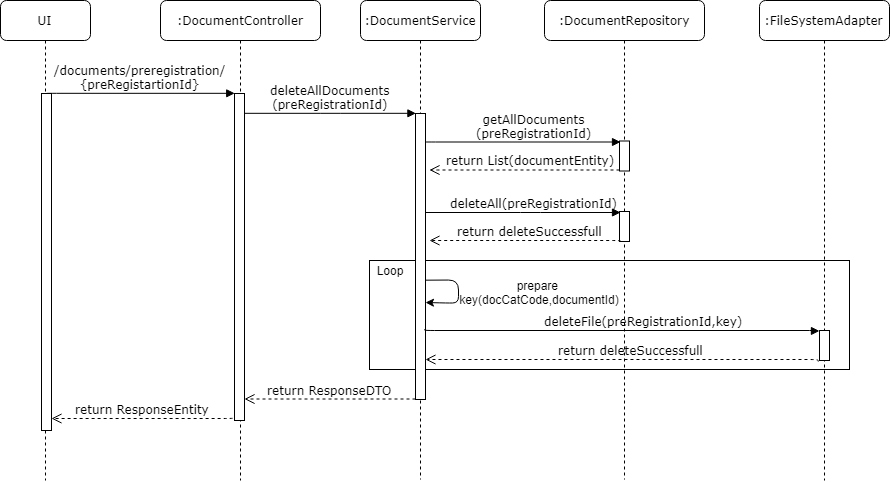

# Approach for pre-registration document service

**Background**
- Exposing the REST API to store the supporting documents of the citizen for a pre-registration.

The target users are -
   - Pre-Registration portal
   
The key requirements are -

- Create the APIs to store, modify, delete and reterive the supporting document of the citizen for a pre-registration.

- For each document upload it should hit the rest api to store the document in database.

- There should be a copy document option in the UI prospective, Once it get checked then an REST API call should happen with source pre-registation id, destination pre-registartion id and document catageory type, with this parameter document get copied to the destination pre-registartion id in database.

- Get all the documents associated with pre-registartion id. 

- Get particular document associated with document id. 

- Delete particular document by providing the document id and pre-registartion id.

The key non-functional requirements are

-   Security :
    - Document should be encrypted.
	- Generate hash out of encrypted document.
	- Store the encrypted document in HDFS.
	- Compare hash while reteriving the data.

-   Log the each state of the pre-registration creation:
    -   As a security measures the Pre-Id or applicant information should
        not be logged.
		
-   Audit :
    -   Each state of the document service should be stored into the DB for audit purpose.
    -   Pre-reg Id and important detail of the applicant should not be audited.

-   Exception :
    -   Any exception occurred during the pre-registration, the same will be reported to the user with the user understandable exception.

**Solution**

**Class Diagram**

**Document Upload:**

- Create a REST API as '/documents' with POST method which accept the pre-registartion id from the request path parameter, document and document's JSON object from the request part parameter.

- Encrypte the document with current timestamp and set the timestamp to the document entity. If the encryption is successful continue otherwise throw an respective error message. 

- Generate hash out of encrypted document and set it to the document entity. If the hash function is successful continue otherwise throw an respective error message. 

- Save the encrypted document into the file system using KERNEL API. If file system store is successful continue otherwise throw an respective error message. 

- Save new per-registartion document entity in the database. If data save successful in database render the successful response otherwise any database exception occures then rollback the current transaction and throw the respective exception otherwise.

- Audit the exception/start/exit of the each stages of the document save mechanism using AuditManager component.

**Sequence Diagram**

**Document Copy:**

- Create a REST API as '/documents' with PUT method which accept the pre-registartion id from the request path parameter, document catageory code and source pre-registartion id from the request query parameter.

- Get the existing source per-registartion document entity from database by source pre-registartion id and catageory code. If data is not present in the database throw an respective exception.

- Create an document entity for the specified pre-registartion id and set the values from the source per-registartion document entity.

- Save new per-registartion document entity in the database. If data save successful in database render the successful response otherwise any database exception occures then rollback the current transaction and throw the respective exception otherwise.

- Audit the exception/start/exit of the each stages of the document copy mechanism using AuditManager component.

**Sequence Diagram**

**Reterive All documents metadata for the pre-registartion:**

- Create a REST API as '/documents' with GET method which accept the pre-registration id from request parameter.

- Get the all document entity from database by pre-registartion-id. If data is not present in the database throw an respective exception.

- Loop all document entities and reterive the required field values from the entity and construct an object and assign to the list otherwise throw an respective exception.

- Send the list of object into the response.

- Audit the exception/start/exit of the each stages of the Pre-registration reterive all documents metadata mechanism using AuditManager component.

**Sequence Diagram**

**Reterive document :**

- Create a REST API as '/documents' with GET method which accept the document id from request parameter and pre-registartion-id from query parameter.

- Get the existing document entity from database by document id. If data is not present in the database throw an respective exception.

- Get the pre-registartion-id from the query parameter and compare with pre-registartion-id present in entity, if it success then proceed with next operation otherwise throw an respective exception.

- Reterive the encrypted document from the FileSystemManager, if it success then proceed with next operation otherwise throw an respective exception.

- Generate hash out of encrypted document and compare with the existing hash from the entity, if it success then proceed with next operation otherwise throw an respective exception.

- Then decrypt document using timestamp of encryption by using KERNEL API, send a successful response with document bytearray otherwise throw an respective exception.

- Audit the exception/start/exit of the each stages of the Pre-registration reterive document mechanism using AuditManager component.

**Sequence Diagram**

**Discard Document:**

- Create a REST API as '/documents' with DELETE method which accept the document id from request parameter.

- Get the existing document entity from database by document id. If data is not present in the database throw an respective exception.

- Delete the record from the database and delete the encrypted document from the file system and send the success response otherwise throw an respective exception.

- Audit the exception/start/exit of the each stages of the Pre-registration document delete mechanism using AuditManager component.

**Sequence Diagram**

**Discard All Document:**

- Create a REST API as '/documents/preRegistration' with DELETE method which accept the pre-registration id from request parameter.

- Get the all document entities from database by pre-reg id. If data is not present in the database throw an respective exception.

- Loop the document entities and delete the record from the database and delete the encrypted document from the file system and send the success response otherwise throw an respective exception.

- Audit the exception/start/exit of the each stages of the Pre-registration delete all mechanism using AuditManager component.

**Sequence Diagram**

**Success / Error Code** 

 While processing the Pre-Registration if there is any error or successfully
 then send the respective success or error code to the UI from API layer as  Response object.

  Code   |       Type  | Message|
-----|----------|-------------|
  0000      |             Success |   Packet Successfully created
  PRG_PAM_DOC_001 |  Error   |   Document failed to upload
  PRG_PAM_DOC_002  | Error   |   Document exceeding premitted size
  PRG_PAM_DOC_003 |  Error   |   Document type not supported
  PRG_PAM_DOC_004  | Error   |   Document invalid format
  PRG_PAM_DOC_005 |  Error    |  Document failed in virus scan
  PRG_PAM_DOC_006 |  Error   |  Document failed in quality check
  PRG_PAM_DOC_007  | Error   |   Document failed in encryption
  PRG_PAM_DOC_008  | Error    |  Document failed in decryption
  PRG_PAM_DOC_009  | Error   |   Document not present
  PRG_PAM_DOC_010 |  Error   |   Document failed to delete
  PRG_PAM_DOC_011  | Error   |   Document failed to copy

**Dependency Modules**

Component Name | Module Name | Description | 
-----|----------|-------------|
  FileSystemManager | Kernel | To store the documents in file system
  Audit Manager     |   Kernel        |    To audit the process while creating the pre-registation.
  Exception Manager  |  Kernel     |       To prepare the user defined exception and render to the user.
  Log        |          Kernel         |   To log the process.
  Database Access   |    Kernel      |      To get the database connectivity

**User Story References**

  **User Story No.** |  **Reference Link** |
  -----|----------|
  **MOS-623**      |     <https://mosipid.atlassian.net/browse/MOS-623>
  **MOS-626**      |     <https://mosipid.atlassian.net/browse/MOS-626>
  **MOS-805**       |    <https://mosipid.atlassian.net/browse/MOS-805>
