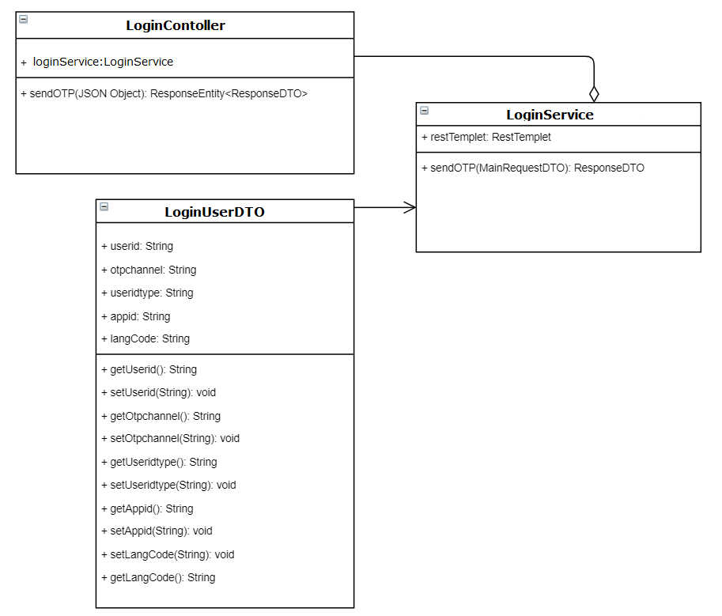
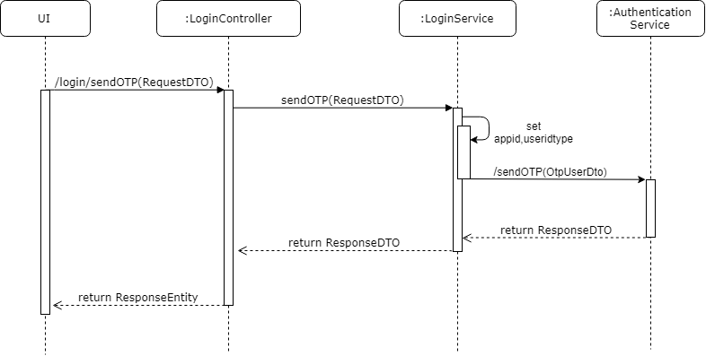
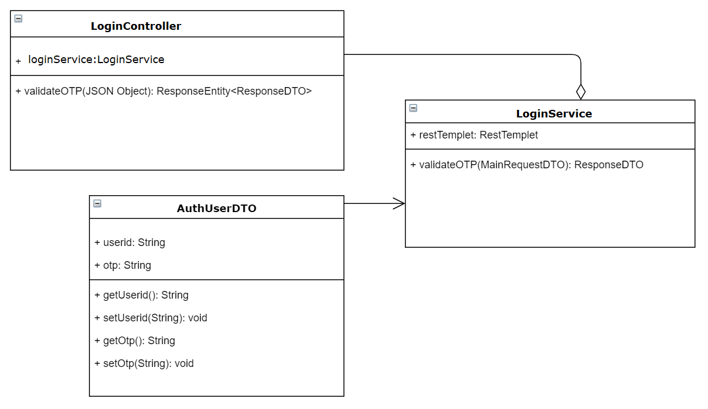
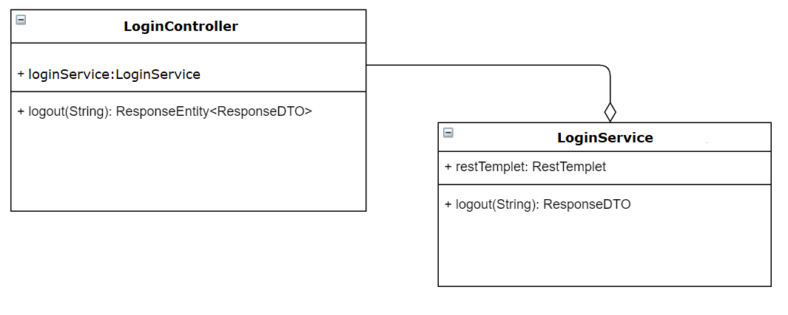
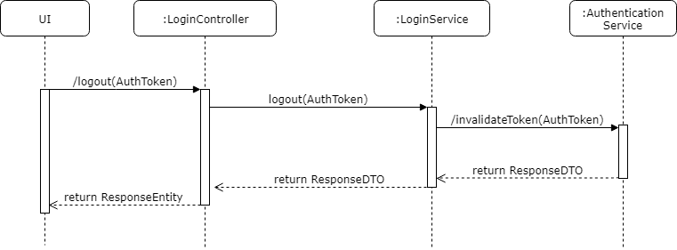
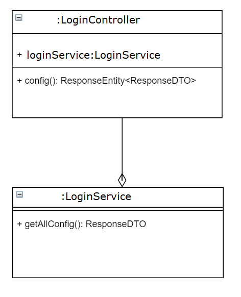

# Approach for Pre-Registration Login Service

**Background**
- Exposing the REST API to authenticate citizen and login to pre-registration portal.

The target users are -
   - Pre-Registration UI

The key requirements -

-   Create the REST API to authenticate citizen by user-id and OTP while login and invalidate the token for logout. which internally call the KERNEL authentication service.

The key non-functional requirements are

-   Log the each state of the pre-registration citizen login:

    -   As a security measures the citizen OTP should not be logged.

-   Exception :

    -   Any exception occurred during the login, the same will
        be reported to the user with the user understandable exception.

**Solution**

**Login - sendOTP :**

- Create a REST API as '/login/sendOtp' POST method, which accept the login JSON object in request body.

- Get the app-id value defined in global configuration and prepare the request object.

- Then do the REST call to send OTP from Authentication service.
refer : https://github.com/mosip/mosip/wiki/AuthN-&-AuthZ-APIs

**Class Diagram**

**Sequence Diagram**

**Error Code** 

 While sending the OTP if there is any error then send the respective error code to the UI from API layer as Response object.

  Code   |       Type  | Message|
-----|----------|-------------|
PRG_AUTH-001 |  Error   |   Failed to send the OTP.

**Login - validateOTP :**

- Create a REST API as '/login/validateOtp' POST method, which accept the login validate JSON object in request body.

- Then do the REST call to validate OTP from Authentication service.
refer : https://github.com/mosip/mosip/wiki/AuthN-&-AuthZ-APIs

**Class Diagram**

**Sequence Diagram**

**Error Code** 

  While validating the OTP if there is any error then send the respective error code to the UI from API layer as Response object.
  
  Code   |       Type  | Message|
-----|----------|-------------|
  PRG_AUTH-002 |  Error   |   Failed to validate the OTP.

  
  
  
**Logout - invalidate :**

- Create a REST API as '/login/invalidateToken' POST method, which accept the AuthToken from the request header.

- Then do the REST call to invalidate the authentication token from Authentication service.
refer : https://github.com/mosip/mosip/wiki/AuthN-&-AuthZ-APIs

**Class Diagram**

**Sequence Diagram**

**Error Code**

  While invalidating AuthToken if there is any error then send the respective error code to the UI from API layer as Response object.
  
  Code   |       Type  | Message|
-----|----------|-------------|
  PRG_AUTH-003 |  Error   |   Failed to invalidate token.
  
  
  
  
  
**Reterive Config Parameters :**

- Create a REST API as 'login/config' GET Method.

- It will fetch from global properties from application.properties file and module related properties from pre-registration.properties file.

- To fetch values of global properties we need to have the required key configured in pre-registration.properties file and do the REST call to the config server to get the application.properties file and do the operation to get the values.

**Class Diagram**

**Sequence Diagram**

**Error Code**
  While invalidating AuthToken if there is any error then send the respective error code to the UI from API layer as Response object.
  
  Code   |       Type  | Message|
-----|----------|-------------|
PRG_AUTH_004 |  Error   |   Config files not found.
  

**Dependency Modules**

Component Name | Module Name | Description | 
-----|----------|-------------|
  Authentication Service    |   Kernel        |    To send/validate OTP and invalidate token.
  Exception Manager  |  Kernel     |       To prepare the user defined exception and render to the user.
  Log        |          Kernel         |   To log the process.

**User Story References**

  **User Story No.** |  **Reference Link** |
  -----|----------|
  **MOS-13173**      |     <https://mosipid.atlassian.net/browse/MOS-13173>
