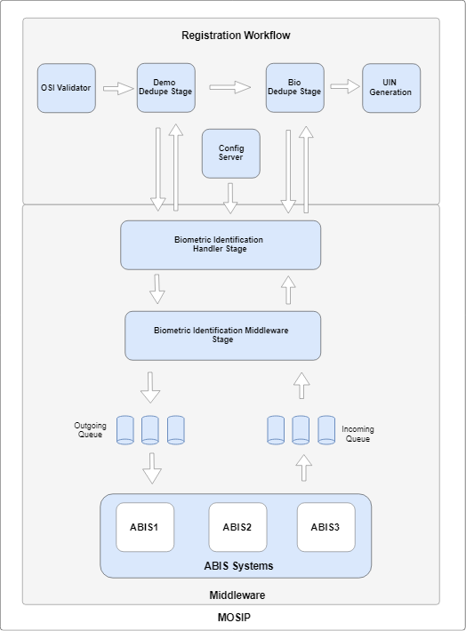
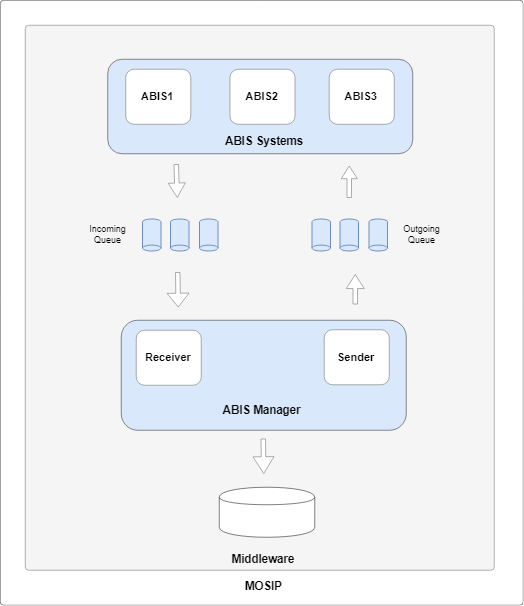
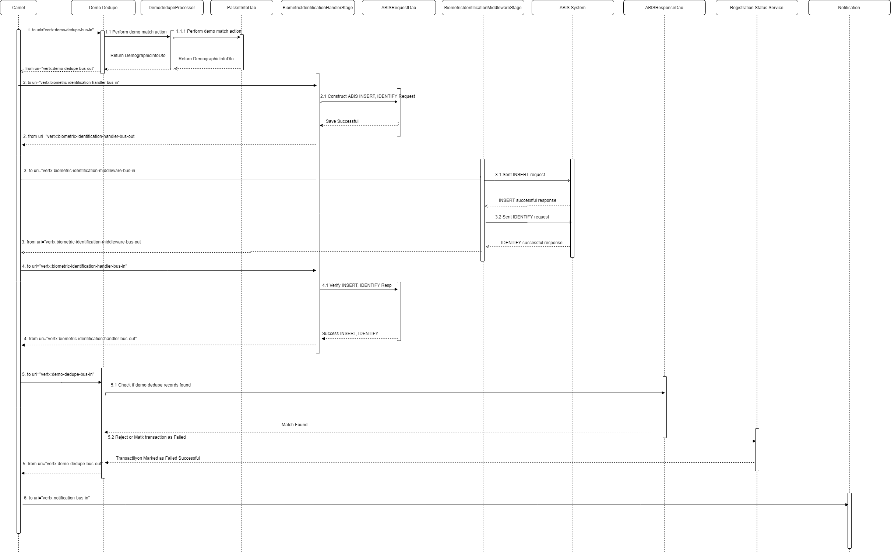
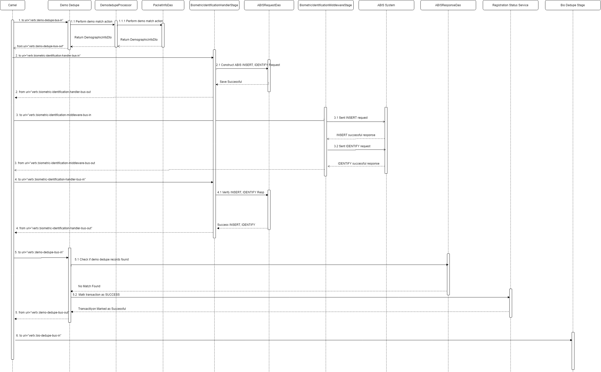
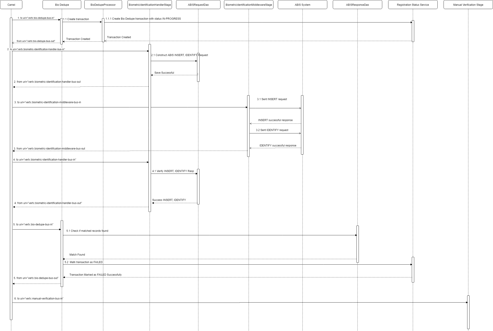
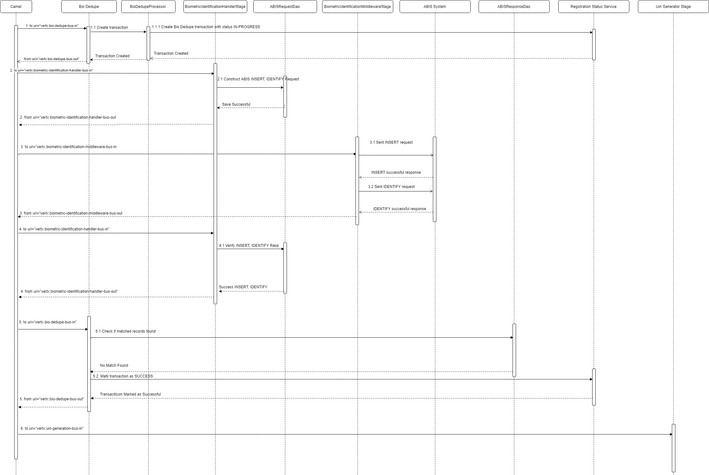
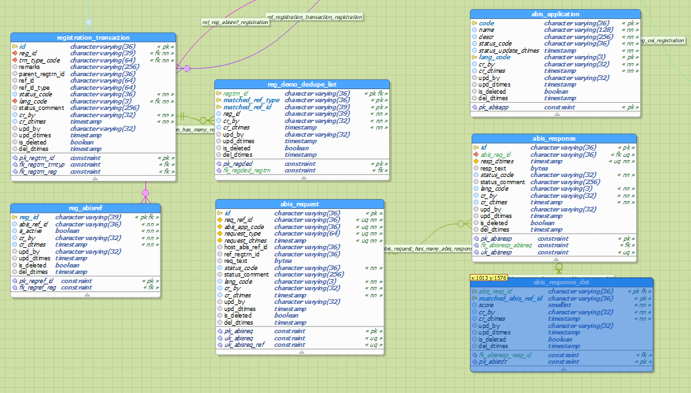

# Approach for ABIS Middleware 


**Background**

Automated Biometric Identification System (ABIS) gives ability to MOSIP to provide unique identity for an individual. To do this MOSIP will:
- Use multi modal biometric information of an individual
- Leverage Automated Biometric Identification System (ABIS) to de-duplicate Individual's biometric data
- Design for integrating with multiple ABIS providers to leverage expertise of different ABIS providers
- ABIS will be not used for authentication (deduplication only)

This document will describe/provide designing details about ABIS middleware which is responsible to connect to ABIS system to provide unique identity for an individual. 

**The target users are -**

- Application Support Team

**The key requirements are -**
-	MOSIP system should be able to provide unique identity for an individual and also avoid multiple entry for an individual to protect any fraud.

**The key non-functional requirements are**
1.	Auditing of the all the transactions including success and failed scenario.
2.	Logging of the all the requests
- 	INFO log message in case print request success or failed
- 	DEBUG log message in case if data fetched, PDF and text documents are created, PDF send on the queue.
- 	ERROR log message in case of any exception and retry
3.	Exception handling
4. Packets will be not processed until response is received from all the ABIS systems
5. MOSIP should have ability to verify liveliness of ABIS systems


**Solution**

The key solution considerations are -
1.	**Add and Alter tables**:
- 	"registration_transaction"
-	"reg_demo_dedupe_list"
- 	"abis_request"
- 	"abis_response"
- 	"abis_response_det"
-	"abis_application"

2.	**Configuration changes**:
- 	Add key registration.processor.abis.details having value 
```html
{
 "abis": [
   {
    "name": "", 
    "host": "",
    "port": ""
    "brokerUrl": "",
    "inboundQueueName": "",
    "outboundQueueName": "",
    "pingInboundQueueName": "",
    "pingOutboundQueueName": "",
    "userName": "",
    "password": ""
   }
 ]
}
```
- Add key registration.processor.abis.ping.schedule.time with expected value: 
0 0/5 * * * ?  .This triggers scheduler after every 5 minutes.
3.	**Update MessageDTO**: 
Add field called isForMatchIdentification boolean field.

1. **ABIS API Specification:**
Reference to ABIS API specifiaction can be found from [here](https://github.com/mosip/mosip/wiki/ABIS-APIs "here") which includes INSERT, IDENTIFY, PING request details.

4.	**Create or Update Stage**:

	1. **"DemodedupeStage" :** 
	Update this stage to identify potential match based on name, DOB and Gender. In case potential match found make an entry in "registration_transaction" table with status "IN-PROGRESS" and make potential matched records entry in "reg_demo_dedupe_list". Update MessageDTO with true for isForMatchIdentification and send out event (demodedupe-bus-out). Add camel flow to send event to BiometricIdentificationHandlerStage in case if isForMatchIdentification set to true or else to BioDedupeStage.
	In case if there is no any potential matched record found sent event by setting isForMatchIdentification flag to false and add camel flow to send event to BioDedupeStage.
	Event originated from BiometricIdentificationHandlerStage will be identified by looking at the status in transaction table which is "IN-PROGRESS". In case ABIS sends list of potential match records, which can be identified by looking at the "abis_response_det" table by registration id mark transaction status as "REJECTED" and sent event to NotificationStage by setting isValid flag false. In case no potential match found by ABIS then update transaction status as "SUCCESS" and sent "demodedupe-bus-out" event.

	1. **"BioDedupeStage" :** Upon receiving event check if there is any transaction entry. In case if there is no entry then create transaction entry with status "IN-PROGRESS" and set flag "isForMatchIdentification" in MessageDTO to true. Add camel route to send event to BiometricIdentificationHandlerStage in case flag "isForMatchIdentification" value is true.
	In case if there is transaction entry in table with status "IN-PROGRESS" go and check if there is any entry in "abis_response_det" table for the registration id. In case of any entry set isValid flag false, change transaction status "SUCCESS" and sent out event (bio-dedupe-bus-out). Configure camel route to send event to ManualVerificationStage for isValid flag false in MessageDTO. In case there is no entry in "abis_response_det" table then sent out event "bio-dedupe-bus-out" without setting any flag which will be passed to UinGeneratorStage.

	1. **"BiometricIdentificationHandlerStage":**  
	Upoon receiving event, check transaction entry, in case if it is IN-PROGRESS for Demo Dedupe then create request data in "abis_request" table with status "IN-PROGRESS" using "reg_demo_dedupe_list" table and in case if transaction entry is for Bio Dedupe then create 1:n entry in "abis_request" table for Bio Dedupe. Below are the various requests to be sent to ABIS system:
		1. Demo INSERT: Construct and save INSERT request to be send to ABIS
		1. Demo IDENTIFY: Construct and save IDENTITY request (1:1, 1:2 etc.)  using gallery API and using potential matched records found from  "reg_demo_dedupe_list" table.
		1. Bio INSERT: In case demo insert operation is not executed which might happen in case if no potential mached recoards found by demographic data then construct and save INSERT ABIS request in "abis_request" table. In case INSERT operation is already executed then skip Bio INSERT operation.
		1. Bio IDENTIFY: Construct and save IDENTITY request for 1:n bio match.
		For earch INSERT, IDENTIFY message, create unique request id and persist in the database under column: "id" from table "abis_request".

	1. **"BiometricIdentificationMiddlewareStage":** 
		This stage registers ABIS queue listener  and senders in deploy verticle method. ABIS queue listener will listen to messages received from ABIS and sender is responsible to send messages to ABIS. ABIS queue details are configured in config server using which BiometricIdentificationMiddlewareStage will connect to ABIS queues.

		Upon receiving event, this stage reads "IN-PROGRESS" requests from "abis_request" table and start sending them to ABIS system.
		Once message send, mark request status with "SENT".

		Once listener receives response message from ABIS system update "abis_request" status by unique request id received from ABIS. Also verify if all ABIS has send response for the given registration id by looking at "abis_request". In case response received from all ABIS system for given registration id then sent event to BiometricIdentificationHandlerStage or else in case if response not received from all ABIS then wait for it without sending out any event.

	1. **"Ping Operation" :**
		1. Create Stage: 
		Create stage called BiometricIdentificationManagerStage. This stage is responsible for handling ABIS ping operation. Upon receiving event from scheduler BiometricIdentificationManagerStage sent ping message on each ABIS queue. 
		1. PingScheduler: 
		Create or register chime scheduler to trigger event to BiometricIdentificationManagerStage  after every x minutes which is configured using key registration.processor.abis.ping.schedule.time. Upon receiveing event sent ping message to all ABIS systems. Number of ABIS systems registered in MOSIP are configured in spring cloud server using key: registration.processor.abis.details along with inboun outbound ping queue server details. 
		1. PingBiometricIdentificationSender: 
		Register/deploy jms sender in BiometricIdentificationManagerStage start (deployVerticle) method. 
		1. PingBiometricIdentificationListener: 
		Register/deploy jms listener in BiometricIdentificationManagerStage start (deployVerticle) method. ABIS sent reponse for all ping request back on queue - pingInboundQueueName. In case response not received for ping request from any particular ABIS, mark that ABIS system as IN-ACTIVE in "abis_application" table. In case received response from ABIS system then update status form IN-ACTIVE to ACTIVE for ABIS for which we receive ping acknowledgement message from ABIS system.


**Logical Architecture Diagram**

------------

**Behavior of Identification:**



- Demo Dedupe, Bio Dedupe Stage: These stages will be responsible to take business decisions like Rejecting packet or sending event for manual varification upon potential match found or sending event to UIN generation in case if no potential match found.
- BiometricIdentificationHandlerStage: This stage will understand request to be sent to ABIS systems and hence responsible to construct request objects.
- BiometricIdentificationMiddlewareStage: This stage communicate with ABIS systems via queue. This stage creates request object to be send to ABIS and receives asynchronous response from ABIS system.


**Behavior of Ping:**




**Sequence Diagram**

------------


**Demo Failed Sequence Diagram:**




**Demo Success Sequence Diagram:**



**Bio Failed Sequence Diagram:**



**Bio Success Sequence Diagram:**



**Database Design**

------------



