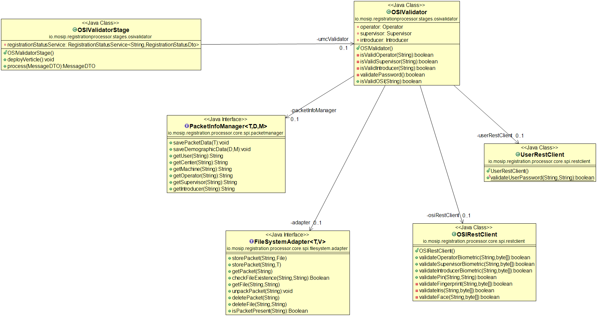
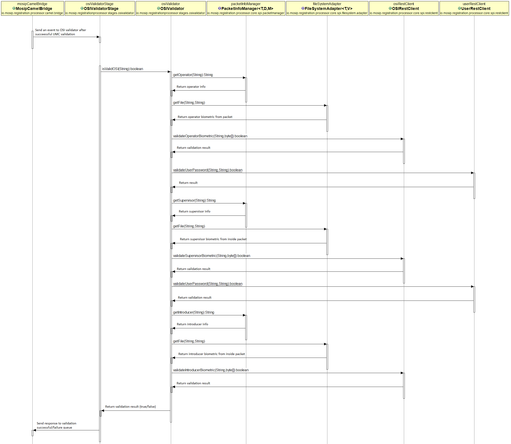

# Approach for OPERATOR, SUPERVISOR and INTRODUCER validator

**Background**

After successful user/machine/center validation, the packet packet meta info is stored in DB. The operator, supervisor and introducer biometric/password/pin will be further validated to check if the packet is created by authorized person.

The target users are -

Server application which will process the packets.
Administrator of the platform who may need to verify the packets.

The key requirements are -
-	Validate operator biometric if present in packet(Fingerprint/iris/face).
-	Validate supervisor biometricif present in packet(Fingerprint/iris/face).
-	Validate introducer biometricif present in packet(Fingerprint/iris/face).
- Validate operator pin/passwordif present in packet.
- Validate supervisor pin/passwordif present in packet.
-	Send response to eventbus on successful/failed validation.

The key non-functional requirements are
-	Performance: Should be able to support processing multiple requests per second.

**Solution**

The key solution considerations are -
- Create vertical "OSI-validator" to validate operator, supervisor and introducer biometric authentication.
- In camel bridge after successful user/machine/center validation the request will be routed to OSI-validator by default. Create routers and request processors to map the incoming request from umc_bus to osi_bus address.
- Add new methods in "PacketInfoManager" to fetch the operator, supervisor and introducer basic details from table.
- Call 'packet-store-adapter-ceph' service to get the biometric for operator/supervisor/introducer from inside the packet. 
- The [Auth-rest-service](https://github.com/mosip/mosip/blob/DEV/design/authentication/Auth_Request_REST_service.md) will be responsible for validating OSI info and the service accepts encoded biometrics. The encoded image will be present inside the packet by default.
- Check if the following information is present inside packet. If available then verify information against user type. A country may choose not to send certain information(ex - fingerprint/iris etc). Hence if one type of information is not present inside packet then move to next check.
```
    1. If operator is valid.
        a. validate fingerprint.
        b. validate iris.
        c. validate face.
        d. validate pin.
        e. validate password.
    2. If supervisor is valid.
        a. validate fingerprint.
        b. validate iris.
        c. validate face.
        d. validate pin.
        e. validate password.
    3. If introducer is valid.
        a. validate fingerprint.
        b. validate iris.
        c. validate face.
```
- The auth module will provide rest API to validate OSI biometrics and pin. 
    ```
    REST API to validate uin and biometric
    Input ->    1. UIN (the UIN of Operator/supervisor/introducer).
                2. biometric as byte array.
    Output ->   json with status as TRUE or FALSE.
                     TRUE : valid individual.
                     FALSE : invalid individual.
    ```
    ```
    REST API to validate uin and pin
    Input ->    1. UIN (the UIN of Operator/supervisor).
                2. pin.
    Output ->   json with status as TRUE or FALSE.
                     TRUE : valid individual.
                     FALSE : invalid individual.
    ```
- TODO : Password validation - Registration-processor has to support password validation as well. The Kernel will provide rest API inside IAM module which will validate user password. Registration-Processor will create a dummy service to complete own implementation. Once the Kernel service is ready then integrate with the actual API. 
- On successful validation send request to osi_bus out address. On failure send response to error queue. If any internal error happens during validation then send response to retry queue. In case of failure the registration-client has to resend the packet. Make sure the failure status is mapped to external status as 'resend'
- Update the packet status in "Registration-status" table for both successful and failed validation.

**Class Diagram**



**Sequence Diagram**


