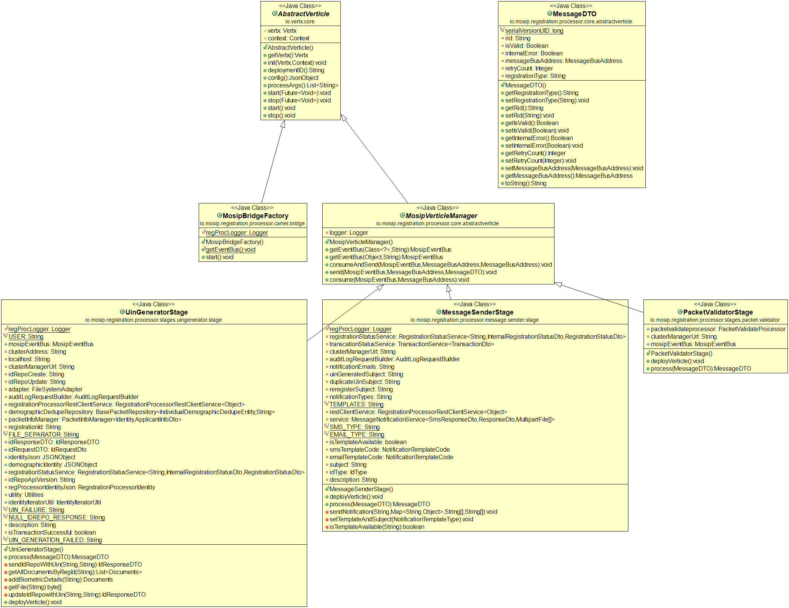
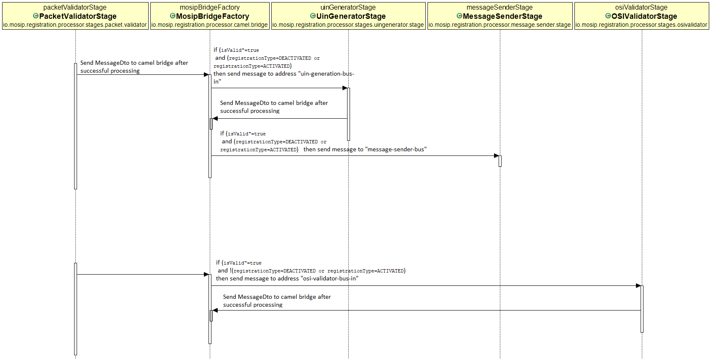

# Approach for activate and deactivate UIN

**Background**

Once the UIN is generated it can be deactivated or reactivated in registration-processor.

The target users are -

The admin applications which will trigger activate and deactivate request.
System administrator who will integrate with registration-processor.

The key requirements are -
- activate or deactivate uin packets should come from authenticated source.
- Deactivate UIN in registration-processor.
- Reactivate UIN in registration-processor.
- Route the request to applicable stages based on registrationType ['ACTIVATED', 'DEACTIVATED'] in camel-route xml. 

The key non-functional requirements are
- .
- Performance - Should process thousands of packets per second.

**Solution**

The key solution considerations are -
- Only users with admin roles will be able to trigger deactivate or reactivate request. The 'sync' and 'packet-receiver' APIs should validate the request and allow uploading packets based on user role.
- The deactivate/reactivate packet will have only required information. Below is the example for id json and packet_meta_info json -
```
// id json
{
  "identity" : {
    "IDSchemaVersion" : 1.0,
    "UIN": 981576026435
  }
}
```
```
// packet meta info json
{
  "identity" : {
    "metaData" : [
    {
      "label" : "registrationType",
      "value" : "ACTIVATE"
    }, {
      "label" : "applicantType",
      "value" : "Adult"
    }, {
      "label" : "registrationId",
      "value" : "10031100110027520190301190007"
    }, {
      "label" : "uin",
      "value" : null
    }, {
      "label" : "creationDate",
      "value" : "2019-03-01T19:04:47.504Z"
    } ],
    "hashSequence1" : [ {
      "label" : "applicantDemographicSequence",
      "value" : [ "ID" ]
    } ],
    "hashSequence2" : [ {
      "label" : "otherFiles",
      "value" : [ "audit" ]
    } ]
  }
}
```
- Each stage in registration-processor communicates with camel-bridge and the bridge reads the camel route configuration to redirect request to next stage. The information is passed from one stage using MessageDto and camel takes decision based on same information. Add one new attribute in MessageDto.
```
		public class MessageDTO implements Serializable {
			private String rid;
			private Boolean isValid;
			private Boolean internalError;
			private MessageBusAddress messageBusAddress;
			private Integer retryCount;
			// add new attribute registrationType
			private String registrationType;
		}
```
- The packets with registrationType as ['ACTIVATED', 'ACTIVATED'] will go through below stages -
	1. packet-receiver-stage
	2. virus-scanner-stage
	3. packet-uploader-stage
	4. registration-processor-connector-stage
	5. packet-validator-stage
	6. uin-generator-stage
	7. message-sender-stage
- Modify the camel-route xml to route the request directly to uin-generator-stage after successful message from packet-validator-stage. Below is an example to add one more route -
```
<when>
	<simple>${bodyAs(String)} contains '"isValid":true'</simple>
	<when>
		<simple>${bodyAs(String)} contains '"registrationType":"DEACTIVATED"' or '"registrationType":"ACTIVATED"'</simple>
		<to uri="vertx:uin-generation-bus-in" />
	</when>
	<otherwise>
	<to uri="vertx:osi-validator-bus-in" />
	</otherwise>
</when>
```
- The camel-bridge will route the request to the next stage based on "registrationType". If the request is valid and registrationType contains 'ACTIVATED' or 'DEACTIVATED' then the message will go to "uin-generation-bus-in". Otherwise message will be sent to "osi-validator-bus-in".
- The uin-generator-stage calls [kernel-idrepo-updateIdentity-service](https://github.com/mosip/mosip/wiki/ID-Repository-API) to update the uin.
```
// example request
{
  "id": "mosip.id.update",
  "version": "1.0",
  "timestamp": "2019-03-01T06:12:25.288Z",
  "registrationId": "10031100118827720190303115013",
  "status": "DEACTIVATED"
}
// example response
{
  "id": "mosip.id.update",
  "version": "1.0",
  "timestamp": "2019-03-06T12:12:41.483Z",
  "status": "DEACTIVATED",
  "response": {
    "entity": "http://integ.mosip.io/idrepo/identity/v1.0/7319368562"
  }
}
```
- The uin-generator-stage will send message to camel bridge after successful updation of uin. The camel route will decide the next stage based on "registrationType". If the registrationType  contains 'ACTIVATED' or 'DEACTIVATED' then the message will go to message-sender-stage. Or else message will be sent to both printing-stage and message-sender stage. Example -
```
<when>
				<simple>${bodyAs(String)} contains '"isValid":true'</simple>
				<when>
					<simple>${bodyAs(String)} contains '"registrationType":"DEACTIVATED"' or '"registrationType":"ACTIVATED"'</simple>
					<to uri="vertx:message-sender-bus" />
				</when>
				<otherwise>
					<to uri="vertx:message-sender-bus" />
					<to uri="vertx:printing-bus" />
				</otherwise>
			</when>
```
- The message-sender-stage will pick the template by the registration-status. The uin updation message will be sent to the resident.
- Add transaction and audit wherever applicable.


**Class Diagram**



**Sequence Diagram**


