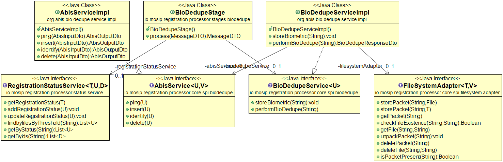
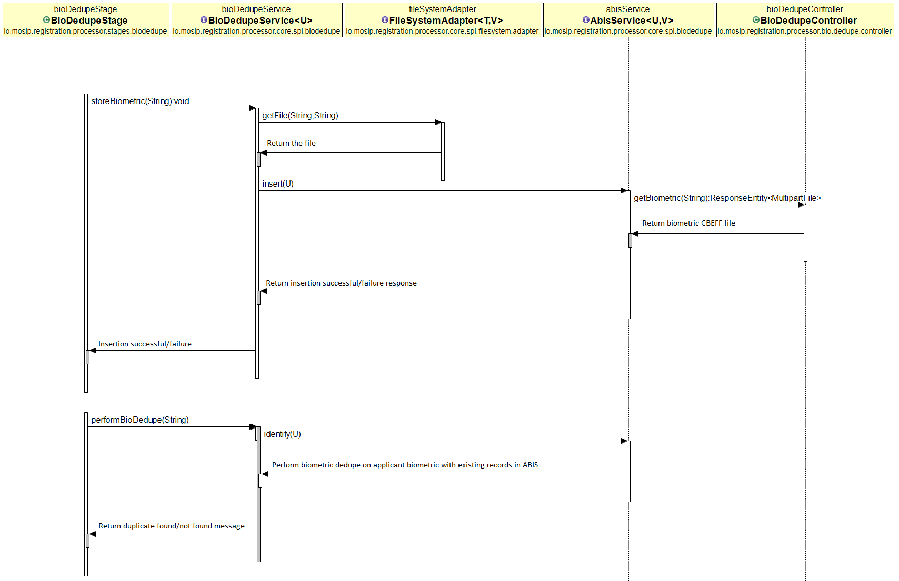

# Approach for Bio Dedupe

**Background**

After successful Demo dedupe, the bio dedupe will be performed on applicant biometric to find out the potential duplicates.

The target users are -

Server application which will process the packets.
System administrator who will integrate abis systems.

The key requirements are -
- Dummy Abis system to insert biometric records.
- Dummy Abis system to identify duplicate records and return all candidates matching or greater than targetFPIR socre.
- An interface to communicate with Abis systems.
- A middlewire system to communicate between ABIS and Bio-dedupe stage.
- Middlewire system to have all logic related to Abis.
- Bio dedupe stage to perform bio dedupe.

The key non-functional requirements are
-	Performance: Should be able to perform bio dedupe on thousands of potential duplicate records per second.

**Solution**

The key solution considerations are -
The solution is divided into 3 parts :
1. Dummy Abis
2. Bio dedupe microservice
3. Bio dedupe stage

##### Dummy Abis
- In registration-processor-core, Create an interface 'AbisService' to communicate with ABIS system with below functionalities -
	1. insert()
	2. identify()
	3. ping()
	4. delete()
- Create a microservice 'Dummy-Abis' and create rest apis for below functionalities -
	1. INSERT
	2. IDENTIFY
	3. PING
	4. DELETE
	
	Please refer to [Abis api spce](https://github.com/mosip/mosip/wiki/ABIS-APIs) for more info.
- Since its a dummy ABIS, dont bother about how Abis internally perform dedupe check. Create a dummy logic to convert CBEFF file into byte array and match against other records.
- ReferenceID : the reference id is unique for each applicant. It will be mapped against the registration id and will be created when insert is called. After successful response from ABIS the referenceid and registrationid mapping will be stored inside table.
- Create a message queue for abis request and response. There will be an unique request id for each request which will be mapped to a reference id. As its a queue we have to check both requestid and reference id to find out for which request we have received the response.

##### Bio dedupe microservice
-  In registration-processor-core, Create an interface 'BioDedupeService' and add below methods -
	1. insertBiometrics(RegistrationId); - Returns String either 'success' or 'failure'.
	2. performDedupe(RegistrationId); - Returns duplicate List<RegistrationId>
- Create a microservice 'bio-dedupe-service' to -
	1. perform bio dedupe.
	2. call Abis.
- The responsibility of the middleware system is to have all the logic related to abis. It will perform below 2 operations -
##### Insert applicant record into abis
	- Create unique requestId and referenceId(Please refer to Abis api spce for format of UUID).
	- A microservice to to expose biometric data in a reference URL.
	- Create request with -
		1. Request Id
		2. Reference Id
		3. Reference URL
	- Call abis insert API.
	- After receiving successful response, Save the RequestId - ReferenceId - RegistrationId mapping in table for future reference
	- Send response.

##### Perform Dedupe
	- Create unique requestId. 
	- Get the referenceId for the input registrationID.
	- read maxResults and targetFPIR from config properties.
	- Call Identify api to perform dedupe.
	- It returns list of candidates which has same or more score than targetFPIR. These are the duplicate referenceIds. Find the registrationId against the candidate reference ids.
	- Return list of duplicate registrationIds.

##### Bio Dedupe Stage
- Call BioDedupeService.insertBiometrics(RegistrationId) to insert the applicant biometric in Abis.
- Call BioDedupeService.performDedupe(RegistrationId) method to check for duplicate records with matching biometric.
- If the above method returns list of registration ids then save information in manual_adjudication table against the applicant regId and matching registrationIds. Send message to manual adjudication stage.
- If performDedupe() doesnot return any registration ids that means there are no potential duplicate against the applicant. Send message to UIN Generator Stage for further processing.

**Class Diagram**

**Sequence Diagram**

