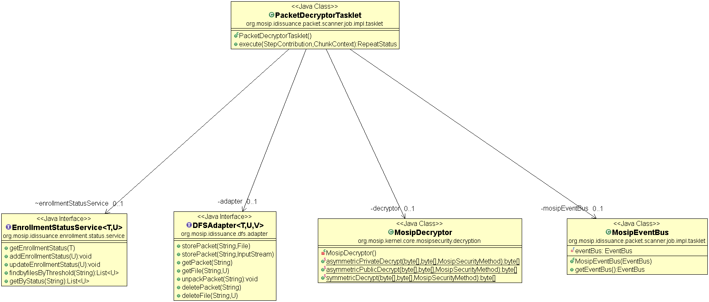
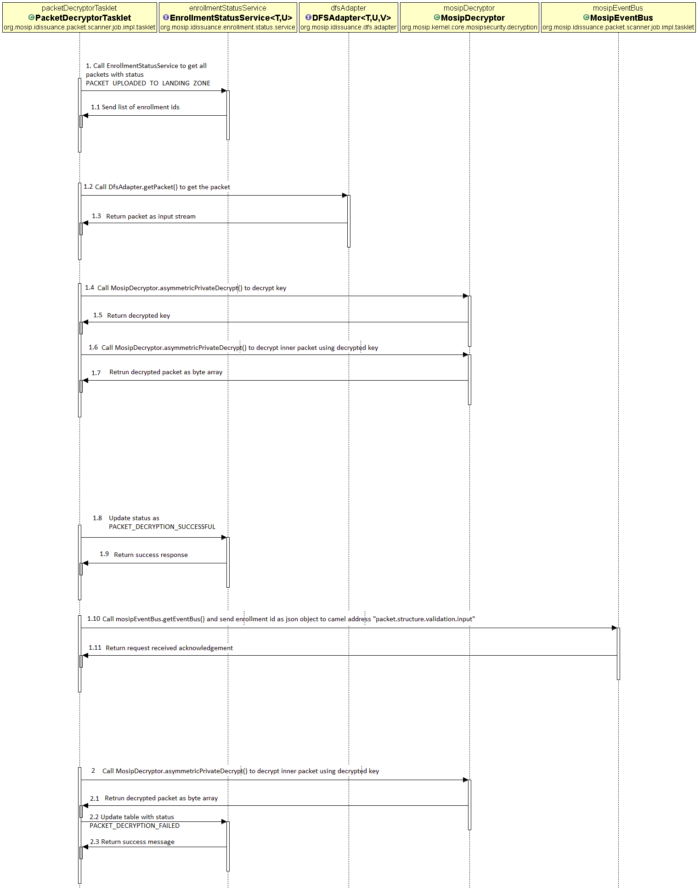

# Approach for decrypting registration packets and storing files in filesystem

**Background**

Registration packets created by the registration clients will be periodically uploaded to the server for processing. The packets will be scanned for viruses and after successful scan it will be uploaded to file system.

The target users are -
-	Server application which will process the packets.
-	Administrator of the platform who may need to verify the packets.

The key requirements are -
-	Find out registration ids, which are successfully uploaded to file system and ready for decryption.
-	Decrypt the encrypted zip file and receives a Zip file.
-	Unpack the Zip file.
-	Store the unpacked files in file system.
-	Updates the status of the packets in the Registration Status Table.
-	Send notification to event bus with registration id of the packet.

The key non-functional requirements are
-	Performance: Should be able to support processing multiple packet requests per second.

**Solution**

The key solution considerations are -
-	Create a batch job “PacketDecryptorJob” to run periodically based on configuration.
-	Get the Registration ids of the packets that are successfully uploaded in FILE SYSTEM.
Service: RegistrationStatusService.getByStatus(PACKET_UPLOADED_TO_FILE SYSTEM))
-	Call the unpack functionality from file-system-adapter-ceph module which will do the following -  
o	Unpack the outer zip file.
o	Store the inner encrypted zip and metainfo file back to FILE SYSTEM.
Service: FileSystemAdapter.unpackPacket(RegistrationId))
-	The Registration client will generate asymmetric key (asymkey) and use it to encrypt the packet. The asymkey will be further be encrypted using the public key of the client and will be sent along with the packet. All public and private key for client ids will be present in server. Now server has to get the private key of the same client id and decrypt the asymkey first. After decrypting, it uses same key to decrypt the Registration packet.
TODO: Call the “Key Management” module from core kernel to get private key for given client id. Call “MosipDecryptor” to decrypt asymkey. Again, call MosipDecryptor to decrypt inner zip file.
-	Once the packet is successfully decrypted, use file system adapter module to store the encrypted files inside packet back to FILE SYSTEM.
Service: FileSystemAdapter.storePacket(RegistrationId, FilePath)
-	Update packet status by calling Registration-status service.
-	In case of failure only update Registration status as “PACKET_DECRYPTION_FAILED”
Service: RegistrationStatusService.updateRegistrationStatus(RegistrationStatusDto))
-	Send the Registration id as json format by calling eventbus interface for  further processing.
Service: eventBus.send("packet.structure.validation.input", JsonObject);
Note: "packet.structure.validation.input" is the camel address where structural validation vertical will listen and pick request for processing.
-	Audit the entire transaction.

**Registration Packet Structure**

**Class Diagram**

**Sequence Diagram**

