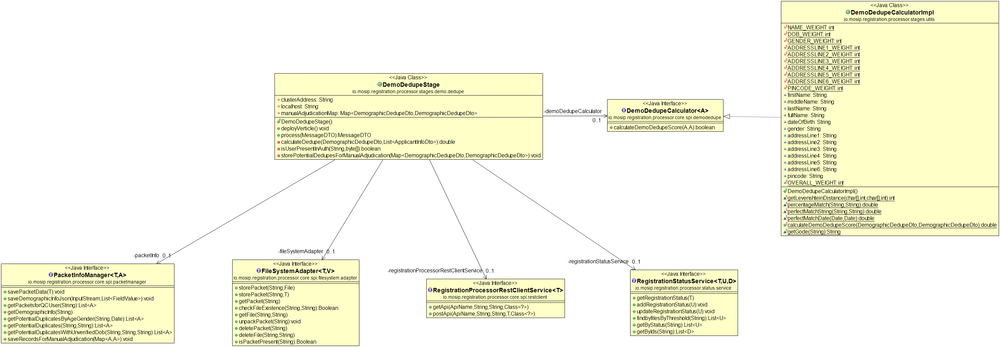
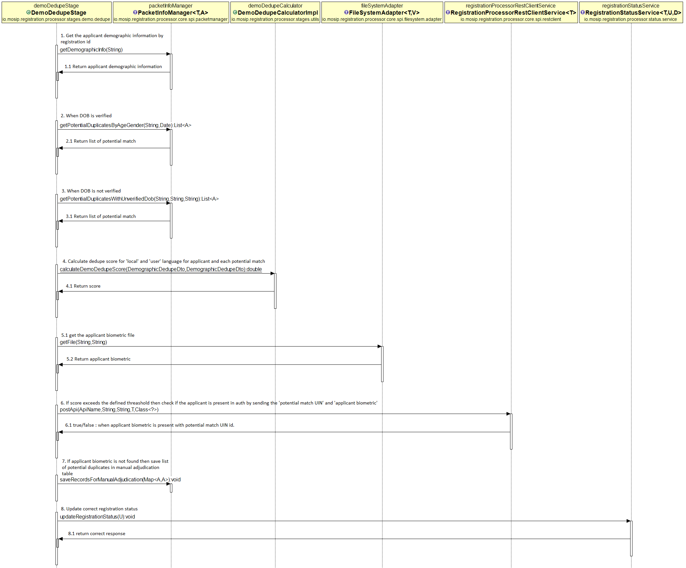

# Approach for Demo Dedupe

**Background**

After successful OSI validation, the demo dedupe will be performed on applicant demographic information to find out if there are potential duplicate present.

The target users are -

Server application which will process the packets.
Administrator of the platform who may need to verify the packets.

The key requirements are -
-	Find potential demo dedupe records matching GENDER and DOB.
-	Perform demo dedupe on all potential 'demo dedupe records' with 'applicant demographic information' using levenshtein distance algorithm.
-	Perform authentication using auth service on applicant biometric details and list of potential demo dedupes. For ex - for applicant p there are 2 potential dedupe p' and p''. Call auth service to authenticate user by passing ref ids of p' and p'' and biometrics of p. If same person has enrolled before then auth service will identify p .
- Fail demo dedupe if auth service identifies the applicant.
- Save the potential duplicates in Manual adjudication table when auth service doesnot identify the applicant.
-	Route request to next vertical when there is no potential duplicates found for applicant.

The key non-functional requirements are
-	Performance: Should be able to perform demo dedupe on millions of potential duplicate records per second.

**Solution**

The key solution considerations are -
- Create vertical "Demo-dedupe" to to perform dedupe check on applicant demographic information.
- Add 3 new functionalities in packet-info-storage-service module -
	1. Get the applicant demographic information by registration id. There will be max 2 records by language -
		1) local language record.
		2) user language record.
	2. Step 1 will return applicant demographic information. Now get all potential matches by applicant 'gender' and 'dob' when the DOB is verified. NOTE : there will be a flag in demo dedupe table which will indicate if the dob is verified or not.
```
	if (applicant dob is verified) {
	// find all matcing records with Gender and  DOB
	getPotentialDuplicates(Gender, DOB);
	}
```
	3. There can be scenarios where applicant doesnot have date of birth proof. In that case system will backtrack date based on age. For example - in 2018 if applicant with age 18 doesnot have date of birth proof then system will assign dob as 01/01/2000. In these scenarios there will be a flag "dob verified" with true/false values in applicant demographic table. Get all the **unverified** dob records with 'applicant dob year + 1' and 'applicant dob year - 1' to perform demo dedupe. For example -
```
	if ((applicant dob is not verified) && applicant dob is 01/01/2000) {
	// find all unverified records with DOB year -> '2000 + 1' and '2000 - 1'
	getPotentialDuplicatesWithUnverifiedDob(Gender, starting dob range -> 1999, ending dob range -> 2001);
	}
```
-  Above step will provide the list of potential matches to perform demo-dupe.  Iterate the list and for each record run algorithm with the applicant demographic information. Create an interface in registration-processor-core and provide implementation in demo-dedupe-stage. Registration-processor will use [levenshtein distance algorithm](https://en.wikipedia.org/wiki/Levenshtein_distance) and perform demo dedupe on name and address. Do the following -
	1. perform dedupe in local language.
	2. perform dedupe on user language.
	3. Calculate average score. (local language score + user language score) / 2
	4. If only one language is present then consider that as final score.
	5. check if it exceeds the threashold defined. By default the threashold is 80% which is configurable. If the average score exceeds threashold then its a potential duplicate.
	For example - applicant p has a potential duplicate as p'. Demo dedupe in local language is 80% and in user language is 70%. Average = (80 + 90) / 2 = 85% > threashold 80%. Hence potential duplicate.
There is an weight associated with every field. Read the weight from config server -
```
registration.processor.demo.dedupe.name.weight=50
registration.processor.demo.dedupe.addressline1.weight=5
registration.processor.demo.dedupe.addressline2.weight=5
registration.processor.demo.dedupe.addressline3.weight=5
registration.processor.demo.dedupe.addressline4.weight=5
registration.processor.demo.dedupe.addressline5.weight=5
registration.processor.demo.dedupe.addressline6.weight=5
registration.processor.demo.dedupe.pincode.weight=10
registration.processor.demo.dedupe.overall.weight=90
```
- The above step will provide the final list of potential duplicates. Call [Auth-rest-service](https://github.com/mosip/mosip/blob/DEV/design/authentication/Auth_Request_REST_service.md) to authenticate the applicant biometrics against the list of potential duplicates. The service accepts the refid(UIN reference id) and the biometrics and validates if the record is present in Auth DB. For example - applicant p has a potential duplicate as p' and p''. Select the refId of p' and the biometrics of p. If the service returns status as true(means person is present) that means p and p' is same person.  No need to check p'' as already match found with p'. Fail the demo dedupe and Reject the packet with proper reason.
- After auth-service validation -
	1. If applicant is identified then reject the packet and update correct status in registration status DB. 
	2. If the person is not identified then save the Applicant record and list of potential duplicates to manual adjudication table. Next step is to perform [manual adjudication](https://github.com/mosip/mosip/blob/DEV/design/registration-processor/Approach_for_manual_adjudication.md) on record.
- Route the request -
	1. CASE - 1 : When no potential duplicates found - route request to bio dedupe stage.
	2. CASE - 2 : When potential duplicates found - route request to manual adjudication.
	3. CASE - 3 : When applicant found in AUTH - reject packet and update status accordingly.


**Class Diagram**



**Sequence Diagram**




