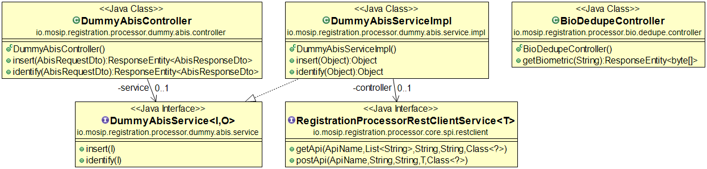
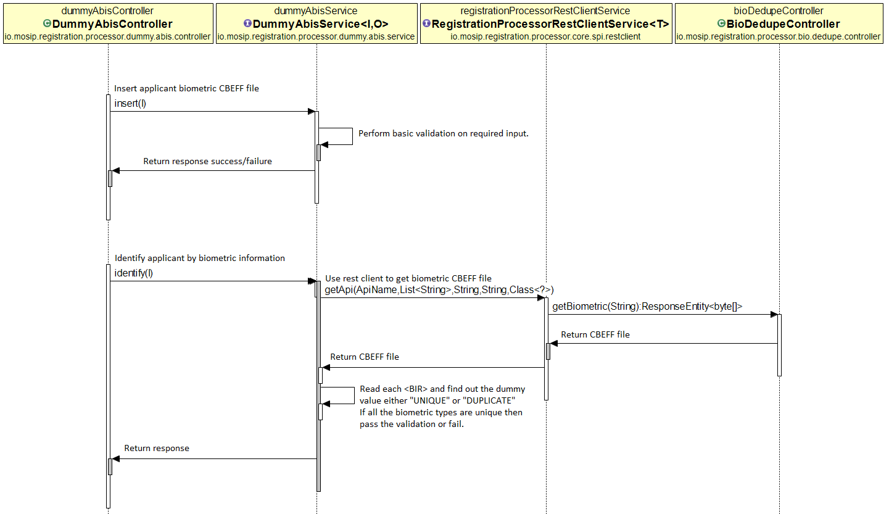

# Approach for Dummy ABIS

**Background**

The registration client will send the applicant biometrics inside the packet. After decryption of the packet the biometrics will be stored in packet store. Then bio dedupe will be performed against the applicant biometric to identify potential duplicate packets.

The target users are -

The registration client application which will upload packets.
The ID repository which will store CBEFF biometrics
System administrator who will integrate abis systems.


The key requirements are -
- A Dummy abis system with rest endpoints.
- Insert biometric records in ABIS.
- Identify duplicate records in ABIS.
- Get the applicant biometric file and evaluate each biometric (fingerprint/iris/face).
- Find potential duplicate from the CBEFF xml file.


The key non-functional requirements are
-	Performance: Should be able to perform bio dedupe on thousands of potential duplicate records per second.


#### Assumptions
- Security mechanism is out of scope.
- Negative scenarios are out of scope as its dummy implementation.
- No message queue implementation for dummy abis.

**Solution**

The key solution considerations are -
- Create a microservice 'dummy-abis-service'
- Create API for below functionalities -
	1. INSERT
	2. IDENTIFY
	
Refer to the [Abis api spce](https://github.com/mosip/mosip/wiki/ABIS-APIs) for more info.
- INSERT
	1. Expose rest endpoint for insert.
	2. Since its dummy abis, donot store any information when abis is called.
	3. The dummy abis system will check if any one of the biometric type(Fingerprint/Iris/Face) is present in the CBEFF file. The CBEFF file should have any one of the biometric for successful insertion in dummy abis.
	4. If the validation fails i,e no biometric type is present in the request then return failure result.
	5. Return successful result when validation is successful.
- IDENTIFY
	1. Expose rest endpoint for identify.
	2. When identify is being called the dummy abis needs the CBEFF biometric file to find out if its duplicate.
	3. The bio-dedupe-service will have a rest endpoint exposed to get the biometric of the applicant. The url format would be - https://url/registrationId>
	4. The reference Id will be present in the request. However to get the CBEFF file first we need to get the corresponding registration Id. Get the registration id.
	5. Call the bio-dedupe-service rest api to get the biometric file.
	6. There can be multiple biometric type for example fingerprint/iris/face.
	7. The dummy abis will check the test tag (TestFingerPrint, TestIRIS, TestFace) inside CBEFF file. It will have value either "UNIQUE" or "DUPLICATE". Check the below example for Face. The test tag TestFace tells us weather its unique or duplicate. We need to check all the biometrics present inside the file and see if all are unique or not.
	```XML
	<BIR>
		<TestFace xmlns="testschema">Unique</TestFace>
		<BIRInfo>
		    <Integrity>false</Integrity>
		</BIRInfo>
		<BDBInfo>
		    <FormatOwner>257</FormatOwner>
		    <FormatType>8</FormatType>
		    <Type>Face</Type>
		    <Level>Raw</Level>
		    <Purpose>Enroll</Purpose>
		    <Quality>90</Quality>
		</BDBInfo>
		<BDB>VGVzdA==</BDB>
	    </BIR>
	```
	
	8. Make dedupe successful if all of the biometric type has test tag as "UNIQUE"
	9. Fail the check even if any of the biometric type has test tag as "DUPLICATE". Create a mocked list of potential duplicates and always return the mocked list whenever duplicate is found.
	10. Configuration - maxResults : Dummy ABIS will store max 30 mocked records for response. The max results can be changed between 1 to 30 in config and ABIS should return same number of records as configured.
	11. Configuration - targetFPIR : The scaledScore score can be set from 1 to 100 and Dummy abis will return same scaledScore for Candidates in response.

### Dummy supported functionalities and logic
Functionality	|	Outcome	|	Abis Logic
----------------|---------------|----------------------------------------------------
Insert	|	Insert Success	|	The dummy abis system will check if any one of the biometric type(Fingerprint/Iris/Face) is present in the CBEFF file. The CBEFF file should have any one of the biometric for successful insertion in dummy abis.
Insert	|	Insert Failure	|	The dummy abis system will check if any one of the biometric type(Fingerprint/Iris/Face) is present in the CBEFF file. The CBEFF file should have none of the biometric for insertion failure in dummy abis.
Identify	|	Identify - no duplicate	|	The dummy abis will check the test tag (TestFingerPrint, TestIRIS, TestFace) inside CBEFF file. All of the values should be "Unique" for no duplicate.
Identify	|	Identify - duplicate	|	The dummy abis will check the test tag (TestFingerPrint, TestIRIS, TestFace) inside CBEFF file. Any one of the value should be "Duplicate".
Identify Configuration - maxResults	|	Check max results	|	Dummy ABIS will store max 30 mocked records for response. The max results can be changed between 1 to 30 in config and ABIS should return same number of records as configured.
Identify Configuration - targetFPIR	|	The targetFPIR score	|	The scaledScore score can be set from 1 to 100 and Dummy abis will return same scaledScore for Candidates in response.


**Class Diagram**



**Sequence Diagram**


