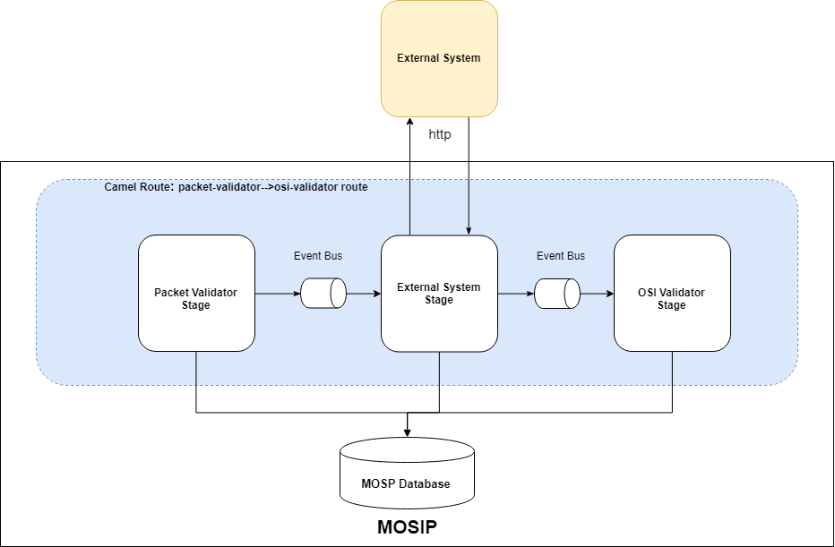
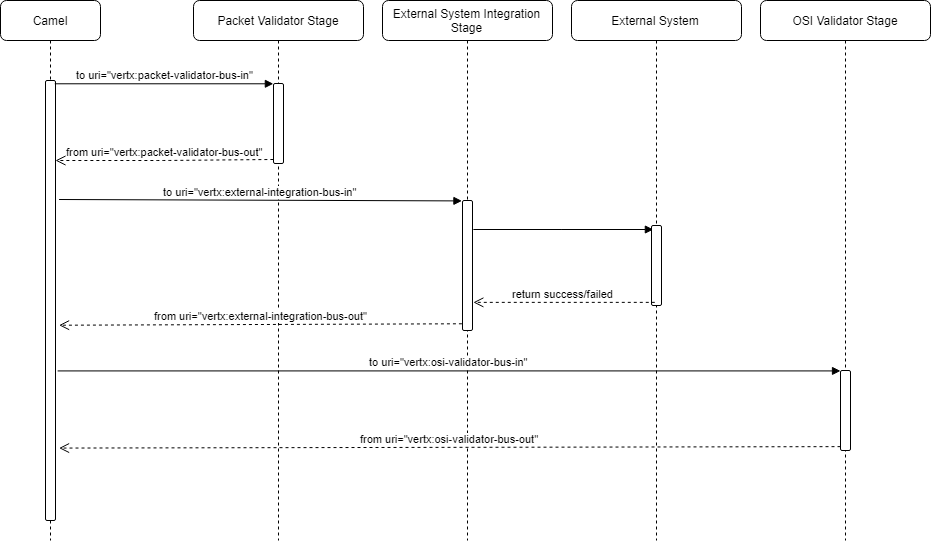

# External System Integration Stage 

**Background**

Technical stack used in Registration Processor gives ability to add or change order/sequence of stages/route in the flow. Most of the stages works in isolation, which are deployed independently and does not depend on the previous or next stage in the flow. This design document describe one of option to integrate registration processor with external system by creating vertx stage. 

**The target users are -**
System Integrator Team

**The key requirements are -**
-	MOSIP product should provide sample code along with documentation which can be used to integrate with the external system.

** Limitation- (TBD) -**

All the vertx stages in registration process are configured using apache camel bridge to execute in a sequence. However, technically, it is possible to add or remove stages in the camel bridge but in some cases, this sequence or order cannot be altered due to highly dependent activity. For example, Packet Receiver, Virus Scanner and Packet Uploader need to work in sequence. 

**The key non-functional requirements are -**
1.	Introduce vertx stage which can be plugged in between stages in registration processor.
2.  Auditing of the all the transactions including success and failed scenario.
3.	Logging of the all the requests
- 	INFO log message in case print request success or failed
- 	DEBUG log message in case if data fetched, PDF and text documents are created, PDF send on the queue.
- 	ERROR log message in case of any exception and retry
4.	Exception handling


**Solution**

------------

Solution is based on creating and adding additional vertx stage in workflow which will connect to external system.

**The key solution considerations are -**
1.	Create Vertx Stage:
- Create vertx stage (ExternalIntegrationStage) by extending MosipVerticleManager abstract class and provide implementation for abstract method. 
- Add business logic in process method which includes connecting to HTTP endpoint, send request and process response
- Fetch ID json object from DFL system and send it to external system using REST API
- Update registration status once business logic is executed in ExternalIntegrationStage SUCCESS/ERROR.

2.  Create dummy External System
- Create a microservice 'dummy-external-system' and create POST REST API which accept ID json object and send success response.

3.	Apache Camel Changes:
- 	Update apache camel DSL xml file:
Update apache camel DSL xml file "registration-processor-camel-routes.xml" to add additional route to connect to external system. 

Example: Let's update workflow to add additional route so ExternalIntegrationStage will be executed after packet validator stage and before OSI validator stage. Extract and update "registration-processor-camel-routes.xml" in spring configuration with below details:
	
Below is the route details from original registration-processor-camel-routes.xml file:

```html
	<!-- Packet Validator to OSI Validator Route -->
	<route id="packet-validator-->osi-validator route">
		<from uri="vertx:packet-validator-bus-out" />
		<log
			message="packet-validator-->osi-validator route ${bodyAs(String)}" />
		<choice>
			<when>
				<simple>${bodyAs(String)} contains '"isValid":true'</simple>
				<to uri="vertx:osi-validator-bus-in" />
			</when>
			<when>
				<simple>${bodyAs(String)} contains '"isValid":false'</simple>
				<to uri="vertx:message-sender-bus" />
			</when>
			<when>
				<simple>${bodyAs(String)} contains '"internalError":true'</simple>
				<to uri="vertx:retry" />
			</when>
			<otherwise>
				<to uri="vertx:error" />
			</otherwise>
		</choice>
	</route>
```
Update above apache camel route with the below:

```html

	<!-- Packet Validator to External Integration Route -->
	<route id="packet-validator-->external-integration route">
		<from uri="vertx:packet-validator-bus-out" />
		<log
			message="packet-validator-->external-integration route ${bodyAs(String)}" />
		<choice>
			<when>
				<simple>${bodyAs(String)} contains '"isValid":true'</simple>
				<to uri="vertx:external-integration-bus-in" />
			</when>
			<when>
				<simple>${bodyAs(String)} contains '"isValid":false'</simple>
				<to uri="vertx:message-sender-bus" />
			</when>
			<when>
				<simple>${bodyAs(String)} contains '"internalError":true'</simple>
				<to uri="vertx:retry" />
			</when>
			<otherwise>
				<to uri="vertx:error" />
			</otherwise>
		</choice>
	</route>
		<!-- External Integration to OSI Validator Route -->
	<route id="external-integration-->osi-validator route">
		<from uri="vertx:external-integration-bus-out" />
		<log
			message="external-integration-->osi-validator route ${bodyAs(String)}" />
		<choice>
			<when>
				<simple>${bodyAs(String)} contains '"isValid":true'</simple>
				<to uri="vertx:osi-validator-bus-in" />
			</when>
			<when>
				<simple>${bodyAs(String)} contains '"isValid":false'</simple>
				<to uri="vertx:message-sender-bus" />
			</when>
			<when>
				<simple>${bodyAs(String)} contains '"internalError":true'</simple>
				<to uri="vertx:retry" />
			</when>
			<otherwise>
				<to uri="vertx:error" />
			</otherwise>
		</choice>
	</route>

```

Sample Http Request:

```html
{
	"id":"mosip.registration.httpintegration.httpcall",			
	"version":"1.0",	
	"requesttime":"2018-14-03T10:15:30Z",
	
	"metadata" : {
	},
	
	"request" : {
		// ID JSON
	}
}
```

Sample Http Success Response:

```html
{ 
   "id":"mosip.registration.httpintegration.httpresponse",			
   "version":"1.0",	
   "responsetime":"2018-14-03T10:15:30Z",
   "metadata" : {
   	"registrationid":"<<registrationid>>"
   },
   "response" : {
   	"status":"Success"
   }
   "errors":[
   ]
}
```
Sample Http Error Response:

```html
{ 
   "id":"mosip.registration.httpintegration.httpresponse",			
   "version":"1.0",	
   "responsetime":"2018-14-03T10:15:30Z",
   "metadata" : {
   	"registrationid":"<<registrationid>>"
   },
   "response" : {
   	"status":"Failed"
   }
   "errors":[
		"errorCode": "PRG_REG_HTTP_APP_001",
		"message": "Error Processing Request"
   ]
}
```

**Logical Architecture Diagram**


------------
- Without External System Stage:


- After adding External System Stage:




**Sequence Diagram**

------------

 
