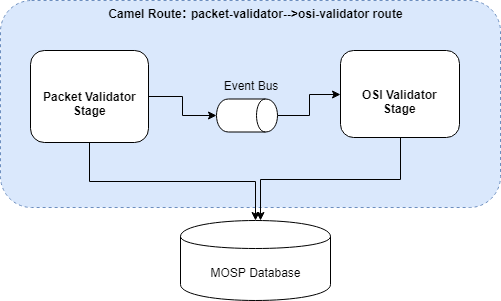
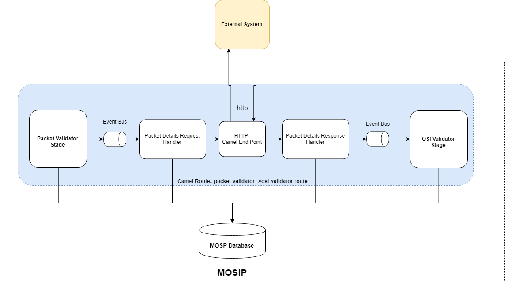
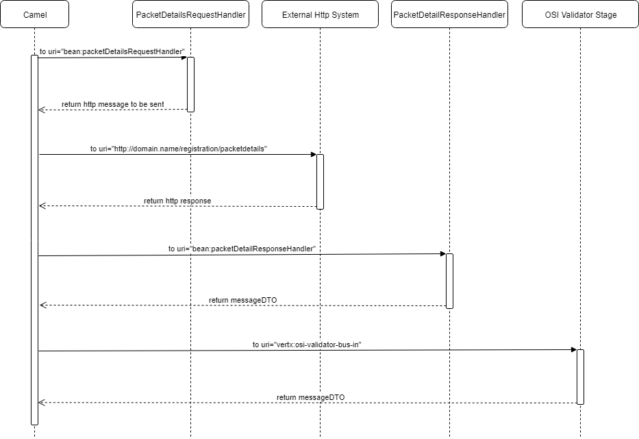

# Add HTTP stage 

**Background**

Technical stack used in Registration Processor gives ability to add or change order/sequence of stages/route in the flow. Most of the stages works in isolation, can be deployed independently and does not depend on the previous or next stage in the flow. This design document will helps support team to understand steps to integrate MOSIP with external system using http end point.

**The target users are-**
- Application support team

**The key requirements are -**
-	Once MOSIP as a product is released as an open source for anyone to use it, product should have sample code for stages and apache camel DSL xml along with document with the steps to add or remove them.

**Apache Camel Bridge -**
All the vertx stages in registration process are arranged in a particular sequence using apache camel bridge. Though technically it is possible to add or remove stages in the camel bridge but in some cases this sequece or order can not be altered due to highly dependent activity. For example Packet Receiver, Virous Scanner and Packet Uploader need to work in sequence. 

**The key non-functional requirements are**
1.	Addition of a additional HTTP route should be done without updating any existing stages.
2.  Auditing of the all the transactions including success and failed scenario.
3.	Logging of the all the requests
- 	INFO log message in case print request success or failed
- 	DEBUG log message in case if data fetched, PDF and text documents are created, PDF send on the queue.
- 	ERROR log message in case of any exception and retry
4.	Exception handling


**Solution**

------------

**Apache Camel HTTP end points: **

- This will be the simplest approach as apache camel capability will be used to connect to HTTP external system. 
- An apache converter will be used to fetch details from database which then will be send to HTTP system.
- Apache camel bridge need to be deployed.

**The key solution considerations are -**
1.	HTTP End point:
- Create sample HTTP rest service using spring boot, which will be used to post packet details and send response 

2.	Apache Camel Changes:
- 	Update apache camel DSL xml file:
Add additional route in DSL xml file with the apache HTTP end point 

Example: For example let's integrate HTTP end point between existing packet validator and OSI validator stage. To include HTTP endpoint apache camel DSL file from spring configuration "registration-processor-camel-routes.xml" need to be updated.

Below is the route details from original registration-processor-camel-routes.xml file file:

```java
	<!-- Packet Validator to OSI Validator Route -->
	<route id="packet-validator-->osi-validator route">
		<from uri="vertx:packet-validator-bus-out" />
		<log
			message="packet-validator-->osi-validator route ${bodyAs(String)}" />
		<choice>
			<when>
				<simple>${bodyAs(String)} contains '"isValid":true'</simple>
				<to uri="vertx:osi-validator-bus-in" />
			</when>
			<when>
				<simple>${bodyAs(String)} contains '"isValid":false'</simple>
				<to uri="vertx:message-sender-bus" />
			</when>
			<when>
				<simple>${bodyAs(String)} contains '"internalError":true'</simple>
				<to uri="vertx:retry" />
			</when>
			<otherwise>
				<to uri="vertx:error" />
			</otherwise>
		</choice>
	</route>
```
Apache DSL camel file "registration-processor-camel-routes.xml" need to be updated with below. Add PacketDetailsRequestHandler.java and PacketDetailsResponseHandler.java spring bean classes which will be added  in apache camel DSL as a processor between end points as shown in above sample DSL file. PacketDetailsRequestHandler will have logic to fetch packet details using request id from database and convert it into http post request to send. PacketDetailsResponseHandler handle response from http endpoint and send vertx event with json message (from MessageDTO) to OSI validator "<to uri="vertx:packet-validator-bus-in" />"

```html
	<route id="packet-validator-->osi-validator route">
		<from uri="vertx:packet-validator-bus-out" />
		<log
			message="packet-validator-->osi-validator route ${bodyAs(String)}" />
		<choice>
			<when>
				<simple>${bodyAs(String)} contains '"isValid":true'</simple>
				<to uri="bean:packetDetailsRequestHandler"/>
				<setHeader headerName="CamelHttpMethod">
			      <constant>GET</constant>
			    </setHeader>
				<to uri="http://domain.name/registration/packetdetails" />
				<to uri="bean:packetDetailResponseHandler"/>
				<to uri="vertx:osi-validator-bus-in" />
			</when>
			<when>
				<simple>${bodyAs(String)} contains '"isValid":false'</simple>
				<to uri="vertx:message-sender-bus" />
			</when>
			<when>
				<simple>${bodyAs(String)} contains '"internalError":true'</simple>
				<to uri="vertx:retry" />
			</when>
			<otherwise>
				<to uri="vertx:error" />
			</otherwise>
		</choice>
	</route>
```

Sample Http Request:

```html
{
	"id":"mosip.registration.httpintegration.httpcall",			
	"version":"1.0",	
	"requesttime":"2018-14-03T10:15:30Z",
	
	"metadata" : {
	},
	
	"request" : {
		// ID JSON
	}
}
```

Sample Http Success Response:

```html
{ 
   "id":"mosip.registration.httpintegration.httpresponse",			
   "version":"1.0",	
   "responsetime":"2018-14-03T10:15:30Z",
   "metadata" : {
   	"registrationid":"<<registrationid>>"
   },
   "response" : {
   	"status":"Success"
   }
   "errors":[
   ]
}
```
Sample Http Error Response:

```html
{ 
   "id":"mosip.registration.httpintegration.httpresponse",			
   "version":"1.0",	
   "responsetime":"2018-14-03T10:15:30Z",
   "metadata" : {
   	"registrationid":"<<registrationid>>"
   },
   "response" : {
   	"status":"Failed"
   }
   "errors":[
		"errorCode": "PRG_REG_HTTP_APP_001",
		"message": "Error Processing Request"
   ]
}
```

**Logical Architecture Diagram**


------------
- Without http end point:



- With http end point:




**Sequence Diagram**

------------


