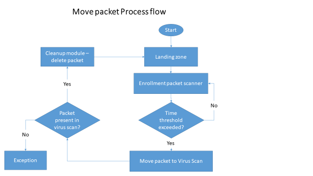

# Approach for scanning registration packets from landing zone and move it to processing folder

**Background**
Registration packets created by the registration clients will be periodically uploaded to the server for processing. The packets will be stored in landing zone initially and status will be updated in enrollment status table.

The target users are
-	Server application which will process the packets
-	Administrator of the platform who may need to verify the packets

The key requirements are
-	Check the Registration status table for the packets for which Threshold Time has exceeded.
-	A job to scan the Landing Zone to get the list Packets for which threshold time has been exceeded.
-	Move these packets from Landing Zone to Virus Scan folder.
-	After moving the packet to virus scan folder update packet status in Registration Status Table.
-	Clean up the Packets from Landing Zone using Clean Up module. (IIS-006 : User Story).
-	Audit the entire process.

The key non-functional requirements are
-	Performance: Should be able to support moving multiple packet requests per second.
-	Availability: After moving the packet to destination directory and before cleaning up the packet from source directory, there should be a check to ensure packet was successfully moved and present in destination to ensure packet availability.
-	Accessibility: the storage location should be accessible to move packets from one location to another.

**Solution**
The key solution considerations are
-	Add a new method in EnrollmentStatusService which will return all the packets which has exceeded configured threashold time. Input will be timestamp and output will be list of enrollment status dtos.
-	A batch job to run periodically (based on configuration) and scan the landing zone.
-	Read the cron configuration from properties file to schedule the job. For example - @Scheduled(cron="${move.packet.job.start}")
-	Create a tasklet and call enrollment status service to get list of enrollment ids.
-	Call file manager module to copy packet from landing zone to virus scan zone.
-	Update packet status by calling EnrollmentStatusService.
-	Call packetmanager module cleanup method to delete the packet from landing zone. A check should happen if the file is already present in virus scan zone before deleting it from landing zone.
-	Audit the entire transaction.

**Process Flow**

**Class Diagram**

**Sequence Diagram**

