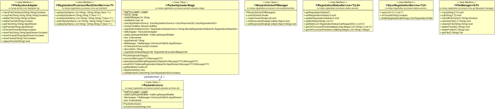
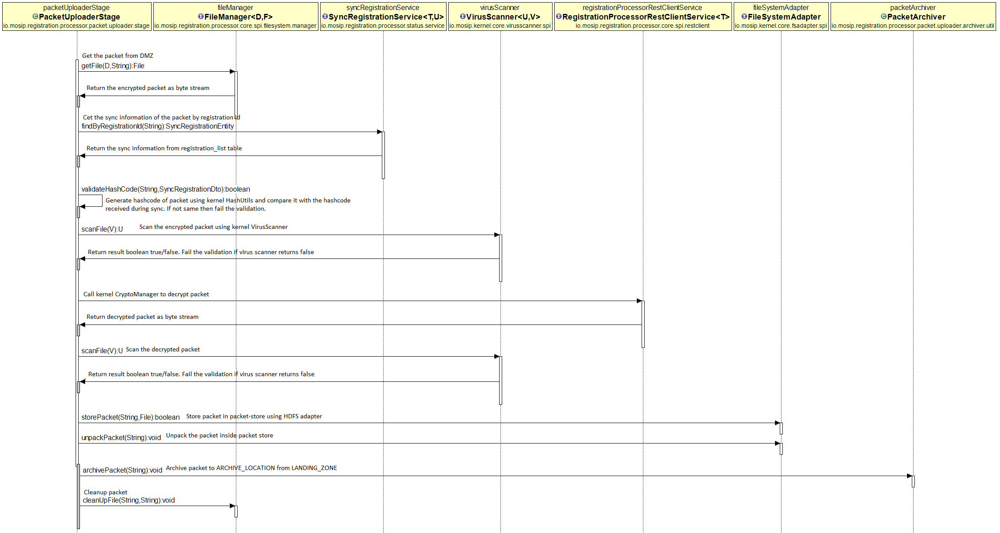

# Approach for Packet Uploader Stage

**Background**

After successful validation the packet-receiver-stage will accept the packet and put it in LANDING_ZONE filesystem. The packet-receiver-stage will send an event to camel-bridge and it will be received by packet-uploader-stage for further processing.

The target users are -
The registration client.
External system integrator.
Residence service portal to integrate with registration-processor.

The key requirements are -
1. Provide an api to send an event to packet-uploader-stage from the dmz camel-bridge instance.
2. Validate packet before accepting in secure zone.
3. Perform virus scan of the encrypted and the decrypted packet in memory.
4. Store packet to a packet-store after virus scan is successful.
5. Send event to next stage for further processing.


The key non-functional requirements are
1.	Auditing of the all the transactions including success and failed scenario:
2.	Logging of the all the requests
a.	INFO log message in case print request success or failed
b.	DEBUG log message in case if data fetched, PDF and text documents are created, PDF send on the queue.
c.	ERROR log message in case of any exception
3.	Exception handling


**Solution**

The key solution considerations are -
1.	A new stage "registration-processor-packet-uploader-stage" inside registration-processor/pre-processor directory. This stage will be deployed in secure zone.
```java
public class PacketUploaderStage extends MosipVerticleAPIManager {
// Add code here.
}
```
2.	A rest endpoint using vertx web to send an event to "registration-processor-packet-uploader-stage" from dmz camel-bridge instance. All the stages present in secure network will form a single cluster to communicate with each other. The DMZ stages will not be part of this cluster and will form separate cluster. Hence the communication between DMZ stage and the secure network stage will happen through rest call. Click -> [API spec for connector](https://github.com/mosip/mosip/wiki/Registration-Processor-APIs#1-packet-receiver-service) to see the api specifications.

		1. server.servlet.path = v1/uploader
		
		2. URI : /securezone
3. New methods in io.mosip.registration.processor.core.spi.filesystem.manager.FileManager.java
	1. getFile(directoryPath, fileName) method to get the file from LANDING_ZONE.
	2. cleanup(directoryPath, fileName) method to cleanup the file after successfully uploading to packet-store.
4. In FileManagerImpl use [JSch Library](http://www.jcraft.com/jsch/) as a default implementation to connect to DMZ and get the file. This implementation can be overridden by the country to use country specific implementation. This library will use username and password/ppk to connect to DMZ and get/cleanup file.
5.	Validate the packet before accepting it to the secure network. Perform below validations -
		1. Call SyncRegistrationService.findByRegistrationId() to get the sync information for the packet. Fail the validation if there is no sync record against the registration id.
		2. Generate the hashcode using kernel HMACUtils. Compare the hashcode with the sync hashcode. If both are not same then fail validation. 
4.	After successful above validation call kernel VirusScanner.scanFile() and send the encrypted packet as input stream. It will return boolean value. Throw exception as virus scan failed if the VirusScanner returns false. Let the exceptionHandler sends response to the api consumer.
5.	After successful scan of the encrypted packet call kernel cryptomanager rest api to decrypt the packet. Use RegistrationProcessorRestClientService.postApi() to consume cryptomanager API. [Click on the link](https://github.com/mosip/mosip/wiki/Kernel-APIs#2-crypto-manager) to see the request and response specs of kernel cryptomanager.
6.	The cryptomanager will return byte stream after successful decryption. Send same byte stream to kernel VirusScanner again to perform one more round of scan. Fail the validation if VirusScanner returns false.
7.	After all above validations are passed call FileSystemAdapter.storePacket() to store decrypted packet in packet store. Inturn call FileSystemAdapter.unpackPacket() to unzip it.
8. Call PacketArchiver.archivePacket() which will copy packet from LANDING_ZONE to the ARCHIVE_LOCATION. Use FileManager.copy() for same. Change implementation in FileManagerImpl to use JSch and perform copy operation.
9.  Call FileManager.cleanup() to cleanup the packet from LANDING_ZONE. Change implementation in FileManagerImpl to use JSch for cleanup activity.
10. Add RegProcessorLogger, AuditLogRequestBuilder whereever applicable.


**Class Diagram**

------------



**Sequence Diagram**

------------


