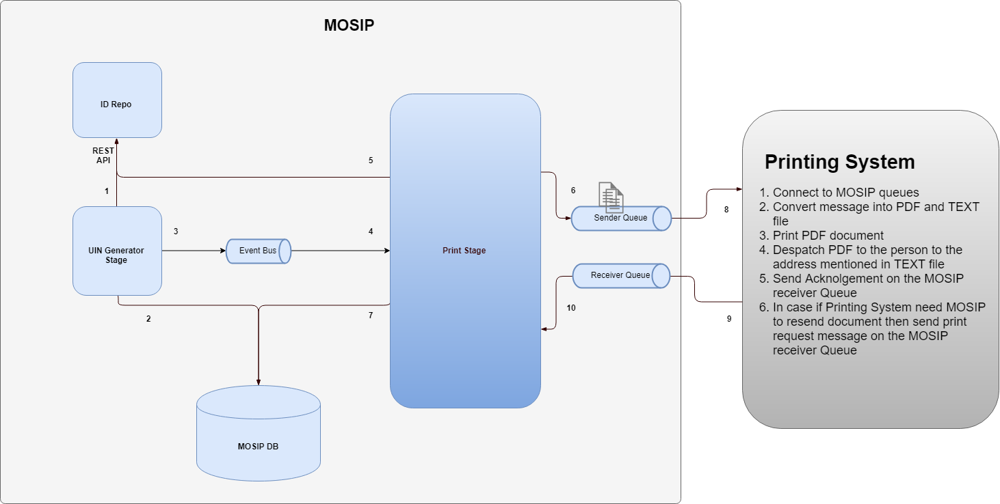
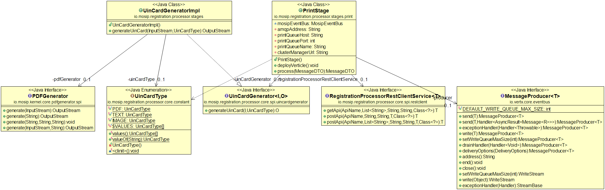
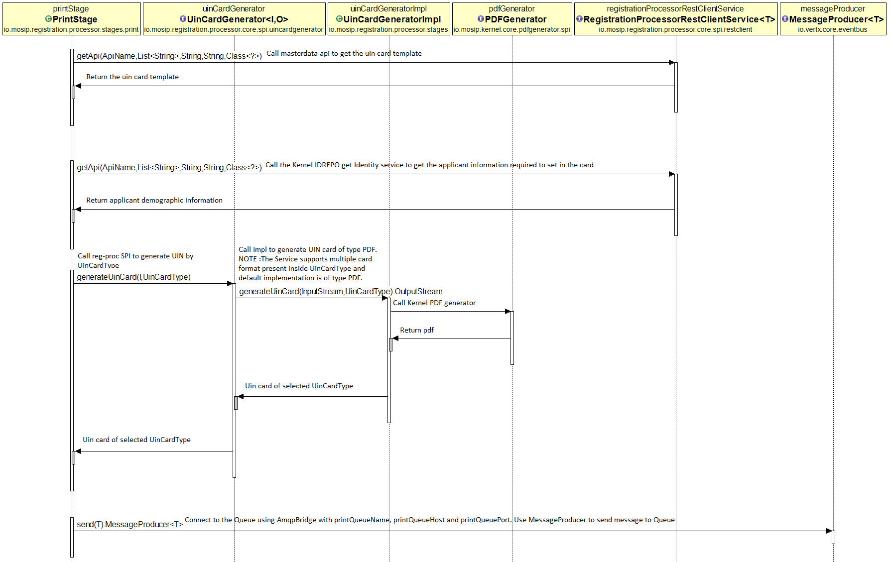

# Approach for Print

**Background**

Once Bio dedupe is successful and once UIN is generated print request will be initiated which will send PDF documents along with the details like name and address.

The target users are -
Vendor application which will process the document for printing.
Registered user which will receive document.

The key requirements are -
1. UIN for the Registration has been generated.
2. The ID Object has been sent to ID Repository post-UIN Generation.
3. UIN Card Template is present in Template Tables.


The key non-functional requirements are
1.	Auditing of the all the transactions including success and failed scenario:
2.	Logging of the all the requests
a.	INFO log message in case print request success or failed
b.	DEBUG log message in case if data fetched, PDF and text documents are created, PDF send on the queue.
c.	ERROR log message in case of any exception
3.	Exception handling


**Solution**

The key solution considerations are -
1.	Create a new verticle: Print Stage
2.	Configure route for print in camel having starting point : uin-generation-bus-out
3.	Configure queue connection manager, queue name along with any other details in configuration server. 
	Outbound Queue name: reg.proc.print.outbound.queue
	Inbound Queue name: reg.proc.print.inbound.queue
4.	Setup and install/deploy active MQ server and enable required ports
5.	Create queue on the active server: reg.print.outbound.queue
6.	Create HTML page to generate PDF document or image
7.	Make entry in configuration cloud server having key and value:
registration.processor.print.documentype which will have values: PDF, IMAGE
8.	Use velocity tool and by fetching data by registration id convert HTML document into PDF or IMAGE based on the config property: registration.processor.print.documentype
9.	Create text file having user name, address, phone number
10.	Send PDF/IMAGE along with text on JMS activemq queue
11.	In case if there is connection time out, frame work should try to resend documents for max attempts which is configured in the configuration cloud server as: registration.processor.max.retry=5
12. Once PDF for print send, Print system can send acknogement response on inbound queue: reg.proc.print.inbound.queue.
	Update status in transaction table for the request id for which acknogement received.
13. Queue configued by key: reg.proc.print.inbound.queue in configuration server will be also used to serve reprint functionality.
	Once reprint message received system should trigger process and should generate PDF and send it to Print system.
	
**Sample Request and Response**
- Print message:
 
------------

Text File Content:
 ```html
 { 
 	"id":"mosip.registration.print.send",			
	"version":"1.0",	
	"requesttime":"2007-12-03T10:15:30Z",
	"metadata" : {
	},
	"request" : {
		"name_ara":"َتهِفَ َلمَس",
		"name_eng":"Mohamed Zhaeer",
		"addressLine1_ara":"٢٥ مُهَمِد سترِِت",
		"addressLine1_eng":"25 Mohamed Street",
		"addressLine2_ara":"سيرَِ رَُد",
		"addressLine2_eng":"Syria Road",
		"addressLine3_ara":"ِرَن",
		"addressLine3_eng":"IRAN",
		"region_ara":"ِرَن",
		"region_eng":"IRAN",
		"province_ara":"فِس-مِكنِس",
		"province_eng":"Fes-Meknes",
		"postalCode":"300033",
		"phoneNumber":"9003356458",
		"city_ara":"سيرَِ",
		"city_eng":"SYRIA"
	}
}
```

- Acknolgement:

------------
 ```html
 
- Success Message:

{ 
	"id":"mosip.registration.print.acknolgement",			
	"version":"1.0",	
	"responsetime":"2007-12-03T10:15:30Z",
	"metadata" : {
		"uin":"<UIN NUMBER>"
	},
	"response" : {
		"status":"Print Success"
	}
	"errors":[
	]
}
```
```html
- Error Message:

{ 
	"id":"mosip.registration.print.acknolgement",			
	"version":"1.0",	
	"responsetime":"2007-12-03T10:15:30Z",
	"metadata" : {
		"uin":"<UIN NUMBER>"
	},
	"response" : {
		"status":"Print Error"
	}
	"errors":[
		"errorCode": "PRINT_APP_001",
		"message": "Mobile or email not available"
		},
		  {
		"errorCode": "PRINT_APP_002",
		"message": "Service vendor is not responding"
		}
	]
}

```

- Reprint Request:

------------

 ```html
{ 
	"id":"mosip.registration.reprint",			
	"version":"1.0",	
	"requesttime":"2007-12-03T10:15:30Z",
	"metadata" : {
	},
	"request" : {
		"uin":"123456789"
	}
}
```	
	
	
**Logical Architecture Diagram**

------------




**Class Diagram**

------------



**Sequence Diagram**

------------


