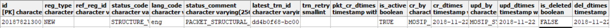
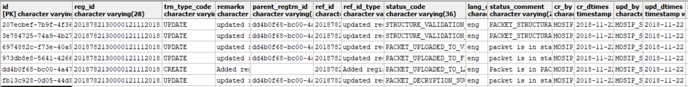
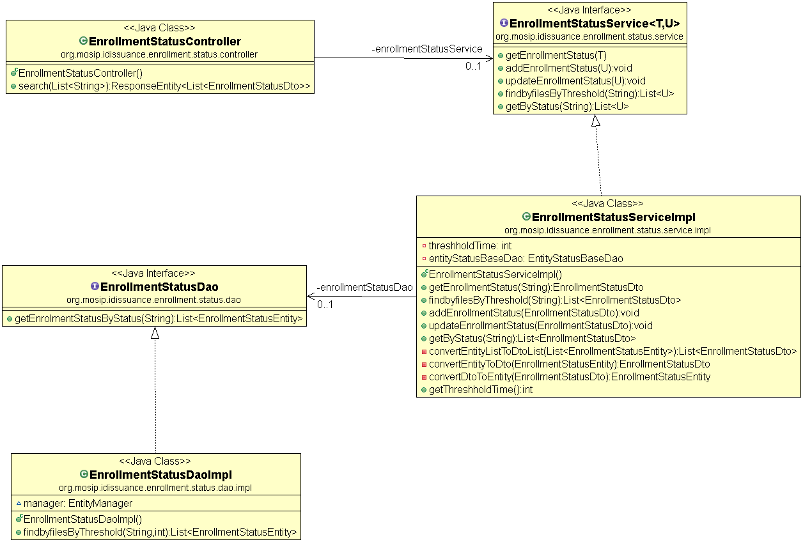
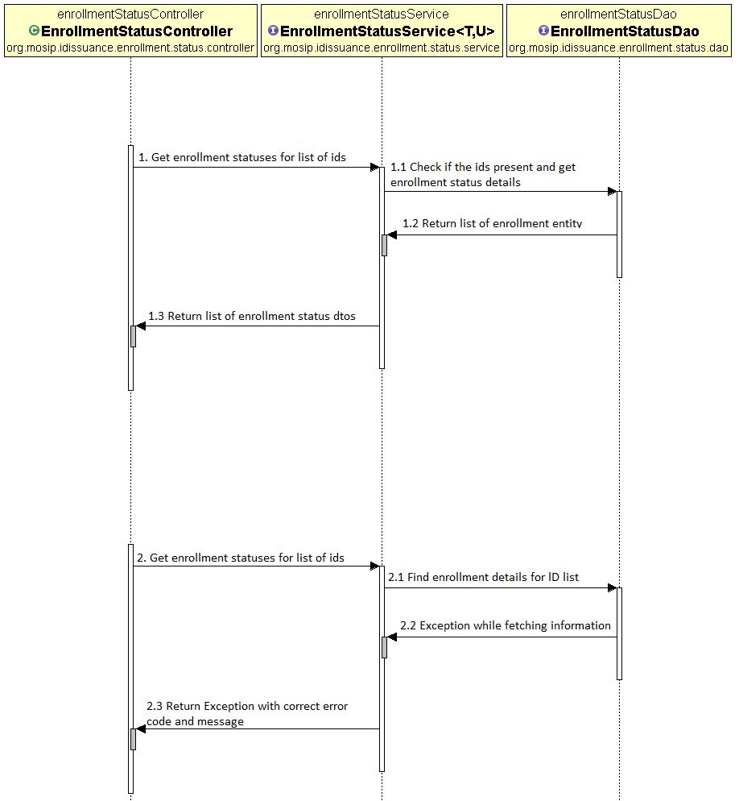

# Approach for Registration status module

**Background**
Registration packets created by the registration clients will be periodically uploaded to the server for processing. The packets will be further processed and in each step  status will be updated in registration status table.

The target users are
-	Client application, which will use search API to get current status of packets.
-	Server application which will process the packets
-	Administrator of the platform who may need to verify the packets

The key requirements are
-	Get registration status based on id.
-	Get the registration based on status.
-	Update registration status.
-	Add registration status.
-	Provide rest API to get the registration statuses for list of registration ids.
-	Add registration transaction record for each transaction.

The key non-functional requirements are
-	Performance: Should fetch information from DB in less time for millions of records. Should be able to support processing multiple status requests per second.

**Solution**
The key solution considerations are
-	2 new tables -
	“registration”table : this table stores current registration status. Example below -
	
	“registration_transaction” table : this table holds all the transactions for a registration id. There can be multiple transactions against one registration id. All the transactions will be recorded in this table with parent transaction id so that we can trace all transactions for a particular registration id. In below example there are multiple  transactions for same registration id which indicates what are the stages it has went through -
	
-	Create Registration and Transaction entity and create dao layer for below crud operations:
o	Add new registration status.
o	Add Transaction details with transaction type code and status code (TRANSACTION_STARTED, TRANSACTION_SUCCESSFUL, and TRANSACTION_FAILED).
o	Get registration status by ID.
o	Update registration status.
o	Get registration status by status code.
o	Find registration status by time threshold on creation date time.
-	Provide rest API to search registration status based on list of registration ids.
-	Registration and Transaction service.
-	Handle exceptions in using custom Exception handler and send correct response to client.
-	Audit the entire transaction.

[Download script for registration table](https://github.com/mosip/mosip/tree/DEV/design/registration-processor/_scripts/regprc-registration_v003.zip)
[Download script for registration_transaction table](https://github.com/mosip/mosip/tree/DEV/design/registration-processor/_scripts/regprc-registration_transaction_v003.zip)

**Class Diagram**

**Sequence Diagram**

