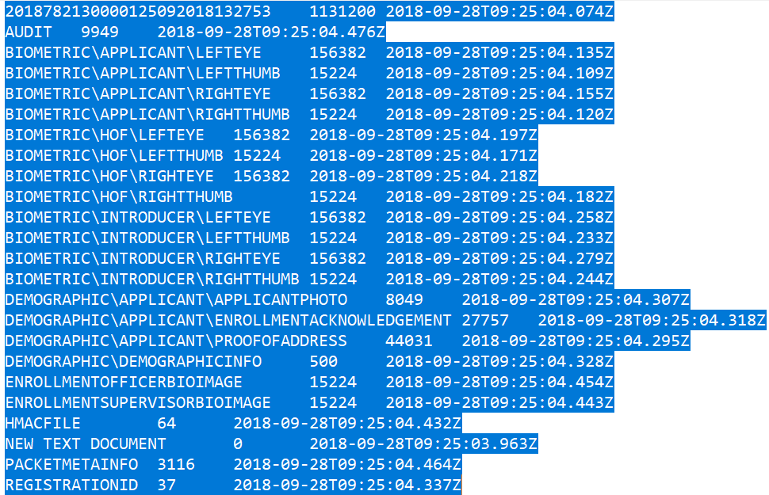
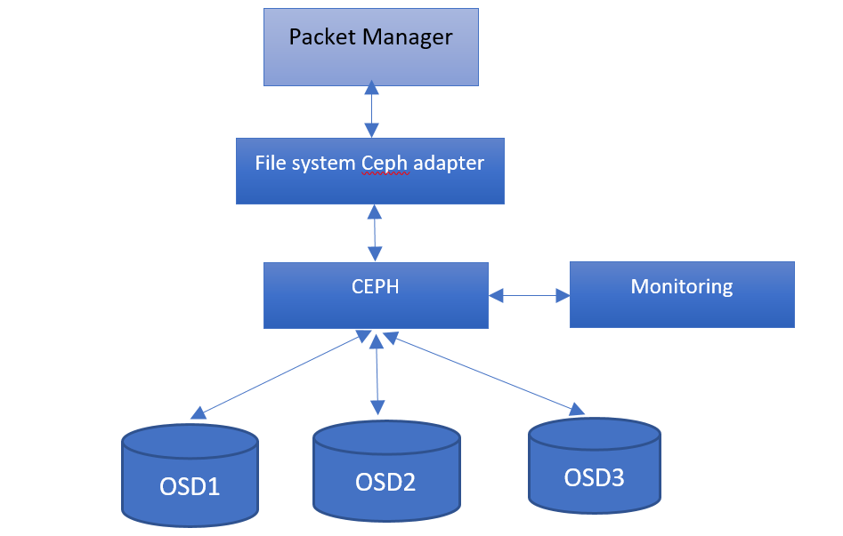
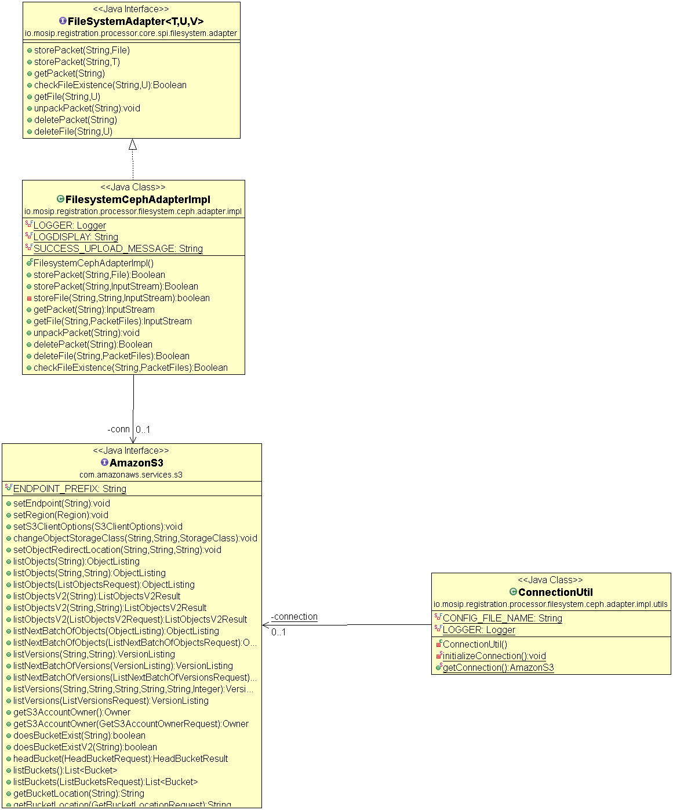

# Approach for storing encrypted registration packets in file system

**Background**

Enrolment packets created by the enrolment clients will be periodically uploaded to the server for processing. These packets must be stored securely and with duplicate copies of each packet such that in the event of storage disk failures, packets should not be lost. 
The target users are
-	Server application which will process the packets
-	Administrator of the platform who may need to verify the packets
The key requirements are
-	Each packet should have one or more duplicate copies such that in case of failure of one of the storage disks, the packet should be retrievable from one of the other disks
-	The interface to store and retrieve packets should be transparent such that packets can be stored on a local on-premise storage or cloud such that the client need not know where the packet is stored
-	The interface will support storage and retrieval of one packet at a time
-	The storage operation should be idempotent i.e., a packet should be stored only once
-	Storage and retrieval operations should be secure with authentication and authorization built in

The key non-functional requirements are
-	Availability: The storage disks should have high availability
-	Automated disk management: This component should have automated disk management capability such that if one of the disks is crossing storage threshold limit, an alert should be generated
-	Scalable: Should be able to scale up or scale down the storage disks based on load at runtime
-	Management: Should have a management interface to manage and monitor the disks
-	Performance: Should be able to support 100’s of packet storage & retrieval requests per second

**Solution**

The key solution considerations are
-	Distributed storage system to maintain duplicate copies of packets
-	Open source out of the box distributed file store to align with the principle of non-proprietary software and open standards
-	The distributed file store should be built on commodity hardware
-	The interface for storage should be loosely coupled and not dependent on the file storage software
-	The component should be resilient and fault tolerant such that if one of the disks fail the other disks should be able to serve the packets
CEPH will be used as the default distributed file storage software in MOSIP
The solution can be decomposed into 2 parts
-	Interface for storage and retrieval
o	The interface to store and retrieve packets should be transparent such that packets can be stored on a local on premise storage or cloud such that the client need not know where the packet is stored
o	The interface will support storage and retrieval of one packet at a time
-	Adapter for a specific distributed file storage implementation
o	The storage operation should be idempotent i.e., a packet should be stored only once.
o	Storage and retrieval operations should be secure with authentication and authorization built in.

Below is the sample of how files will be stored in CEPH after packet gets decrypted  –

Process Flow

Class Diagram 

Sequence Diagram ** 

