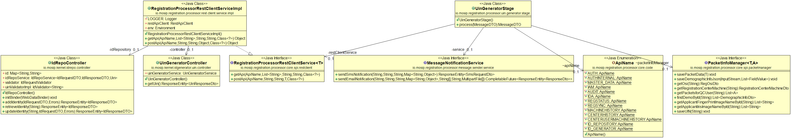
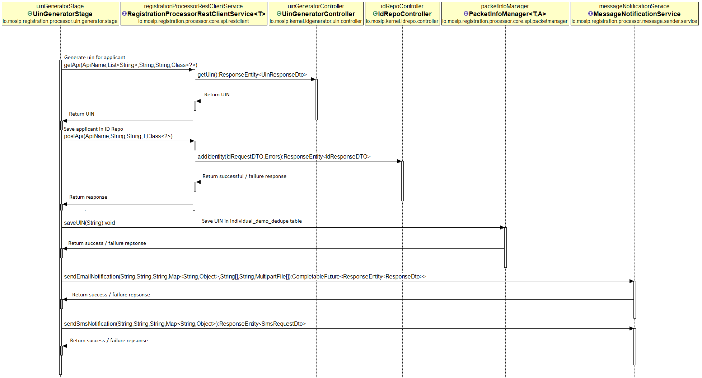

# Approach for Uin Generator

**Background**

After successful Bio dedupe, the UIN Generator will be called to allocate an unique identification number to the applicant.

The target users are -

Server application which will process the packets.
System administrator who will integrate with id repository.

The key requirements are -
- Generate UIN by calling kernel service
- Call ID Repo create API to create a new applicant record with generated UIN.
- Save the UIN into registration-processor db
- Send Email/Notification to the applicant on successful UIN generation

The key non-functional requirements are
- Consistency - the uin generator should provide unique uin numbers everytime called.
- Performance - Should process thousands of packets per second.

**Solution**

The key solution considerations are -
- Create a new verticle uin-generator
- By default after successful manual adjudication the request will be routed to uin-generator. Add camel configuration to route the request.
- Create 2 new properties in registration-processor-rest-client -
	1. IDREPOSITORY : to fetch id-repo server and port
	2. UINGENERATOR : to fetch id generator ip and port
- Call 'kernel-idgenerator-uin' Rest API to generate UIN. It will return the unique id which will be allotted to the applicant. 
- Call [kernel-idrepo-service](https://github.com/mosip/mosip/wiki/ID-Repository-API) create API to add a new applicant to id repository. Set required applicant demographic and biometric information with generated uin in the request dto. 
- After successful response from the idrepo-service, store the uin information in registration processor db. Update individual_demo_dedupe table with uin information against the registration id.
- The global configuration 'global-config.json' will have the notification methods. For example if sms and email notification has to be configured it will have values as - 'sms|email'. Read the values and send notificaton accordingly.
- Call registration-processor-message-sender service to send notification as configured in global-config file.
- Add transaction and audit.

**Class Diagram**

**Sequence Diagram**

