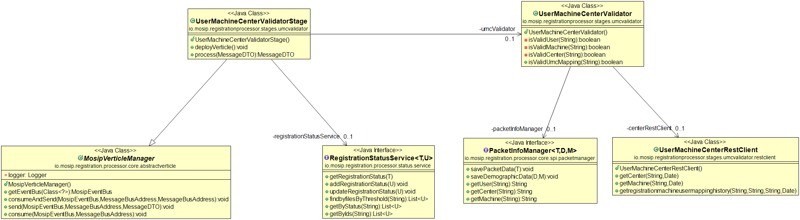

# Approach for USER, MACHINE and CENTER validator

**Background**

After successful packet structure validation, the packet packet meta info is stored in DB. The user, machine and center information will be further validated to check if the packet is created by authorized person.

The target users are -

Server application which will process the packets.
Administrator of the platform who may need to verify the packets.

The key requirements are -
-	Validate user information.
-	Validate machine information.
-	Validate center information.
-	Validate if the user was assigned to the particular machine of same center during creation of the packet.
-	Send response to eventbus on successful/failed validation.

The key non-functional requirements are
-	Performance: Should be able to support processing multiple requests per second.


**Solution**

The key solution considerations are -
- Use existing vertical "OSI-validator" to validate user, machine and center details.
- Add new methods in PacketInfoManager to fetch the user, machine and center details from table.
- Registration processor would check if user/center/machine was valid during creation of the packet. On successful validation, registration-processor will further validate if the user was assigned to the same machine of same center during packet creation time. For this kernel will lookup in user-machine-center lookup table and return information. 
- Use Registration-Processor-rest-client to call [Master-data-APIs](https://github.com/mosip/mosip/wiki/2.4-Master-data-APIs#234-document-formats-master-api). 
    1. Verify CENTER was active on packet creation date/time.
    ### Resource URL
    ### `GET /registrationcentershistory/{id}/{languagecode}/{eff_dtimes}`
    ### Example Response
    ```JSON
    {
      "registrationcenters": [
        {
            "registrationcenterid":"string",
            "registrationcentername":"string",
            "longitude":"string",
            "latitude":"string",
            "isactive":"boolean",
            "centertype":"string",
            "address":"string",
            "workinghours":"string",
            "contactnumber":"string",
            "pincode":"string",
            "locationcode":"string",
            "stateon":"date",
            "languagecode":"string"
        }]
        }
    ```
    2. Verify MACHINE was active on packet creation date/time.
    ### Resource URL
    ### `GET /machineshistory/{id}/{languagecode}/{eff_dtimes}`
    ### Example Response
    ```JSON
    {
      "machines": [
                    { 
                        "machine": [
                            {"machineid":"string"},
                            {"machinename":"string"},
                            {"macid":"string"},	
                            {"serialnumber":"string"},
                            {"isactive":"boolean"}
                            {"languagecode":"string"}
                    ]
                    }
                ]
    }
    ```
    
    3. Verify USER/MACHINE/CENTER mapping was active on packet creation date/time : this is to verify if the user was assigned to the machine of the same center during creation of the packet.    
    ### Resource URL
    ### `GET /getregistrationmachineusermappinghistory/{languagecode}/{eff_dtimes}/{registrationcenterid}/{machineid}/{userid}`
    ### Example Response
    ```JSON
    {
      "registrationcenters": [
        {
            "registrationcenterid":"string",
            "machineid":"string",
            "languagecode":"string"
        },
        {
            "registrationcenterid":"string",
            "machineid":"string",
            "languagecode":"string"
        }
      ]
    }
    ```
- On successful validation send request to osi_bus out address. On failure send response to error queue. If any internal error happens during validation then send response to retry queue.
- Update the packet status in "Registration-status" table for both successful and failed validation.

**Class Diagram**


**Sequence Diagram**

