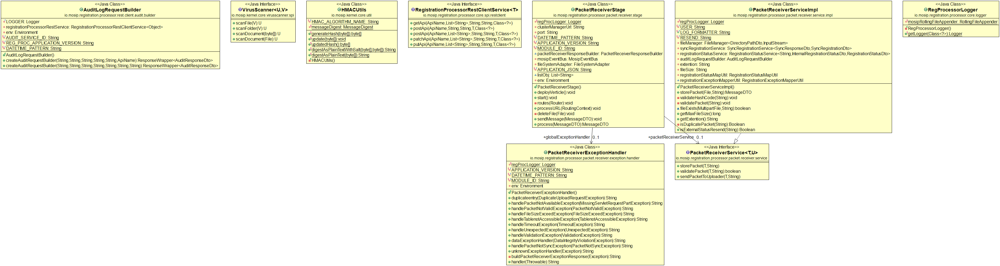
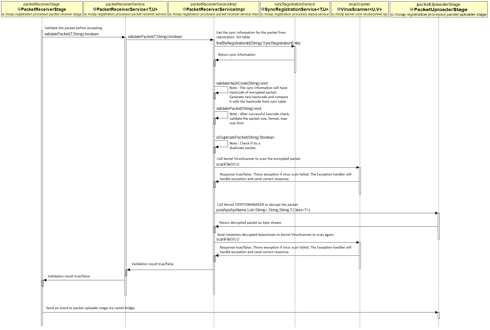

# Approach for uploading enrollment packets to Landing zone

**Background**
Registration packets created by the registration clients will be periodically uploaded to the server for processing. The packets will be stored in landing zone file system for further processing and packet status should be created in registration status table. 

The target users are
-	Server application which will process the packets
-	Client application, which will consume the service and send packets to server.

The key requirements are
-	Publish rest service to take registration packet from client and upload it to landing zone.
-	The client consumes rest service and sends packet to server.
-	Server gets the packets and checks for duplicate in registration status table.
-	Server validates that the registration packet size limit doesn’t exceed the size defined in the configuration module of core kernel.
-	Server stores the packets to landing zone upon successful validation and sends correct response code with message to the client.
-	Server handles all exception scenarios that can occur while storing packets to landing zone. 

The key non-functional requirements are
-	Availability: The application should be highly available to support both online upload and upload through admin portal.
-	Modularity: The application should get the packet from client and call packet-manager module to upload packet in landing zone.
-	Performance: Should support uploading packets from multiple clients at same time.

**Solution**
The key solution considerations are
-	A rest producer application – “packet-receiver".
-	Expose rest end-point, which supports multipart ‘zip’ file upload and sends back success/error status codes with message. (Note : input file extention can be configurable and should not support any other format)
-	A repository layer to support crud operations on registration status DB by extending Kernel 'BaseRepository'.
-	An “packet-manager” module to take logical location name and file as input and support upload/get/delete operations.
-	The “packet-receiver" to use “registration-file-manager” for uploading packets into landing zone.
-	A RegistrationStatusService which will get/add/update registration status by registration id.

There are three components in the solution -
-	“packet receiver” application.
-	“packet-manager” application.
-	“registration-status” application.

**Class Diagram**

**Sequence Diagram**

