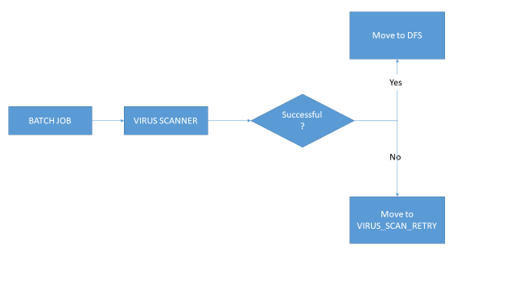
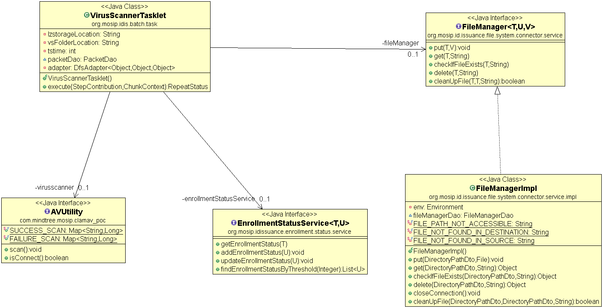
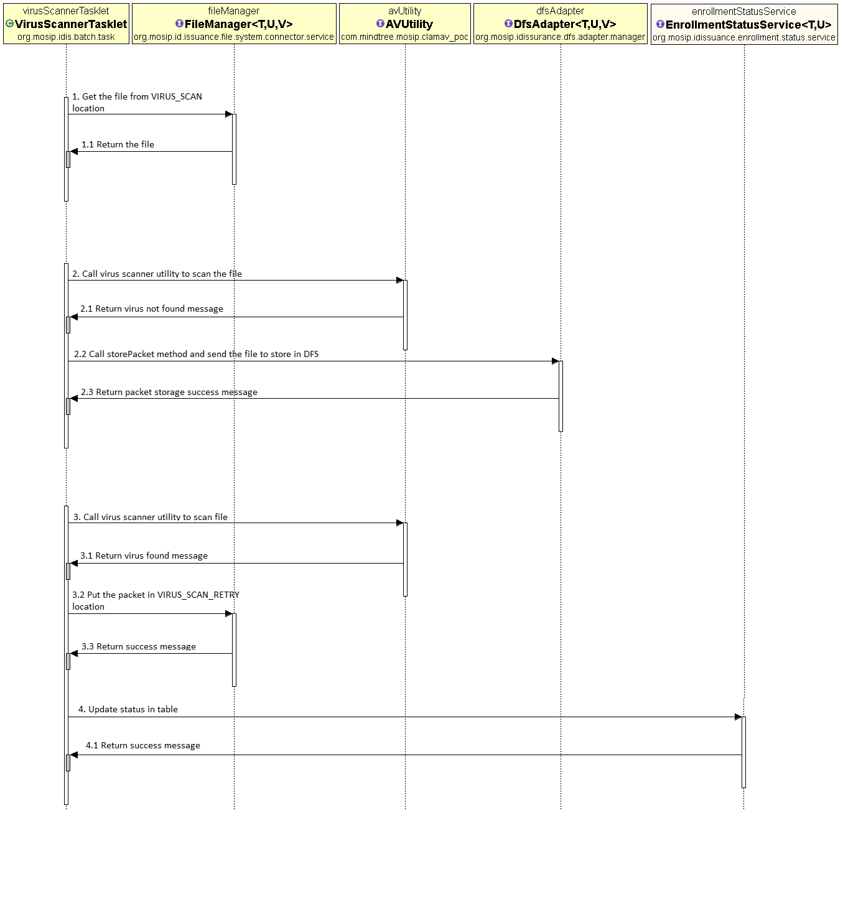

# Approach for Virus scanner

**Background**

Registration packets created by the registration clients will be periodically uploaded to the server for processing. The packets will be stored in virus scan zone initially and a new record will be added in registration table.
The target users are
-	Server application which will process the packets
-	Administrator of the platform who may need to verify the packets
The key requirements are
-	A virus-scanner-stage to scan the registration packets.
-	A FileManager module to perform crud operations on packet(save/retrieve/delete etc).
-	Perform Virus Scan on the Packets using Kernel service.
-   Upon successful virus scan decrypt packet and scan again using kernel virus scanner.
-	On virus scan failure reject packet and update the registration status.
-   Send message to camel bridge with isValid flag 'true'/'false' based on virus scanner response.

The key non-functional requirements are
-	Performance: Should be able to support processing multiple packet requests per second.
-	Availability: The virus scanner should keep running based on configuration so that whenever files comes in it should pick files and start processing.
-	Accessibility: the storage location should be accessible to move packets from one location to another.

**Solution**

The key solution considerations are
-	A virus-scanner-stage to scan registration packets for viruses.
-	Use FileManager module to get the packet from VIRUS_SCAN zone.
-   Use kernel VirusScanner.scanFile() service to scan the encrypted packet. It will return boolean value. Reject packet if the scan is not successful.
-	On successful virus scan use [kernel CryptoManager rest api](https://github.com/mosip/mosip/wiki/Kernel-APIs#2-crypto-manager) to decrypt the packet. It takes applicationId, data, referenceId and timestamp.
		1. ApplicationId : registration
		2. Data : Encrypted packet data stream as string.
		3. referenceId : Kernel will fetch the private key to decrypt file by reference id. The keys will be generated on center id. Read the center id from the packet name. Read the centerid length from the config server. Example - packetName.substring(0, centerIdLength);
		4. Timestamp : the last 14 digit of the packetName is the timestamp. Read the timestamp from packet and convert to proper date format the crypto manager accepts.
-	Use FileManager service to save the decrypted packet in VIRUS_SCAN_DEC location.
-	Unzip the file and use FileManager to save the unzipped packet inside VIRUS_SCAN_UNPACK.
- Cleanup packets using FileManager service.
- Send message to camel briged with isValid(true/false) on the virus scan result.
-	Audit the entire transaction.

**Process Flow Diagram**

**Class Diagram**

**Sequence Diagram**

