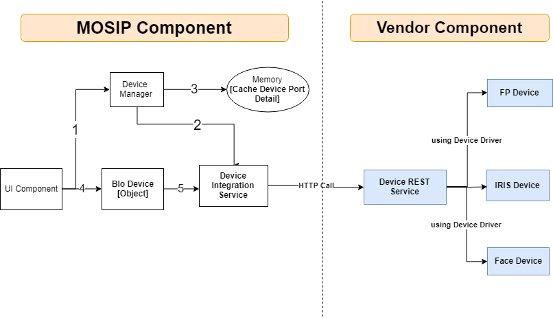
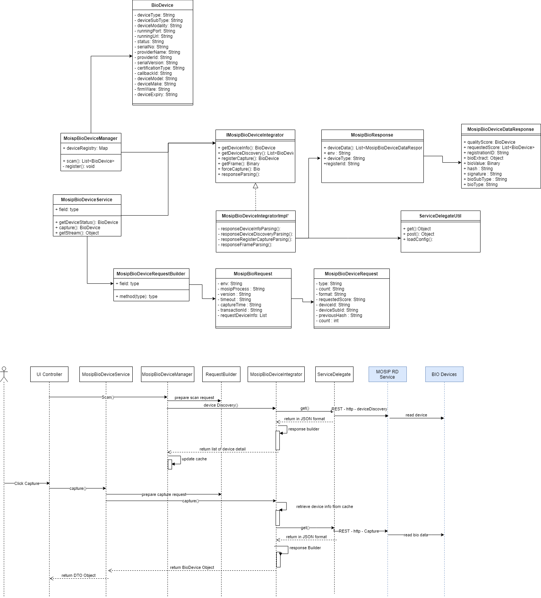

**Design - MOSIP Bio-Metric Device Integration**

This document covers the technical design of MOSIP Device Integrator [MDI], which will be used to communicate with Mosip Device Manager [MDM] to capture the data from variety of Bio devices. This Integrator acts as interface between Registration client application controller and MDM.

There are three major entities are being considered to interact with Bio-metric devices.   
   1. MDM [MOSIP Device Manager - Provided by External third party].  
   2. MDI  [Mosip Bio Device Integrator - Provided by MOSIP].  
   3. Application [Registration client application - Provided by MOSIP].    

**Device Integration Block Diagram:**  
  

The technical detail of the DM and Registration client application is briefly covered in this document. MDM technical spec is out of this document.  

1. Mainly **Http protocol** will be used to communicate between MDI and MDM services.  
2. The Standard **REST call** procedure would be followed to make the connection.
3. The standard JSON structure would be followed while sending the request and receiving response from MDM.     
4. MDM Service internally uses required drivers to communicate with the Bio-metric devices.    
5. All requests and responses carry a requestId.  
6. The application communicates with MDI that intern communicate with MDM to interface with BIO devices.

**Out of Scope:** 
   - The MDM technical design is out of scope of this document.  
     

**MDI - Mosip Device Integration:** 

The MOSIP provided MDI component, is responsible for the following:  
   - Identify the MDM service running 127.0.0.1:port by scanning across the configured ports and store them in cache. 
   - Maintain the list of the all the supported biometric devices available for the applications.  
   - It Notify the applications about arrival and removal of the supported devices .  
   - Once the request has been triggered to the MDM, the client would wait for certain period to receive the response, if there is no response then terminate the request and render the error response to the UI components.   
   - Separate http call would be triggered for each and every requests.   
   - For every devices, one 'BioDevice' business object would be created and the same would be sent to UI layer for further communication. 
   - To display the video stream of Biometric data, the sequential frame would be captured and render to the UI.   

**MDI Consuming messages:** 
   1. Device Info  
   2. Device Discovery   
   3. Capture    
   
   - Device Info : This message would be used when the application needs a particular device [FP/ IRIS/ FACE] specific detail.  
   - Device Discovery : This would be used when the application needs to identify all the running devices and register the respective ports.  
   - Capture : It provides the data captured against a particular device type and modality.   

   
**Application :**  
 The Application must connect to the MDI to discover the biometric devices.  
Once discovered, the application must connect to the required devices through the respective 'BioDevice' object. 

   - Once the application started then invoke the init() method in MDI component, to identify the list of configured ports for MDM services.  
   - Try to connect with the port to identify the running MDM.
   - If MDM is running in the specified port then it parses the requests and provide response based on the request type.
   - The JSON structure is followed to send and receive the data from MDM.  
   - Once the response received from MDM then parse the response and send the required information to the invoking application controller. 
   - Binary stream would be used to receive the video stream of BIO data and render the same to UI application. 	
  

**Device Integration - Class and Sequence Diagram:**  
  
