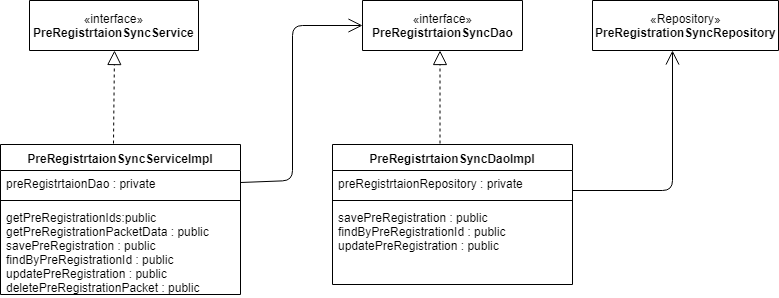
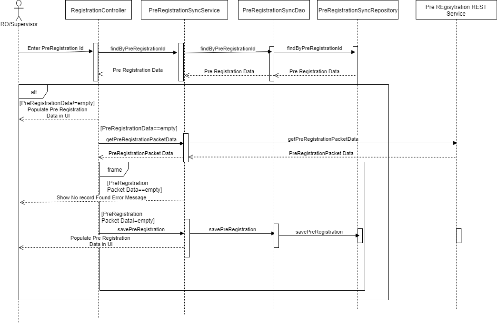

**Design -- Pre-Registration sync**

**Background**

As the process of Registration, the Individual can also provide the
Pre-Registration ID to fetch the details. The Individual can provide all
the details for the Pre-Registration and get Pre-Registration ID as an
acknowledgment. As part of the Sync process we will call the
Pre-Registration application to get the list of Pre-Registration IDs and
the subsequent pre-registration packet information.

The **target users** are

-   Registration

-   Manual trigger by the RO/RS

The key **requirements** are

-   As part of the registration process, the individual can provide the
    pre-registration id to fetch the details.

-   Enter the Pre-registration ID in the New Registration screen.

-   The system should validate against the DB for the provided
    pre-registration id.

-   If the data not available, system fetch the individual details based
    on the Pre-Registration ID as follows.

**Online:**

-   Get the pre-registration service URLs as part of the admin
    configuration.

-   Fetch the Pre-Registration ID call to get the list of
    Pre-Registration ID's as a response and save the list in the DB

-   Fetch the each packet \[ZIP\] file WRT the Pre-Registration ID and
    save to desire location and same thing should be updated to the DB.

-   While saving the Pre-registration packet, we need to encrypt using
    the symmetric key and save the packet.

-   The system will fetch the data based on the pre-registration id and
    populate the same in the registration screen. If the individual
    wants to modify the same and save the information.

-   Once the Registration ID is generated we need to delete the
    Pre-Registration packet and status should be updated in the DB.

**Offline: **

-   If it is available, decrypt the packet and populate the data to the
    screen.

<!-- -->

-   If not available the system should display alert. "**The Details are
    not available**".

The status for the Pre-Registration are as follows

1.  Yet To Receive.

2.  Received

3.  RID Generated

4.  Deleted.

The key **non-functional requirements** are

-   Security:

    -   We should not store the RO/RS plain text credentials or any
        sensitive information.

    -   The password should be not stored as raw data. It should be
        stored in hashed format.

    -   The session key should be stored in the DB for each
        pre-registration packet.

    -   The data resided in the database should be encrypted.

-   Network

    -   URL should be communicated using the SSL mode.

-   Log the each state of the packet Yet To Receive/Received/RID
    Generated/Deleted:

    -   As a security measures the UIN or any sensitive individual
        information should not be logged.

-   Other standard NFR, need to be taken care:

    -   Logging, audit, exception handling.

**Solution**

1.  Create the **PreRegistrtaionIDSyncher** with following methods as

    a.  List\<String\> getPreRegIDs - ( centerID, fromDate,toDate)

    b.  PreregistrtaionEntity getPreRegId - (preRegID).

2.  Call the configured URL to the Pre-registration system to get the
    list of ID's.

3.  Call the Kernel API to get the Symmetric session key for each packet
    and encrypt using it.

4.  Encrypt the pre-registration packet raw data and Save it to the
    desired location \[which is configured\].

5.  Call the PreRegistrtaionDAO with the follows methods to do the
    operation WRT the packet.

    c.  save(Preregistrtaion entity)

    d.  update(Preregistrtaion entity)

    e.  find(String preRegId) \[We need to validate against the status\]

6.  Call the PreregistrtaionSyncRepositry to persist to the data into
    the DB.

    f.  Write the respective queries using the JPA query language.

7.  Use the below status for the pre-registration status.

    g.  'Yet To Receive'.

    h.  Received

    i.  RID Generated

    j.  Deleted

**Class Diagram :**

**Sequence Diagram :**

