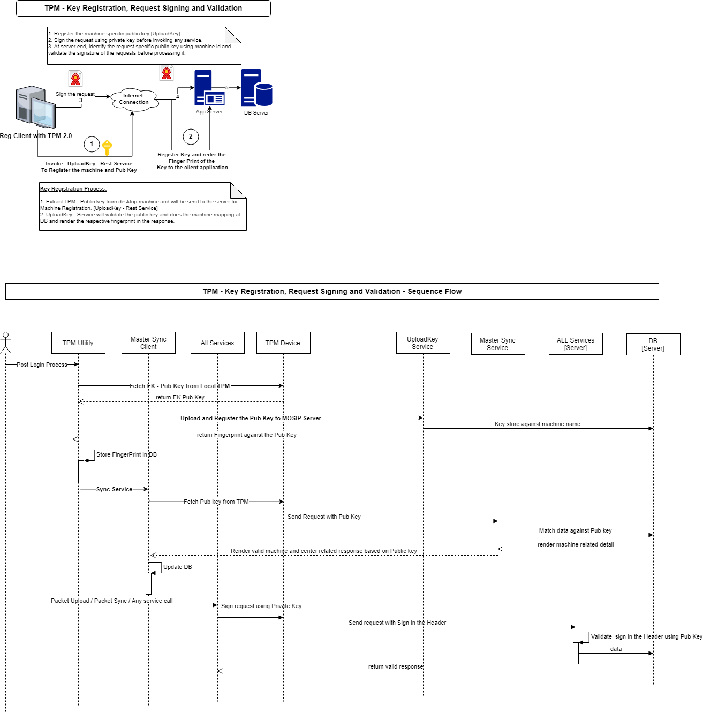

**Design - TPM Device Integration**   

A Trusted Platform Module (TPM) is a specialized chip on a local machines that stores RSA encryption keys specific to the host system for hardware authentication. Each TPM chip contains an RSA key pair called the Endorsement Key (EK). The pair is maintained inside the chip and cannot be accessed by software. By leveraging this security feature every individual machine would be uniquely registered and identified by the MOSIP server component.   

The Registration client application leverages this TPM capabilities and secure the application, data and mark the senders identity in the request before sending to external system. The MOSIP server would validate the request and make sure that the request received from the right source.   

This document covers the technical design of Registration client application integration with TPM [Truster Platform Module]. 

**The following functionalities would be implemented by integrating with the TPM:**   
   1. Secure [Encrypt] the symmetric key [of DB and Binary Jars] using EK public key from TPM.  
   2. Decryption of Symmetric key during runtime using EK private key from TPM.  
   3. Sign the requests sent from Registration client to server by using Endorsement private key.    
   4. Extract the Endorsement public Key from the TPM and share the same with the server component to verify the signature send by client application.  

**Technical Flow:**
The Microsoft provided Java libraries !(https://github.com/Microsoft/TSS.MSR/tree/master/TSS.Java) is used to integrate with the TPM device and implement the required functionalities. 

1. When user Trigger the 'run.jar' :  
   a. It checks the DB key encryption flag from property file. If false, it extracts 'EK - Public key' from TPM and using which DB and binary jar symmetric key would be encrypted and stored into property file. And also mark the key encrypted flag as true.  
   b. Fetch the DB and binary jar's key from property file and decrypt it using the 'TPM - EK - Private key' .  
   c. Un-Encrypt the DB and application binary jar's using the this key and run the same.   
   d. EK - Public Key Registration [using UploadPublicKey - Rest Service]:   
      - This component connects to the local TPM and extract the EK pub key and share the same with the MOSIP server to register the machine.     
      - Server component validate the pub key along with machine name and provide the finger print in the response.  
      - The received Finger print would be stored into the local machine_master table after completing the sync process.  
      - If this table doesn't contain the Local TPM public key and finger print then consider that the client is not registered.    
   e. Once the public key is registered then initiate the Master sync process with 'public key' and 'finger print'. The server component would make sure that the sender's identity is validated and post which success response would be rendered.    
   f. Whenever sending the requests to the server component, the requests would be signed using EK private key and attach it to the header of the requests. The server component would validate the same using the sender's specific public key.  
    
**TPM Integration Block and Sequence Diagram:**  
  

   
